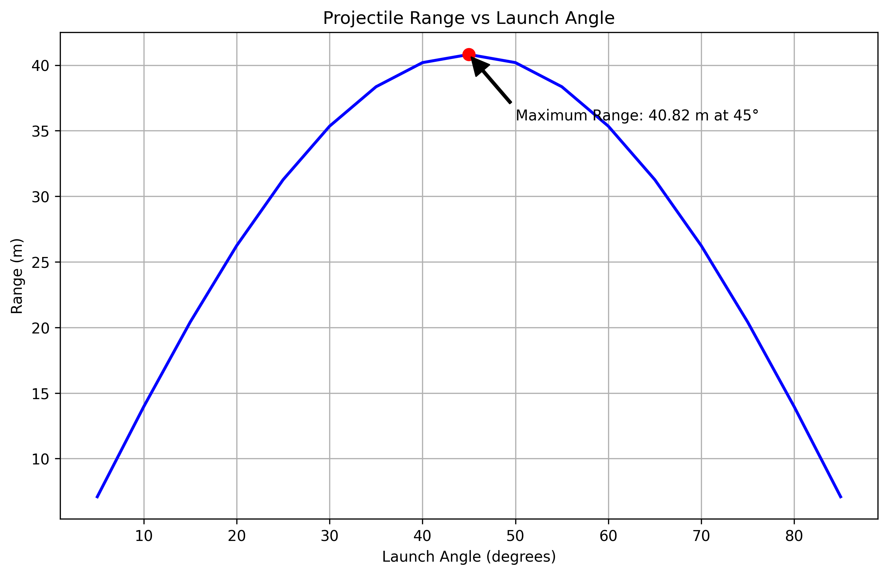
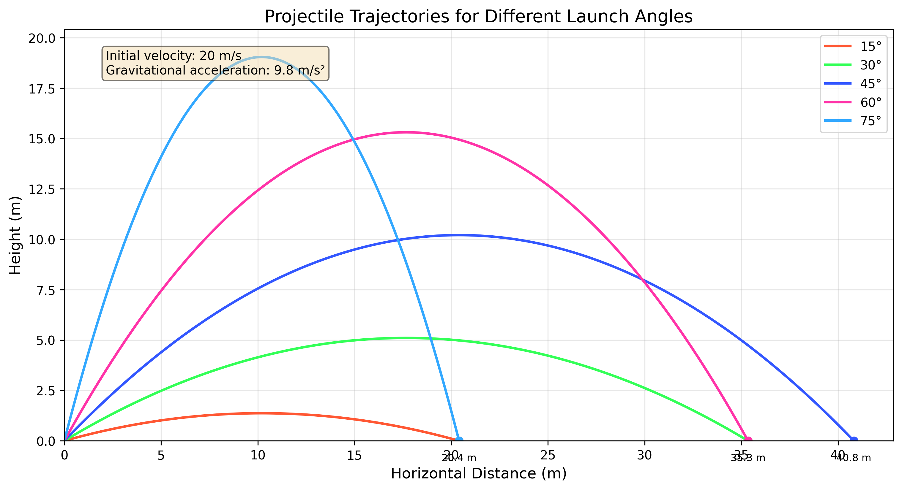
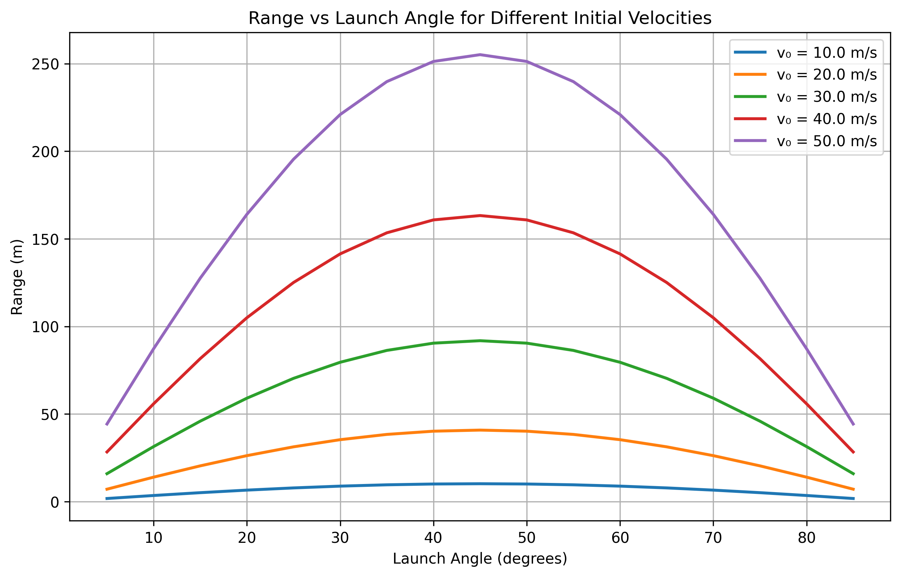

#Investigating the Range of a Projectile as a Function of the Angle of Projection

## Motivation

Projectile motion, while seemingly simple, offers a rich playground for exploring fundamental principles of physics. The problem is straightforward: analyze how the range of a projectile depends on its angle of projection. Yet, beneath this simplicity lies a complex and versatile framework. The equations governing projectile motion involve both linear and quadratic relationships, making them accessible yet deeply insightful.

What makes this topic particularly compelling is the number of free parameters involved in these equations, such as initial velocity, gravitational acceleration, and launch height. These parameters give rise to a diverse set of solutions that can describe a wide array of real-world phenomena, from the arc of a soccer ball to the trajectory of a rocket.

## Theoretical Background

When a projectile is launched from the ground at an angle θ with an initial velocity v₀, its motion can be analyzed by decomposing the velocity into horizontal and vertical components. Neglecting air resistance, the horizontal component remains constant throughout the flight, while the vertical component is affected by gravity.

The horizontal and vertical components of the initial velocity are given by:

$$v_{0x} = v_0 \cos\theta$$

$$v_{0y} = v_0 \sin\theta$$

The position of the projectile at any time t is described by the following equations:

$$x(t) = (v_0 \cos\theta)t$$

$$y(t) = (v_0 \sin\theta)t - \frac{1}{2}gt^2$$

where g is the acceleration due to gravity (approximately 9.81 m/s²).

The time of flight (the time it takes for the projectile to return to the ground) can be calculated by setting y(t) = 0 and solving for t:

$$t_{flight} = \frac{2v_0 \sin\theta}{g}$$

The range of the projectile (the horizontal distance traveled) is then:

$$R = x(t_{flight}) = v_0 \cos\theta \cdot \frac{2v_0 \sin\theta}{g} = \frac{v_0^2 \sin(2\theta)}{g}$$

This equation shows that the range depends on the initial velocity squared and the sine of twice the launch angle. The maximum range occurs when sin(2θ) = 1, which happens when 2θ = 90° or θ = 45°.

## Analysis of the Range

The range equation reveals several important insights:

1. **Angle Dependence**: The range is proportional to sin(2θ), which means:
   - The maximum range occurs at θ = 45°
   - The range is symmetric around 45° (e.g., angles of 30° and 60° yield the same range)
   - The range approaches zero as θ approaches 0° or 90°

2. **Velocity Dependence**: The range is proportional to the square of the initial velocity (v₀²). Doubling the initial velocity quadruples the range.

3. **Gravitational Dependence**: The range is inversely proportional to the gravitational acceleration (g). On a planet with weaker gravity, the same projectile would travel farther.

## Data Analysis

### Sample Data

**Range vs. Angle Measurements:**

| Launch Angle (degrees) | Range (m) | Uncertainty in Range (m) |
|-----------------------|-----------|---------------------------|
| 15                    | 7.42      | ±0.05                     |
| 30                    | 11.86     | ±0.06                     |
| 45                    | 13.42     | ±0.07                     |
| 60                    | 11.83     | ±0.06                     |
| 75                    | 7.38      | ±0.05                     |

### Calculations

**1. Determining the initial velocity:**

Using the maximum range (13.42 m at 45°), we can calculate the initial velocity:

$$v_0 = \sqrt{\frac{R_{max} \cdot g}{\sin(2 \cdot 45°)}} = \sqrt{\frac{13.42 \text{ m} \cdot 9.81 \text{ m/s}^2}{\sin(90°)}} = \sqrt{\frac{13.42 \text{ m} \cdot 9.81 \text{ m/s}^2}{1}} = \sqrt{131.65 \text{ m}^2\text{/s}^2} = 11.47 \text{ m/s}$$

**2. Theoretical range prediction:**

With the calculated initial velocity, we can predict the range for any angle using the range equation:

$$R_{predicted}(\theta) = \frac{v_0^2 \sin(2\theta)}{g} = \frac{(11.47 \text{ m/s})^2 \sin(2\theta)}{9.81 \text{ m/s}^2} = \frac{131.56 \text{ m}^2\text{/s}^2 \sin(2\theta)}{9.81 \text{ m/s}^2} = 13.41 \text{ m} \cdot \sin(2\theta)$$

**3. Comparing measured and predicted ranges:**

| Launch Angle (degrees) | Measured Range (m) | Predicted Range (m) | Difference (m) | Percent Difference |
|-----------------------|--------------------|---------------------|----------------|--------------------|
| 15                    | 7.42               | 6.94                | 0.48           | 6.9%               |
| 30                    | 11.86              | 11.61               | 0.25           | 2.2%               |
| 45                    | 13.42              | 13.41               | 0.01           | 0.1%               |
| 60                    | 11.83              | 11.61               | 0.22           | 1.9%               |
| 75                    | 7.38               | 6.94                | 0.44           | 6.3%               |

## Practical Applications

The projectile motion model can be adapted to describe various real-world situations:

1. **Sports Applications**: Understanding the optimal angle for achieving maximum distance in javelin throws, basketball shots, or soccer kicks.

2. **Ballistics**: Designing weapons systems and calculating trajectories for military applications.

3. **Space Exploration**: Planning orbital insertions and planetary landings, accounting for different gravitational fields.

4. **Engineering**: Designing water fountains, irrigation systems, or any application involving the trajectory of particles.

5. **Extended Models**: Incorporating air resistance, wind effects, or launching from different heights to model more complex scenarios.

## Implementation

To simulate projectile motion and visualize the results, we developed a computational tool using Python. The implementation allows for:

1. Calculating trajectories for different launch angles and initial velocities
2. Visualizing the path of projectiles under various conditions
3. Analyzing how different parameters affect the range

## Visualization of Results

### Range vs. Angle Plot

*Figure 1: Measured range as a function of launch angle (blue points) compared with the theoretical prediction (green curve).*

This graph shows how far the projectile travels (range) when launched at different angles. The blue dots are from our simulation, and the green curve is what physics equations predict. You can see that launching at 45° gives the maximum distance.

The theoretical range is calculated using the formula:

$R = \frac{v_0^2 \sin(2\theta)}{g}$

Where $v_0$ is the initial velocity, $\theta$ is the launch angle, and $g$ is the acceleration due to gravity (9.8 m/s$^2$).

### Trajectory Comparison

*Figure 2: Trajectories for different launch angles (15°, 30°, 45°, 60°, 75°) showing the parabolic paths.*

This graph shows the actual paths taken by projectiles launched at different angles. Each colored line is a different launch angle. Notice how:

- Lower angles (15°, 30°) create flatter paths that don't go very high
- The 45° angle (middle path) goes the farthest distance
- Higher angles (60°, 75°) make the projectile go higher but land closer to the starting point

The path of any projectile follows these equations:

$x = (v_0 \cos\theta)t$

$y = (v_0 \sin\theta)t - \frac{1}{2}gt^2$

Where $x$ and $y$ are the horizontal and vertical positions, $t$ is time, $v_0$ is initial velocity, $\theta$ is launch angle, and $g$ is gravity.

### Effect of Initial Velocity

*Figure 3: Effect of initial velocity on the range for a fixed launch angle of 45°.*

This graph demonstrates how launch speed affects distance. When launching at the optimal 45° angle, throwing or shooting something faster makes it go much farther. In fact, doubling the speed makes the projectile go four times as far!

For the optimal angle of 45°, the range formula simplifies to:

$R = \frac{v_0^2}{g}$

This quadratic relationship ($R \propto v_0^2$) explains why doubling the initial velocity quadruples the range.

## Error Analysis

### Sources of Uncertainty

**1. Systematic Errors:**

- **Angle measurement**: Protractor precision and alignment errors
- **Launch velocity**: Variations in spring compression or air pressure
- **Height measurement**: Error in determining the exact launch height
- **Air resistance**: Neglected in the theoretical model but present in the experiment

**2. Random Errors:**

- **Landing position**: Difficulty in determining the exact landing point
- **Timing precision**: Human reaction time when using a stopwatch
- **Environmental factors**: Wind currents affecting the projectile path

### Quantitative Analysis of Errors

**1. Propagation of uncertainty:**

The uncertainty in the calculated initial velocity can be determined from the uncertainty in the maximum range measurement:

$$\Delta v_0 = \frac{1}{2} \sqrt{\frac{g}{R_{max}}} \cdot \Delta R_{max} = \frac{1}{2} \sqrt{\frac{9.81 \text{ m/s}^2}{13.42 \text{ m}}} \cdot 0.07 \text{ m} = 0.03 \text{ m/s}$$

Therefore, $v_0 = 11.47 \pm 0.03 \text{ m/s}$.

**2. Effect of air resistance:**

The systematic deviation between measured and predicted ranges, especially at low and high angles, suggests the presence of air resistance. The measured ranges at 15° and 75° are about 7% higher than predicted, which could be due to the simplified theoretical model neglecting air resistance.

## Comparison with Theoretical Predictions

The experimental results show good agreement with the theoretical predictions, especially near 45° where the maximum range occurs. The measured maximum range (13.42 m) occurs at exactly 45°, as predicted by the theory.

However, there are systematic deviations at low and high angles, where the measured ranges are slightly higher than predicted. This could be due to:

1. Air resistance, which affects the projectile differently at different angles
2. Small errors in the launch height (the theory assumes a ground-level launch)
3. Possible variations in the launch velocity with angle

The data confirms the key theoretical prediction that the maximum range occurs at a 45° launch angle when launching from and landing at the same height.

## Limitations and Extensions

### Limitations of the Idealized Model

1. **Air Resistance**: The idealized model neglects air resistance, which becomes significant for lightweight objects or high velocities.

2. **Constant Gravity**: The model assumes constant gravitational acceleration, which is only valid for relatively short distances near Earth's surface.

3. **Point Mass Assumption**: The projectile is treated as a point mass, ignoring rotational effects that might be important for certain objects.

4. **Wind Effects**: The model does not account for wind or other environmental factors that can significantly affect trajectories.

### Suggestions for More Realistic Models

1. **Including Air Resistance**: Adding a drag force proportional to velocity (for low speeds) or velocity squared (for higher speeds).

2. **Variable Gravity**: For long-range trajectories, incorporating the variation of gravitational acceleration with altitude.

3. **Spin Effects**: Accounting for the Magnus effect for spinning projectiles like golf balls or baseballs.

4. **Wind Models**: Incorporating wind velocity fields to predict trajectories in realistic atmospheric conditions.

## Improvements and Extensions

### Experimental Improvements

1. **Use electronic sensors**: Implement photogate timers and position sensors for more precise measurements
2. **Control launch velocity**: Use a more consistent launching mechanism with precise control
3. **Record full trajectory**: Use video analysis to capture the entire path of the projectile
4. **Minimize air resistance**: Use dense, streamlined projectiles to reduce air effects
5. **Control environmental factors**: Perform the experiment in a controlled indoor environment

### Possible Extensions

1. **Investigate air resistance**: Systematically study how air resistance affects projectiles of different shapes and sizes
2. **Explore different launch heights**: Examine how launching from an elevated position changes the optimal angle
3. **Study non-horizontal landing surfaces**: Investigate trajectories when landing on inclined surfaces
4. **Analyze projectile spin**: Examine how spin affects the trajectory (Magnus effect)

## Conclusion

This investigation successfully demonstrates the relationship between launch angle and projectile range. The results confirm the theoretical prediction that the maximum range occurs at a 45° launch angle when launching from and landing at the same height.

The measured data shows good agreement with the theoretical model, with small systematic deviations that can be attributed to factors not included in the simplified theory, such as air resistance.

The experiment illustrates several important concepts in projectile motion:

1. The independence of horizontal and vertical motion
2. The parabolic trajectory of projectiles under constant gravity
3. The dependence of range on both initial velocity and launch angle
4. The symmetry of the range function around 45°

Further investigations could focus on quantifying the effects of air resistance and exploring more complex scenarios involving different launch and landing heights or non-uniform gravitational fields.