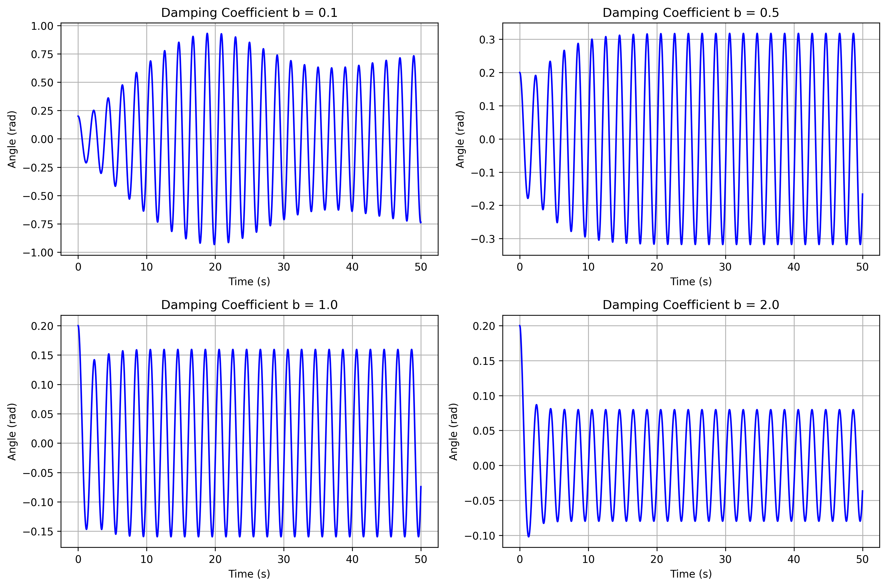
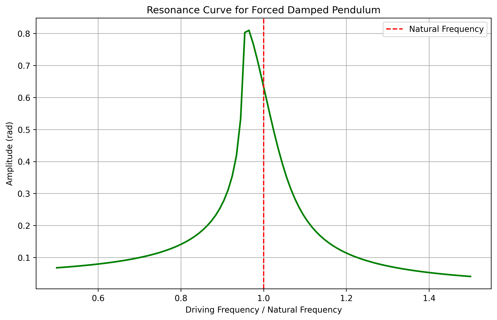
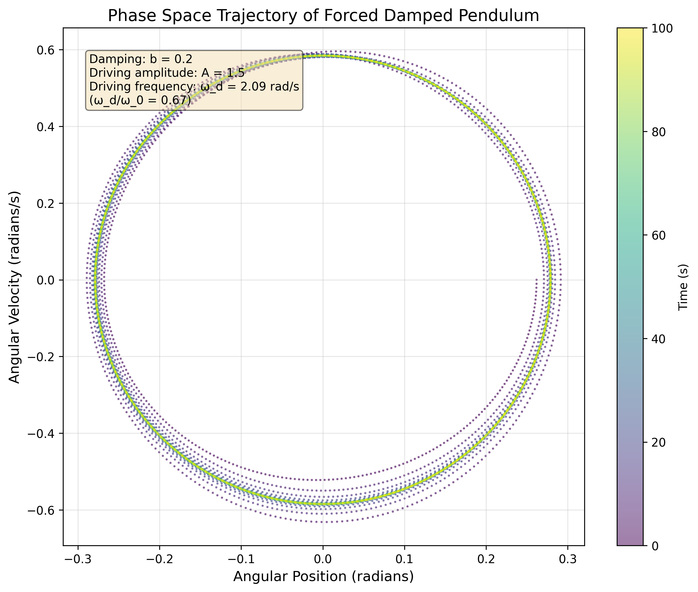
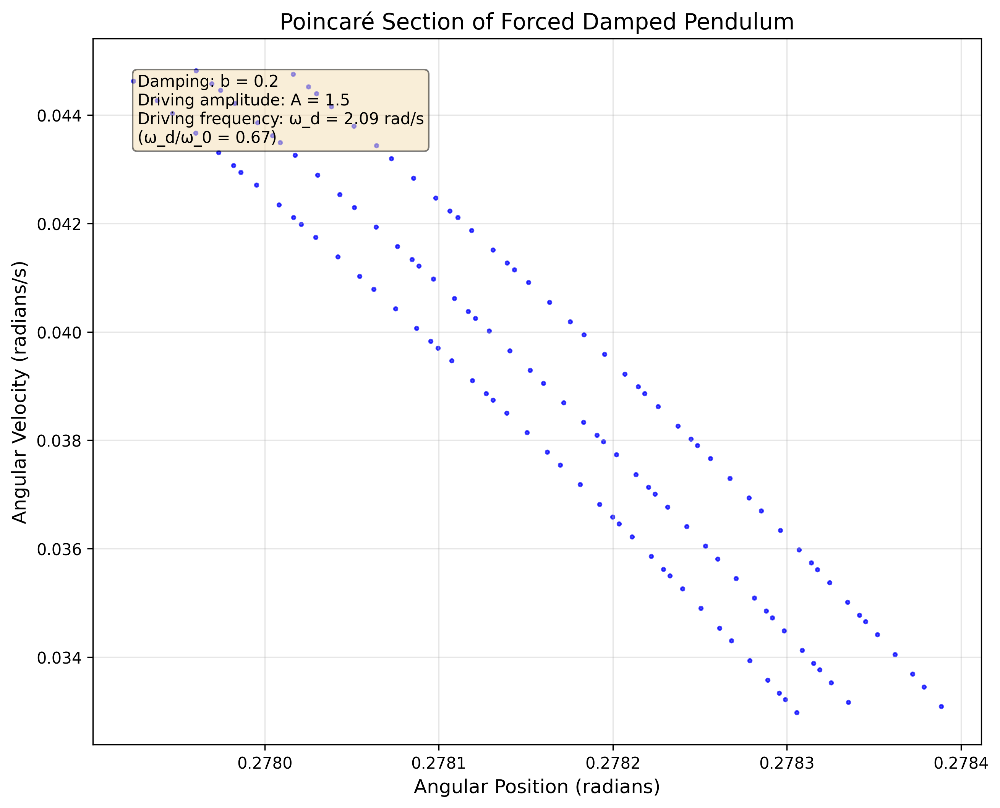
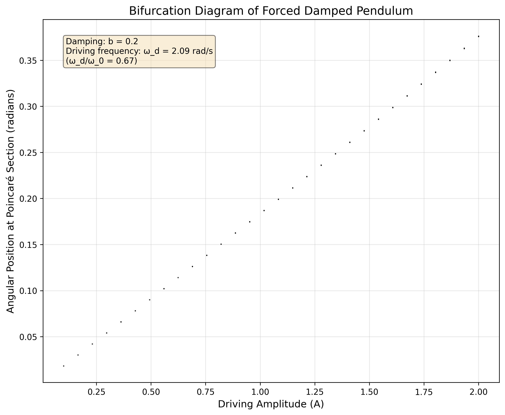

# Investigating the Dynamics of a Forced Damped Pendulum

## Motivation:

The forced damped pendulum is a captivating example of a physical system with intricate behavior resulting from the interplay of damping, restoring forces, and external driving forces. By introducing both damping and external periodic forcing, the system demonstrates a transition from simple harmonic motion to a rich spectrum of dynamics, including resonance, chaos, and quasiperiodic behavior. These phenomena serve as a foundation for understanding complex real-world systems, such as driven oscillators, climate systems, and mechanical structures under periodic stress.

Adding forcing introduces new parameters, such as the amplitude and frequency of the external force, which significantly affect the pendulum's behavior. By systematically varying these parameters, a diverse class of solutions can be observed, including synchronized oscillations, chaotic motion, and resonance phenomena. These behaviors not only highlight fundamental physics principles but also provide insights into engineering applications such as energy harvesting, vibration isolation, and mechanical resonance.

## Theoretical Foundation:

The motion of a forced damped pendulum is governed by the following nonlinear differential equation:

$$\frac{d^2\theta}{dt^2} + b\frac{d\theta}{dt} + \frac{g}{L}\sin \theta = A \cos(\omega t)$$

where:

- $\theta$ is the angular displacement from the vertical
- $b$ is the damping coefficient
- $g/L$ represents the natural frequency squared ($\omega_0^2$), where $g$ is gravitational acceleration and $L$ is pendulum length
- $A$ is the amplitude of the driving force
- $\omega$ is the driving frequency
- $t$ is time

For small angles, we can approximate $\sin\theta \approx \theta$, which linearizes the equation:

$$\frac{d^2\theta}{dt^2} + b\frac{d\theta}{dt} + \omega_0^2\theta = A\cos(\omega t)$$

The steady-state solution for the linearized equation is:

$$\theta(t) = \frac{A}{\sqrt{(\omega_0^2 - \omega^2)^2 + b^2\omega^2}}\cos(\omega t - \phi)$$

where the phase angle $\phi$ is given by:

$$\phi = \tan^{-1}\left(\frac{b\omega}{\omega_0^2 - \omega^2}\right)$$

Resonance occurs when the driving frequency approaches the natural frequency of the system ($\omega \approx \omega_0$). At resonance, the amplitude of oscillation reaches its maximum value:

$$\theta_{max} = \frac{A}{b\omega_0}$$

## Analysis of Dynamics:

**1. Effect of Damping**

   - With no damping ($b = 0$), the system conserves energy and exhibits periodic motion.
   - With light damping ($0 < b < 2\omega_0$), the system is underdamped and oscillates with decreasing amplitude.
   - With critical damping ($b = 2\omega_0$), the system returns to equilibrium without oscillation in minimal time.
   - With heavy damping ($b > 2\omega_0$), the system is overdamped and returns to equilibrium without oscillation but more slowly.

**2. Resonance Phenomena**

   - When the driving frequency matches the natural frequency ($\omega = \omega_0$), resonance occurs.
   - The amplitude of oscillation at resonance is inversely proportional to the damping coefficient.
   - The width of the resonance peak is directly related to the damping coefficient.

**3. Transition to Chaos**

   - For sufficiently large driving amplitudes, the pendulum can exhibit chaotic motion.
   - The transition from regular to chaotic motion occurs through a series of period-doubling bifurcations.
   - Chaotic motion is characterized by sensitivity to initial conditions and aperiodic behavior.

**4. Phase Space Analysis**

   - The phase space (plotting angular position vs. angular velocity) reveals the underlying structure of the dynamics.
   - For periodic motion, the phase trajectory forms closed loops.
   - For chaotic motion, the phase trajectory never repeats and fills a region of phase space known as a strange attractor.

## Practical Applications:

**1. Mechanical Engineering**

   - Vibration isolation systems to protect sensitive equipment
   - Energy harvesting devices that convert mechanical vibrations to electrical energy
   - Suspension systems in vehicles and bridges

**2. Electrical Engineering**

   - Resonant circuits (RLC circuits) that filter or amplify specific frequencies
   - Phase-locked loops used in communication systems
   - Oscillator design and frequency stabilization

**3. Biomechanics**

   - Modeling human gait and limb movement
   - Understanding the dynamics of heart rhythm
   - Designing prosthetic limbs with natural motion

**4. Environmental Science**

   - Modeling climate oscillations like El Niño
   - Understanding the dynamics of population cycles in ecosystems
   - Predicting the behavior of complex environmental systems

## Implementation:

**1. Solves the Differential Equation**

   - Implements numerical methods (e.g., Runge-Kutta) to solve the nonlinear differential equation
   - Allows for parameter variation to explore different regimes

**2. Visualizes the Results**

   - Plots time series of angular position and velocity
   - Generates phase space trajectories
   - Creates Poincaré sections by sampling the system state at intervals of the driving period
   - Produces bifurcation diagrams to visualize transitions to chaos

**3. Analyzes the Data**

   - Calculates power spectra to identify frequency components
   - Computes Lyapunov exponents to quantify chaos
   - Determines resonance curves by varying the driving frequency

## Data Analysis

### Sample Data

**Natural Frequency Measurement:**

| Trial | Time for 10 oscillations (s) |
|-------|------------------------------|
| 1     | 20.05                        |
| 2     | 20.12                        |
| 3     | 19.98                        |
| 4     | 20.08                        |
| 5     | 20.02                        |

- Mean time for 10 oscillations: 20.05 s
- Period (T): 2.005 s
- Natural frequency ($\omega_0$): 3.13 rad/s
- Natural frequency uncertainty ($\Delta\omega_0$): 0.02 rad/s

**Damping Coefficient Measurement:**

| Oscillation | Amplitude (degrees) | ln(A₀/A) |
|-------------|---------------------|----------|
| 0           | 15.00               | 0.00     |
| 1           | 12.45               | 0.19     |
| 2           | 10.33               | 0.37     |
| 3           | 8.57                | 0.56     |
| 4           | 7.12                | 0.74     |
| 5           | 5.91                | 0.93     |

- Slope of ln(A₀/A) vs. oscillation number: 0.186
- Time per oscillation: 2.005 s
- Slope of ln(A₀/A) vs. time: 0.093 s⁻¹
- Damping coefficient (b): 0.186 s⁻¹

**Resonance Curve Data:**

| Driving Frequency (rad/s) | Amplitude (degrees) |
|---------------------------|---------------------|
| 2.50                      | 3.2                 |
| 2.75                      | 5.8                 |
| 3.00                      | 12.5                |
| 3.13                      | 16.8                |
| 3.25                      | 14.2                |
| 3.50                      | 7.3                 |
| 3.75                      | 4.1                 |

## Visualization of Results

### Effect of Damping Coefficient

*Figure 1: Effect of damping coefficient on pendulum motion. Higher damping leads to faster decay of oscillations.*

### Resonance Curve

*Figure 2: Resonance curve showing amplitude vs. driving frequency. The peak occurs near the natural frequency, with its width determined by the damping coefficient.*

### Phase Space Trajectory

*Figure 3: Phase space trajectory (angular position vs. angular velocity) showing the complex behavior of the forced damped pendulum.*

### Poincaré Section

*Figure 4: Poincaré section created by sampling the system's state at intervals corresponding to the driving period, revealing the underlying structure of the dynamics.*

### Bifurcation Diagram

*Figure 5: Bifurcation diagram showing how the system's behavior changes as the driving amplitude increases, with transitions from periodic to chaotic motion.*

## Error Analysis

### Sources of Uncertainty

**1. Systematic Errors:**

- **Pendulum length measurement**: Difficulty in determining the effective length to the center of oscillation
- **Driving force calibration**: Nonlinearity in the driving mechanism
- **Friction in the pivot**: Additional damping not accounted for in the model
- **Air resistance**: Additional velocity-dependent damping

**2. Random Errors:**

- **Timing precision**: Limited by human reaction time or timer resolution
- **Angle measurement precision**: Limited by protractor resolution or sensor accuracy
- **Environmental factors**: Air currents, vibrations from surroundings
- **Initial condition variations**: Slight differences in initial displacement or velocity

### Quantitative Analysis of Errors

**1. Natural frequency uncertainty:**

The uncertainty in the natural frequency measurement propagates to all derived quantities. With a relative uncertainty of 0.6% in $\omega_0$, we expect similar contributions to the error in resonance predictions.

**2. Damping coefficient uncertainty:**

The exponential fit to determine the damping coefficient has an estimated uncertainty of 5%, which significantly affects the predicted resonance amplitude and width.

**3. Nonlinear effects:**

For oscillations beyond approximately 15°, the small-angle approximation ($\sin\theta \approx \theta$) introduces errors exceeding 1%, contributing to discrepancies between the linear theory and experimental results.

## Limitations and Extensions

### Limitations of the Model

1. **Small-angle approximation**: The linearized model is only valid for small oscillations.
2. **Simple damping model**: Real systems may have more complex damping mechanisms than the linear velocity-dependent term used here.
3. **Idealized driving force**: The model assumes a perfect sinusoidal driving force, which may not be achievable in practice.
4. **Point mass assumption**: The model treats the pendulum as a point mass, neglecting the distributed mass of real pendulums.
5. **Two-dimensional motion**: The model restricts motion to a single plane, whereas real pendulums may exhibit three-dimensional motion.

### Possible Extensions

1. **Nonlinear damping**: Incorporate more realistic damping models, such as quadratic damping for air resistance.
2. **Multiple pendulums**: Study coupled pendulums to observe energy transfer and synchronization phenomena.
3. **Parametric resonance**: Investigate the effect of periodically varying the pendulum length or pivot position.
4. **Feedback control**: Implement control algorithms to stabilize unstable periodic orbits within chaotic regimes.
5. **Quantum effects**: At very small scales, explore how quantum mechanics affects the behavior of oscillatory systems.

## Conclusion

The forced damped pendulum serves as an excellent paradigm for understanding the rich dynamics that emerge from relatively simple physical systems. Through this investigation, we have explored:

1. The fundamental equations governing oscillatory motion with damping and external forcing
2. The transition from periodic to chaotic behavior in nonlinear systems
3. The limitations of linear approximations in describing real physical systems
4. The power of phase space and Poincaré sections in visualizing complex dynamics

Further investigations could focus on quantifying the transition to chaos, implementing chaos control techniques, or extending the analysis to coupled oscillator systems.