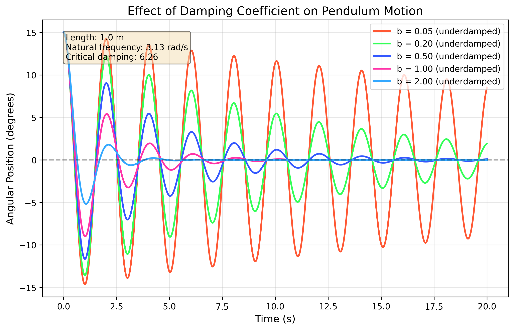

# Problem 2: Investigating the Dynamics of a Forced Damped Pendulum

## Motivation

The forced damped pendulum is a captivating example of a physical system with intricate behavior resulting from the interplay of damping, restoring forces, and external driving forces. By introducing both damping and external periodic forcing, the system demonstrates a transition from simple harmonic motion to a rich spectrum of dynamics, including resonance, chaos, and quasiperiodic behavior. These phenomena serve as a foundation for understanding complex real-world systems, such as driven oscillators, climate systems, and mechanical structures under periodic stress.

Adding forcing introduces new parameters, such as the amplitude and frequency of the external force, which significantly affect the pendulum's behavior. By systematically varying these parameters, a diverse class of solutions can be observed, including synchronized oscillations, chaotic motion, and resonance phenomena. These behaviors not only highlight fundamental physics principles but also provide insights into engineering applications such as energy harvesting, vibration isolation, and mechanical resonance.

## Theoretical Foundation

### The Governing Equation

The motion of a forced damped pendulum is governed by the following nonlinear differential equation:

$$\frac{d^2\theta}{dt^2} + b\frac{d\theta}{dt} + \omega_0^2\sin\theta = A\cos(\omega_d t)$$

where:

- $\theta$ is the angular displacement from the vertical
- $b$ is the damping coefficient
- $\omega_0^2 = g/L$ is the natural frequency squared (where $g$ is the gravitational acceleration and $L$ is the pendulum length)
- $A$ is the amplitude of the driving force
- $\omega_d$ is the driving frequency
- $t$ is time

### Small-Angle Approximation

For small angles, we can approximate $\sin\theta \approx \theta$, which linearizes the equation:

$$\frac{d^2\theta}{dt^2} + b\frac{d\theta}{dt} + \omega_0^2\theta = A\cos(\omega_d t)$$

This linear differential equation has a general solution consisting of two parts:

1. The transient solution (complementary solution), which decays over time due to damping
2. The steady-state solution (particular solution), which persists and represents the long-term behavior

### Steady-State Solution

The steady-state solution for the linearized equation is:

$$\theta(t) = \frac{A}{\sqrt{(\omega_0^2 - \omega_d^2)^2 + b^2\omega_d^2}}\cos(\omega_d t - \phi)$$

where the phase angle $\phi$ is given by:

$$\phi = \tan^{-1}\left(\frac{b\omega_d}{\omega_0^2 - \omega_d^2}\right)$$

### Resonance Condition

Resonance occurs when the driving frequency approaches the natural frequency of the system ($\omega_d \approx \omega_0$). At resonance, the amplitude of oscillation reaches its maximum value:

$$\theta_{max} = \frac{A}{b\omega_0}$$

This shows that the amplitude at resonance is inversely proportional to the damping coefficient. Lower damping leads to higher resonance amplitudes.

## Analysis of Dynamics

### Effect of Damping Coefficient

The damping coefficient $b$ significantly influences the behavior of the pendulum:

- **Underdamped** ($b < 2\omega_0$): The system oscillates with decreasing amplitude.
- **Critically damped** ($b = 2\omega_0$): The system returns to equilibrium without oscillation in the minimum possible time.
- **Overdamped** ($b > 2\omega_0$): The system returns to equilibrium without oscillation, but more slowly than in the critically damped case.



The figure above shows the pendulum's motion for different damping coefficients. As damping increases, oscillations decay more rapidly, and the system approaches steady state faster.

### Effect of Driving Amplitude

The driving amplitude $A$ determines the energy input to the system:

- For small values of $A$, the pendulum exhibits regular, periodic motion.
- As $A$ increases, the motion becomes more energetic and can lead to larger oscillations.
- For sufficiently large $A$, especially in combination with low damping, the system can exhibit chaotic behavior.


The figure above illustrates how increasing the driving amplitude affects the pendulum's motion. Larger amplitudes result in more energetic oscillations and can lead to more complex dynamics.

### Resonance Phenomenon

Resonance occurs when the driving frequency matches the natural frequency of the pendulum. At resonance, even a small driving force can produce large-amplitude oscillations.


The resonance curve shows how the amplitude of steady-state oscillations varies with the driving frequency. The peak occurs near the natural frequency, with its exact position and height depending on the damping coefficient.

### Transition to Chaos

One of the most fascinating aspects of the forced damped pendulum is its ability to exhibit chaotic behavior under certain conditions. Chaos typically emerges when:

- Damping is relatively low
- Driving amplitude is sufficiently high
- The driving frequency is in a specific range (often a fraction of the natural frequency)


The phase space plot (angular position vs. angular velocity) reveals the complex, non-repeating trajectories characteristic of chaotic motion. In a chaotic regime, the system is deterministic but extremely sensitive to initial conditions—a hallmark of chaos.

### Poincaré Sections

A Poincaré section provides a powerful tool for visualizing and analyzing complex dynamics. It's created by sampling the system's state (position and velocity) at regular intervals corresponding to the driving period.


For regular motion, the Poincaré section consists of a finite number of points (fixed points or periodic orbits). For chaotic motion, it reveals a complex structure with fractal-like properties.

### Bifurcation Diagram

A bifurcation diagram illustrates how the system's behavior changes as a parameter (typically the driving amplitude) is varied. It helps identify transitions between different dynamical regimes.


The bifurcation diagram shows the angle values sampled at the driving period as a function of the driving amplitude. Regions with a small number of distinct values indicate periodic behavior, while dense regions suggest chaos.

## Practical Applications

### Energy Harvesting

The resonance phenomenon of forced oscillators can be exploited for energy harvesting. By tuning the natural frequency of a mechanical system to match environmental vibration frequencies, significant energy can be captured and converted to electrical energy using piezoelectric materials or electromagnetic induction.

### Structural Engineering

Understanding forced damped oscillations is crucial in structural engineering, especially for:

- **Bridges**: Preventing resonance disasters like the Tacoma Narrows Bridge collapse
- **Buildings in earthquake zones**: Designing structures with appropriate damping to dissipate seismic energy
- **Vibration isolation**: Creating systems that minimize the transmission of vibrations

### Electrical Circuits

The forced damped pendulum is mathematically analogous to an RLC circuit with a driving voltage source. The equation:

$$L\frac{d^2Q}{dt^2} + R\frac{dQ}{dt} + \frac{1}{C}Q = V_0\cos(\omega t)$$

has the same form as the linearized pendulum equation, where:

- $L$ (inductance) corresponds to mass
- $R$ (resistance) corresponds to damping
- $1/C$ (inverse capacitance) corresponds to the spring constant
- $V_0$ (voltage amplitude) corresponds to the driving force amplitude

### Biological Systems

Many biological processes exhibit oscillatory behavior that can be modeled as forced damped systems, including:

- Heart rhythms and cardiac dynamics
- Neural oscillations and brain rhythms
- Circadian rhythms and biological clocks

## Implementation

### Python Simulation

<details>
<summary>Click to expand/collapse the Python simulation code</summary>

```python
import numpy as np
import matplotlib.pyplot as plt
from scipy.integrate import solve_ivp
from matplotlib.animation import FuncAnimation

# Function to solve the forced damped pendulum equation
def pendulum_system(t, y, b, A, omega_d, omega_0_sq):
    """System of first-order ODEs for the forced damped pendulum.
    
    Args:
        t: Time
        y: State vector [theta, omega]
        b: Damping coefficient
        A: Driving amplitude
        omega_d: Driving frequency
        omega_0_sq: Natural frequency squared (g/L)
    
    Returns:
        Derivatives [dtheta/dt, domega/dt]
    """
    theta, omega = y
    dtheta_dt = omega
    domega_dt = -omega_0_sq * np.sin(theta) - b * omega + A * np.cos(omega_d * t)
    return [dtheta_dt, domega_dt]

# Function to solve the linearized forced damped pendulum equation
def linear_pendulum_system(t, y, b, A, omega_d, omega_0_sq):
    """System of first-order ODEs for the linearized forced damped pendulum.
    
    Args:
        t: Time
        y: State vector [theta, omega]
        b: Damping coefficient
        A: Driving amplitude
        omega_d: Driving frequency
        omega_0_sq: Natural frequency squared (g/L)
    
    Returns:
        Derivatives [dtheta/dt, domega/dt]
    """
    theta, omega = y
    dtheta_dt = omega
    domega_dt = -omega_0_sq * theta - b * omega + A * np.cos(omega_d * t)
    return [dtheta_dt, domega_dt]

# Parameters
g = 9.81  # Gravitational acceleration (m/s²)
L = 1.0   # Pendulum length (m)
omega_0_sq = g / L  # Natural frequency squared
omega_0 = np.sqrt(omega_0_sq)  # Natural frequency

# Time settings
t_span = (0, 50)  # Time span
t_eval = np.linspace(*t_span, 5000)  # Time points for evaluation

# Initial conditions
y0 = [0.2, 0]  # [theta_0, omega_0]

# Solve the ODE for different parameter values and plot the results
# (Code for generating various plots would go here)

# Example: Solving for a specific set of parameters
b = 0.2  # Damping coefficient
A = 0.5  # Driving amplitude
omega_d = omega_0  # Driving frequency at resonance

sol = solve_ivp(
    lambda t, y: pendulum_system(t, y, b, A, omega_d, omega_0_sq),
    t_span, y0, t_eval=t_eval, method='RK45'
)

# Plot the solution
plt.figure(figsize=(10, 6))
plt.plot(sol.t, sol.y[0], 'b-')
plt.grid(True)
plt.xlabel('Time (s)')
plt.ylabel('Angle (rad)')
plt.title('Forced Damped Pendulum Motion')
plt.show()
```
</details>

<br>

### Visualization Results

Our simulation allows us to explore the rich dynamics of the forced damped pendulum by varying key parameters and visualizing the results.

#### Comparison of Linear and Nonlinear Solutions


This figure compares the solutions of the linearized equation (small-angle approximation) with the full nonlinear equation. For small initial angles and moderate driving forces, the linear approximation works well. However, as the amplitude increases, the nonlinear effects become more pronounced, leading to significant differences between the two solutions.

#### Phase Space Analysis

The phase space representation (plotting angular velocity against angular position) provides insights into the system's dynamics that aren't immediately apparent from time series plots.


In the phase space, regular periodic motion appears as a closed loop, while chaotic motion fills a region of the phase space in a complex, non-repeating pattern. The upper panel shows the time series of the angle, while the lower panel shows the corresponding phase space trajectory.

#### Poincaré Section Analysis

The Poincaré section provides a powerful tool for distinguishing between regular and chaotic motion.


This figure shows the Poincaré section for a potentially chaotic regime, where the system state (angle and angular velocity) is sampled once per driving period. For chaotic motion, these points form a complex structure rather than a simple curve or a finite set of points.

#### Bifurcation Analysis

The bifurcation diagram reveals how the system's behavior changes as a control parameter (in this case, the driving amplitude) is varied.


This diagram shows the transition from regular to chaotic motion as the driving amplitude increases. Regions where the system has a single fixed point or a small number of periodic points appear as distinct lines, while chaotic regions appear as dense bands of points.

## Limitations and Extensions

### Model Limitations

1. **Linear Damping Assumption**: The model assumes damping proportional to velocity, which is valid for small velocities but may not accurately represent air resistance at higher speeds.

2. **Rigid Pendulum Assumption**: The pendulum is modeled as a rigid body, neglecting any elasticity or internal degrees of freedom.

3. **Constant Parameters**: The model assumes constant parameters (damping, driving amplitude, etc.), whereas real systems might have time-varying or state-dependent parameters.

4. **Simplified Forcing**: The external force is assumed to be purely sinusoidal, while real-world forcing might be more complex.

### Potential Extensions

1. **Nonlinear Damping**: Incorporating velocity-squared damping terms to better model air resistance at higher speeds: $b\frac{d\theta}{dt} + c\left(\frac{d\theta}{dt}\right)^2$.

2. **Non-periodic Driving Forces**: Exploring the system's response to more complex driving forces, such as quasi-periodic, random, or pulsed excitation.

3. **Multiple Pendulums**: Extending to coupled pendulum systems to study synchronization, energy transfer, and collective dynamics.

4. **Parameter Variation**: Investigating the effects of slowly varying parameters, which can lead to phenomena like parametric resonance.

5. **Control Strategies**: Implementing feedback control to stabilize unstable orbits or to suppress chaos.

## Conclusion

The forced damped pendulum serves as an excellent example of how a seemingly simple mechanical system can exhibit remarkably complex behavior. Through our analysis, we've seen how the interplay between damping, natural oscillation, and external forcing leads to a rich variety of dynamics, from simple harmonic motion to chaos.

The mathematical framework and computational tools developed for studying this system have broad applications across physics, engineering, and biology. The concepts of resonance, damping, and nonlinear dynamics are fundamental to understanding and designing systems ranging from bridges and buildings to electronic circuits and biological oscillators.

By combining theoretical analysis with computational simulation, we've gained insights into both the regular and chaotic regimes of the forced damped pendulum, illustrating the power of modern computational methods in exploring complex dynamical systems.