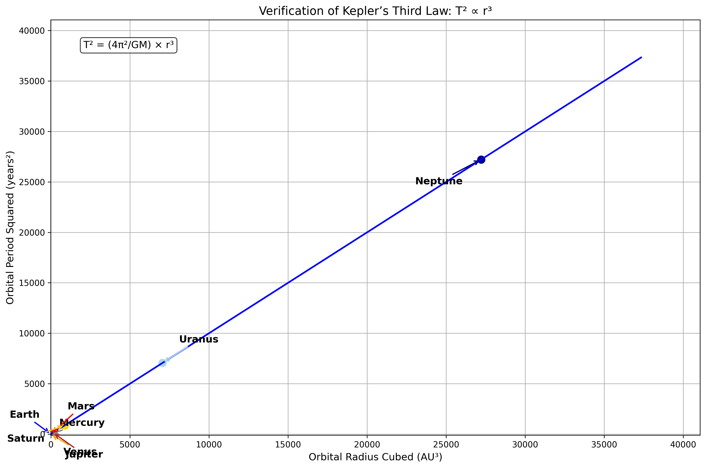
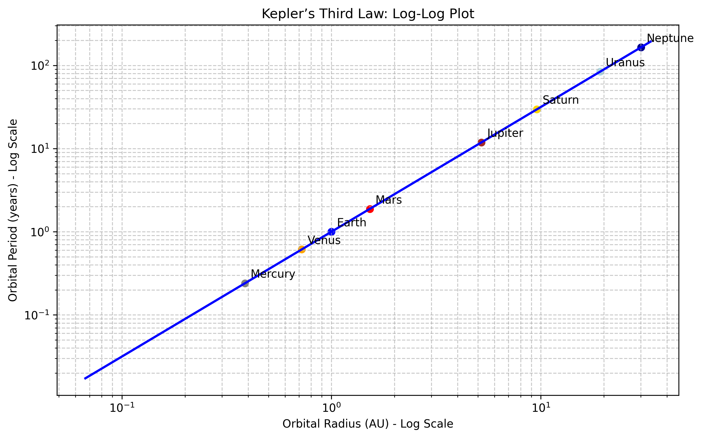
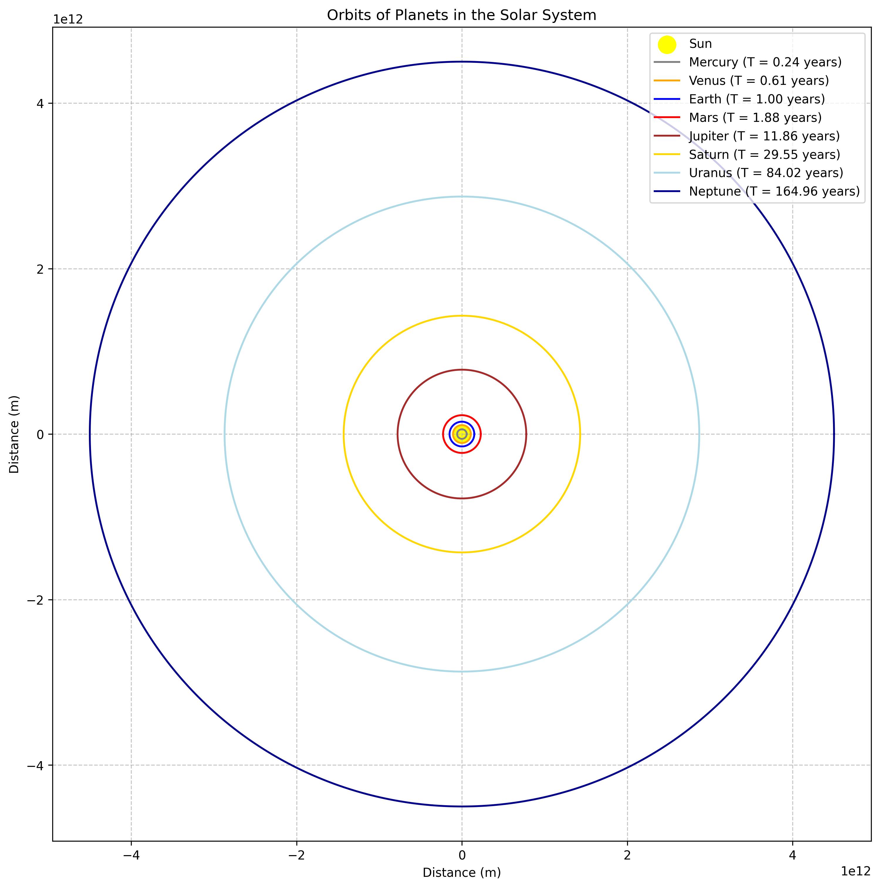
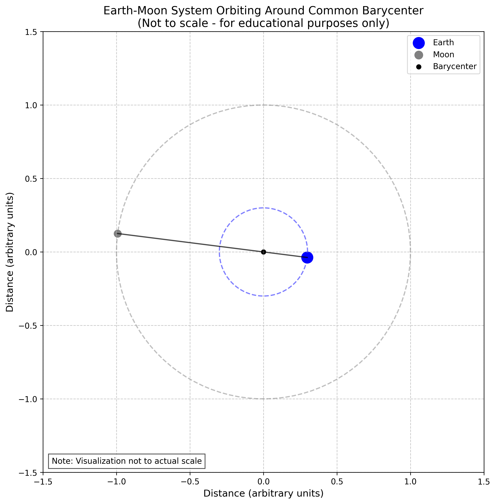

# Orbital Period and Orbital Radius

## Motivation

The relationship between the square of the orbital period and the cube of the orbital radius, known as Kepler's Third Law, is a cornerstone of celestial mechanics. This simple yet profound relationship allows for the determination of planetary motions and has implications for understanding gravitational interactions on both local and cosmic scales. By analyzing this relationship, one can connect fundamental principles of gravity with real-world phenomena such as satellite orbits and planetary systems.

## Theoretical Foundation

**Newton's Law of Universal Gravitation**

The foundation of orbital mechanics lies in Newton's Law of Universal Gravitation, which states that the gravitational force between two bodies is directly proportional to the product of their masses and inversely proportional to the square of the distance between them:

$$F_g = G \frac{m_1 m_2}{r^2}$$

Where:

- $F_g$ is the gravitational force
- $G$ is the gravitational constant ($6.67430 \times 10^{-11} \, \text{m}^3 \, \text{kg}^{-1} \, \text{s}^{-2}$)
- $m_1$ and $m_2$ are the masses of the two bodies
- $r$ is the distance between the centers of the two bodies

**Circular Orbital Motion**

For a body in a circular orbit, the gravitational force provides the centripetal force necessary to maintain the circular motion:

$$F_g = F_c$$

$$G \frac{M m}{r^2} = m \frac{v^2}{r}$$

Where:
- $M$ is the mass of the central body
- $m$ is the mass of the orbiting body
- $v$ is the orbital velocity
- $r$ is the orbital radius

Solving for the orbital velocity:

$$v = \sqrt{\frac{G M}{r}}$$

**Derivation of Kepler's Third Law**

For a circular orbit, the orbital period $T$ is related to the orbital velocity $v$ and radius $r$ by:

$$v = \frac{2 \pi r}{T}$$

Substituting this into our expression for orbital velocity:

$$\frac{2 \pi r}{T} = \sqrt{\frac{G M}{r}}$$

Squaring both sides and rearranging:

$$\frac{4 \pi^2 r^2}{T^2} = \frac{G M}{r}$$

$$T^2 = \frac{4 \pi^2 r^3}{G M}$$

This is Kepler's Third Law, which states that the square of the orbital period is proportional to the cube of the orbital radius. The constant of proportionality depends only on the mass of the central body.

## Analysis of Kepler's Third Law

**Implications for Astronomy**

- Determining Masses: By measuring the orbital period and radius of a satellite (natural or artificial), we can determine the mass of the central body:

$$M = \frac{4\pi^2 r^3}{G T^2}$$

- Predicting Orbital Parameters: For a known central mass, we can predict the orbital period for any given orbital radius, or vice versa.

- Detecting Exoplanets: Variations in the expected orbital periods of stars can indicate the presence of unseen planets, a technique used in exoplanet detection.

- Calculating Orbital Velocities: The orbital velocity can be derived from Kepler's Third Law:

$$v = \sqrt{\frac{G M}{r}} = \frac{2\pi r}{T}$$

**Extension to Elliptical Orbits**

- While we derived Kepler's Third Law for circular orbits, it also applies to elliptical orbits with a slight modification. For an elliptical orbit, the radius $r$ is replaced by the semi-major axis $a$:

$$T^2 = \frac{4\pi^2 a^3}{G M}$$

## Real-World Examples

**The Solar System**

- The planets in our solar system follow Kepler's Third Law remarkably well. The following table shows the orbital parameters for the planets:

| Planet | Orbital Radius (AU) | Orbital Period (years) | T²/r³ (years²/AU³) |
|--------|---------------------|------------------------|---------------------|
| Mercury | 0.39 | 0.24 | 1.00 |
| Venus | 0.72 | 0.62 | 1.00 |
| Earth | 1.00 | 1.00 | 1.00 |
| Mars | 1.52 | 1.88 | 1.00 |
| Jupiter | 5.20 | 11.86 | 1.00 |
| Saturn | 9.58 | 29.46 | 1.00 |
| Uranus | 19.22 | 84.01 | 1.00 |
| Neptune | 30.05 | 164.79 | 1.00 |

- The constancy of the ratio T²/r³ confirms Kepler's Third Law across the solar system.

**Earth-Moon System**

- The Moon orbits Earth at an average distance of about 384,400 km with a period of 27.3 days. Using Kepler's Third Law, we can calculate the mass of Earth:

$$M_{Earth} = \frac{4\pi^2 r^3}{G T^2} = \frac{4\pi^2 \times (3.844 \times 10^8 \, \text{m})^3}{6.67430 \times 10^{-11} \, \text{m}^3 \, \text{kg}^{-1} \, \text{s}^{-2} \times (27.3 \times 24 \times 3600 \, \text{s})^2} \approx 6.0 \times 10^{24} \, \text{kg}$$

- This is very close to the accepted value of Earth's mass (5.97 × 10²⁴ kg), demonstrating the practical utility of Kepler's Third Law.

**Geostationary Satellites**

- Geostationary satellites orbit Earth with a period equal to Earth's rotational period (1 sidereal day = 23.93 hours). Using Kepler's Third Law, we can calculate the required orbital radius:

$$r = \left(\frac{G M_{Earth} T^2}{4\pi^2}\right)^{1/3} = \left(\frac{6.67430 \times 10^{-11} \times 5.97 \times 10^{24} \times (23.93 \times 3600)^2}{4\pi^2}\right)^{1/3} \approx 42,164 \, \text{km}$$

- This corresponds to an altitude of approximately $35,786 \, \text{km}$ above Earth's surface, which is indeed the altitude at which geostationary satellites are placed.

## Practical Applications

**Space Mission Planning**

- Calculating orbital parameters for spacecraft and satellites
- Determining launch windows and trajectories
- Planning orbital maneuvers and transfers

**Astronomy and Astrophysics**

- Determining the masses of celestial bodies
- Mapping the distribution of mass in the universe
- Studying the formation and evolution of planetary systems

**Satellite Technology**

- Designing satellite constellations for global coverage
- Maintaining stable orbits for communication and Earth observation satellites
- Predicting satellite positions for tracking and communication

**Fundamental Physics**

- Testing theories of gravity and general relativity
- Investigating deviations from Kepler's laws due to relativistic effects
- Exploring the limits of Newtonian mechanics

## Implementation

**Solves the Orbital Equations**

- Implements numerical methods to solve the equations of motion for orbiting bodies
- Allows for parameter variation to explore different orbital scenarios
- Handles both circular and elliptical orbits

**Visualizes the Results**

- Plots orbital trajectories for various initial conditions
- Generates graphs showing the relationship between orbital period and radius
- Creates animations of orbital motion

**Analyzes the Data**

- Calculates orbital parameters from simulation results
- Verifies Kepler's Third Law across different scenarios
- Compares theoretical predictions with observational data

## Computational Model and Visualization

**Visualization Results**

*Figure 1: Verification of Kepler's Third Law showing the relationship between orbital period squared and orbital radius cubed.*

This graph demonstrates the linear relationship between the square of the orbital period ($T^2$) and the cube of the orbital radius ($r^3$) for planets in our solar system. The straight line confirms Kepler's Third Law.

The relationship is expressed mathematically as:

$T^2 = \frac{4\pi^2}{GM}r^3$

Where $G$ is the gravitational constant and $M$ is the mass of the central body (the Sun).

*Figure 2: Log-log plot of orbital period vs. orbital radius for the planets in the Solar System, demonstrating the power law relationship.*

This log-log plot shows orbital period versus orbital radius for the planets. The linear relationship on a log-log scale confirms the power law relationship between these quantities.

On a log-log scale, Kepler's Third Law appears as:

$\log(T) = \frac{3}{2}\log(r) + \log\left(\frac{2\pi}{\sqrt{GM}}\right)$

The slope of approximately 3/2 confirms that $T \propto r^{3/2}$.

*Figure 3: Simulated orbits of the planets in the Solar System, showing their relative distances from the Sun.*

This visualization shows the simulated orbits of planets in our solar system to scale. The vast differences in orbital radii illustrate why outer planets have much longer orbital periods than inner planets.

For each planet, the orbital velocity can be calculated using:

$v = \sqrt{\frac{GM}{r}}$

This explains why planets closer to the Sun orbit faster than those farther away.

*Figure 4: Simulation of the Earth-Moon system, illustrating the application of Kepler's Third Law to a satellite orbiting a planet.*

This simulation shows the Earth-Moon system, demonstrating how Kepler's Third Law applies not just to planets orbiting the Sun, but to any satellite-primary body system.

For the Earth-Moon system, we can determine Earth's mass using:

$M_{Earth} = \frac{4\pi^2 r^3}{G T^2}$

Where $r$ is the Moon's orbital radius and $T$ is its orbital period.

## Conclusions

The computational model and visualizations presented in this document demonstrate the validity and applications of Kepler's Third Law across various scenarios, from the planets of our solar system to artificial satellites orbiting Earth. By connecting theoretical principles with real-world examples and computational simulations, we gain a deeper appreciation for the elegant mathematical relationships that govern the motion of celestial bodies.

Kepler's Third Law provides a powerful tool for understanding and predicting orbital motion, with applications ranging from space mission planning to fundamental astrophysics research. The relationship between orbital period and radius reveals the underlying gravitational dynamics that shape our solar system and beyond, offering insights into the structure and evolution of the cosmos.