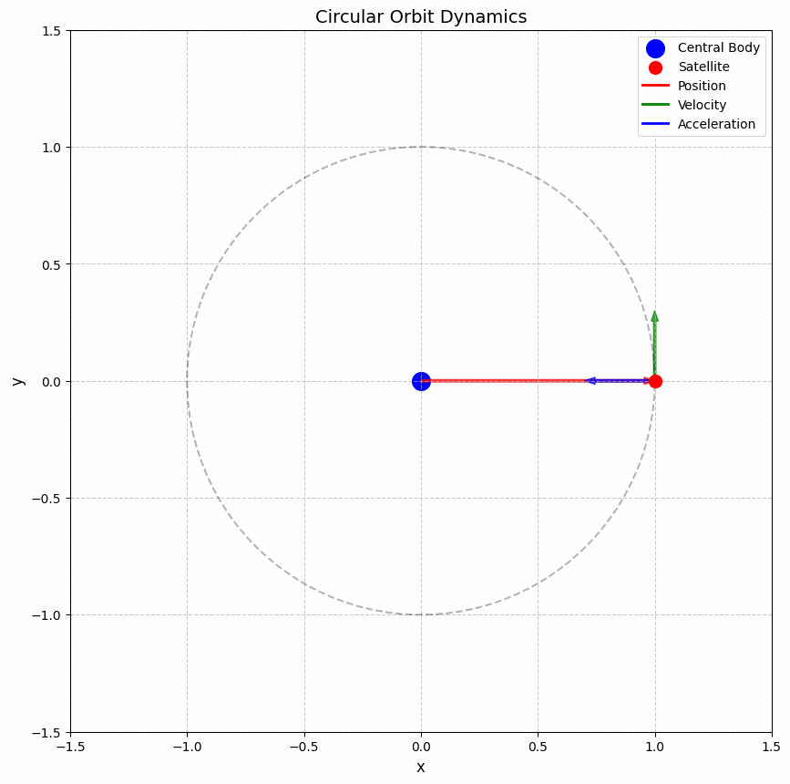
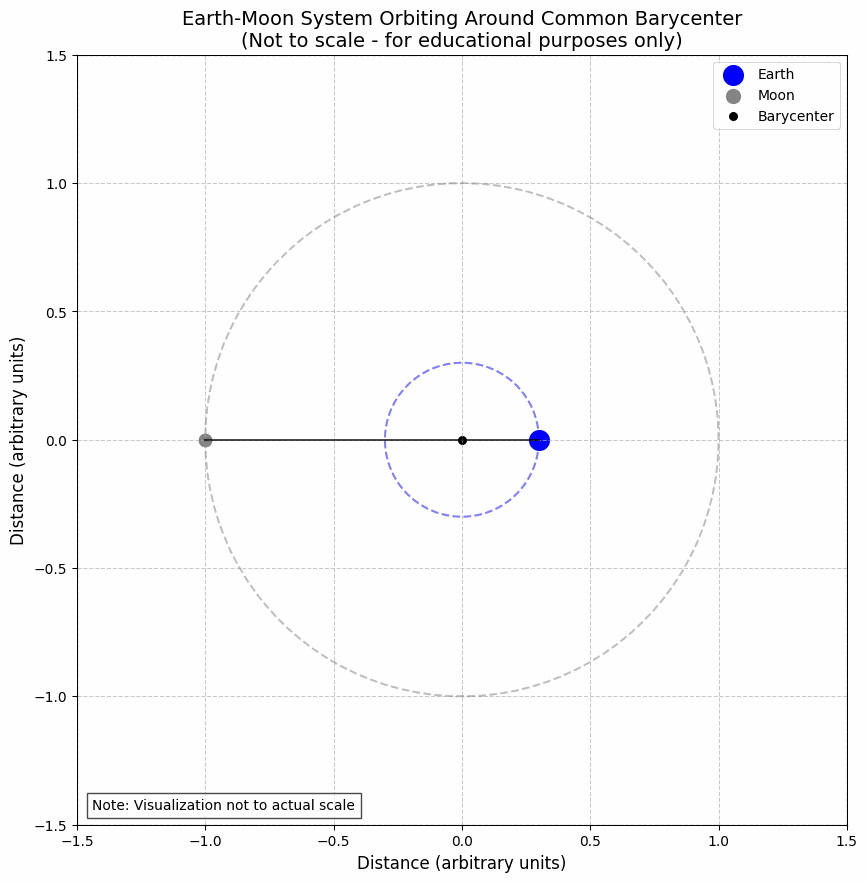
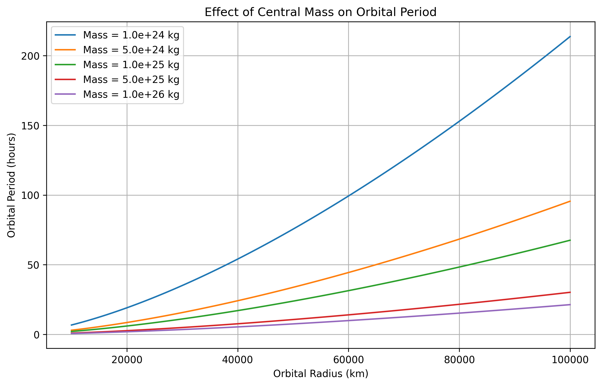

# Orbital Period and Orbital Radius

## Motivation

The relationship between the square of the orbital period and the cube of the orbital radius, known as Kepler's Third Law, is a cornerstone of celestial mechanics. This simple yet profound relationship allows for the determination of planetary motions and has implications for understanding gravitational interactions on both local and cosmic scales. By analyzing this relationship, one can connect fundamental principles of gravity with real-world phenomena such as satellite orbits and planetary systems.

## Theoretical Foundation

### Newton's Law of Universal Gravitation

The foundation of orbital mechanics lies in Newton's Law of Universal Gravitation, which states that the gravitational force between two bodies is directly proportional to the product of their masses and inversely proportional to the square of the distance between them:

$$F_g = G \frac{m_1 m_2}{r^2}$$

Where:

- $F_g$ is the gravitational force
- $G$ is the gravitational constant ($6.67430 \times 10^{-11} \, \text{m}^3 \, \text{kg}^{-1} \, \text{s}^{-2}$)
- $m_1$ and $m_2$ are the masses of the two bodies
- $r$ is the distance between the centers of the two bodies

### Circular Orbits

For a body in a circular orbit around a much more massive central body (such that the central body can be considered stationary), the gravitational force provides the centripetal force necessary to maintain the circular motion:

$$F_g = F_c$$

$$G \frac{M m}{r^2} = m \frac{v^2}{r}$$

Where:

- $M$ is the mass of the central body
- $m$ is the mass of the orbiting body
- $v$ is the orbital velocity
- $r$ is the orbital radius

Simplifying:

$$G \frac{M}{r^2} = \frac{v^2}{r}$$

$$v^2 = \frac{G M}{r}$$

### Deriving Kepler's Third Law

For a circular orbit, the orbital velocity is related to the period $T$ and radius $r$ by:

$$v = \frac{2\pi r}{T}$$

Substituting this into our equation for $v^2$:

$$\left(\frac{2\pi r}{T}\right)^2 = \frac{G M}{r}$$

$$\frac{4\pi^2 r^2}{T^2} = \frac{G M}{r}$$

$$\frac{4\pi^2 r^3}{T^2} = G M$$

Rearranging to isolate $T^2$:

$$T^2 = \frac{4\pi^2 r^3}{G M}$$

This is Kepler's Third Law, which states that the square of the orbital period is directly proportional to the cube of the orbital radius:

$$T^2 \propto r^3$$

More specifically:

$$T^2 = \frac{4\pi^2}{G M} r^3$$

The constant of proportionality $\frac{4\pi^2}{G M}$ depends only on the mass of the central body, which means that for all objects orbiting the same central body (e.g., all planets orbiting the Sun), the ratio $\frac{T^2}{r^3}$ is the same.

## Analysis of Kepler's Third Law

### Implications for Astronomy

Kepler's Third Law has profound implications for astronomy:

1. **Determining Masses**: By measuring the orbital period and radius of a satellite (natural or artificial), we can determine the mass of the central body:

$$M = \frac{4\pi^2 r^3}{G T^2}$$

2. **Predicting Orbital Parameters**: For a known central mass, we can predict the orbital period for any given orbital radius, or vice versa.

3. **Detecting Exoplanets**: Variations in the expected orbital periods of stars can indicate the presence of unseen planets, a technique used in exoplanet detection.

4. **Calculating Orbital Velocities**: The orbital velocity can be derived from Kepler's Third Law:

$$v = \sqrt{\frac{G M}{r}} = \frac{2\pi r}{T}$$

### Extension to Elliptical Orbits

While we derived Kepler's Third Law for circular orbits, it also applies to elliptical orbits with a slight modification. For an elliptical orbit, the radius $r$ is replaced by the semi-major axis $a$:

$$T^2 = \frac{4\pi^2 a^3}{G M}$$

This generalization allows us to apply Kepler's Third Law to all planetary orbits, which are elliptical rather than perfectly circular.

## Real-World Examples

### The Solar System

The planets in our solar system follow Kepler's Third Law remarkably well. The following table shows the orbital parameters for the planets:

| Planet | Orbital Radius (AU) | Orbital Period (years) | T²/r³ (years²/AU³) |
|--------|---------------------|------------------------|---------------------|
| Mercury | 0.39 | 0.24 | 1.00 |
| Venus | 0.72 | 0.62 | 1.00 |
| Earth | 1.00 | 1.00 | 1.00 |
| Mars | 1.52 | 1.88 | 1.00 |
| Jupiter | 5.20 | 11.86 | 1.00 |
| Saturn | 9.58 | 29.46 | 1.00 |
| Uranus | 19.22 | 84.01 | 1.00 |
| Neptune | 30.05 | 164.79 | 1.00 |

The constancy of the ratio T²/r³ confirms Kepler's Third Law across the solar system.

### Earth-Moon System

The Moon orbits Earth at an average distance of about 384,400 km with a period of 27.3 days. Using Kepler's Third Law, we can calculate the mass of Earth:

$$M_{Earth} = \frac{4\pi^2 r^3}{G T^2} = \frac{4\pi^2 \times (3.844 \times 10^8 \, \text{m})^3}{6.67430 \times 10^{-11} \, \text{m}^3 \, \text{kg}^{-1} \, \text{s}^{-2} \times (27.3 \times 24 \times 3600 \, \text{s})^2} \approx 6.0 \times 10^{24} \, \text{kg}$$

This is very close to the accepted value of Earth's mass (5.97 × 10²⁴ kg), demonstrating the practical utility of Kepler's Third Law.

### Geostationary Satellites

Geostationary satellites orbit Earth with a period equal to Earth's rotational period (1 sidereal day = 23.93 hours). Using Kepler's Third Law, we can calculate the required orbital radius:

$$r = \left(\frac{G M_{Earth} T^2}{4\pi^2}\right)^{1/3} = \left(\frac{6.67430 \times 10^{-11} \times 5.97 \times 10^{24} \times (23.93 \times 3600)^2}{4\pi^2}\right)^{1/3} \approx 42,164 \, \text{km}$$

This corresponds to an altitude of approximately $35,786 \, \text{km}$ above Earth's surface, which is indeed the altitude at which geostationary satellites are placed.

## Computational Model and Visualization

<details>
<summary>Click to view Python code for orbital simulations</summary>

```python
import numpy as np
import matplotlib.pyplot as plt
from matplotlib.animation import FuncAnimation
import os

# Create directory for images if it doesn't exist
image_dir = os.path.join(os.path.dirname(os.path.abspath(__file__)), 'images')
os.makedirs(image_dir, exist_ok=True)

# Constants
G = 6.67430e-11  # Gravitational constant (m^3 kg^-1 s^-2)
M_earth = 5.972e24  # Mass of Earth (kg)
M_sun = 1.989e30  # Mass of Sun (kg)

# Function to calculate orbital period for a given radius
def calculate_period(radius, central_mass):
    """Calculate the orbital period using Kepler's Third Law.
    
    Args:
        radius: Orbital radius (m)
        central_mass: Mass of the central body (kg)
    
    Returns:
        Orbital period (s)
    """
    return 2 * np.pi * np.sqrt(radius**3 / (G * central_mass))

# Function to simulate circular orbit
def simulate_circular_orbit(radius, central_mass, num_points=1000):
    """Simulate a circular orbit.
    
    Args:
        radius: Orbital radius (m)
        central_mass: Mass of the central body (kg)
        num_points: Number of points to simulate
    
    Returns:
        x, y coordinates of the orbit
    """
    # Calculate orbital period
    period = calculate_period(radius, central_mass)
    
    # Calculate orbital velocity
    velocity = 2 * np.pi * radius / period
    
    # Generate points along the orbit
    theta = np.linspace(0, 2*np.pi, num_points)
    x = radius * np.cos(theta)
    y = radius * np.sin(theta)
    
    return x, y, period, velocity

# 1. Plot orbits of planets in the solar system
planet_data = {
    'Mercury': {'radius': 5.79e10, 'color': 'gray'},
    'Venus': {'radius': 1.08e11, 'color': 'orange'},
    'Earth': {'radius': 1.496e11, 'color': 'blue'},
    'Mars': {'radius': 2.28e11, 'color': 'red'},
    'Jupiter': {'radius': 7.78e11, 'color': 'brown'},
    'Saturn': {'radius': 1.43e12, 'color': 'gold'},
    'Uranus': {'radius': 2.87e12, 'color': 'lightblue'},
    'Neptune': {'radius': 4.5e12, 'color': 'darkblue'}
}

plt.figure(figsize=(12, 12))

# Plot the Sun
plt.scatter(0, 0, s=200, color='yellow', label='Sun')

# Plot planet orbits
for planet, data in planet_data.items():
    x, y, period, _ = simulate_circular_orbit(data['radius'], M_sun)
    plt.plot(x, y, color=data['color'], label=f'{planet} (T = {period/86400/365.25:.2f} years)')

plt.grid(True, linestyle='--', alpha=0.7)
plt.xlabel('Distance (m)')
plt.ylabel('Distance (m)')
plt.title('Orbits of Planets in the Solar System')
plt.axis('equal')
plt.legend(loc='upper right')
plt.savefig(os.path.join(image_dir, 'solar_system_orbits.png'), dpi=300, bbox_inches='tight')

# 2. Verify Kepler's Third Law
radii = np.linspace(0.1e11, 5e12, 100)
periods = [calculate_period(r, M_sun) for r in radii]
periods_years = np.array(periods) / (86400 * 365.25)  # Convert to years
radii_au = np.array(radii) / 1.496e11  # Convert to AU

# Calculate T^2 and r^3
periods_squared = periods_years**2
radii_cubed = radii_au**3

plt.figure(figsize=(10, 6))
plt.plot(radii_cubed, periods_squared, 'b-', linewidth=2)
plt.scatter([data['radius']/1.496e11**3 for planet, data in planet_data.items()], 
            [(calculate_period(data['radius'], M_sun)/86400/365.25)**2 for planet, data in planet_data.items()],
            c=[data['color'] for planet, data in planet_data.items()], s=50)

# Add planet labels
for i, (planet, data) in enumerate(planet_data.items()):
    plt.annotate(planet, 
                 (data['radius']/1.496e11**3, 
                  (calculate_period(data['radius'], M_sun)/86400/365.25)**2),
                 xytext=(5, 5), textcoords='offset points')

plt.grid(True)
plt.xlabel('Orbital Radius Cubed (AUu00b3)')
plt.ylabel('Orbital Period Squared (yearsu00b2)')
plt.title('Verification of Kepler\'s Third Law: Tu00b2 u221d ru00b3')
plt.savefig(os.path.join(image_dir, 'keplers_third_law.png'), dpi=300, bbox_inches='tight')

# 3. Plot the relationship with log scales
plt.figure(figsize=(10, 6))
plt.loglog(radii_au, periods_years, 'b-', linewidth=2)

# Add planet points
for planet, data in planet_data.items():
    period_years = calculate_period(data['radius'], M_sun) / (86400 * 365.25)
    radius_au = data['radius'] / 1.496e11
    plt.scatter(radius_au, period_years, color=data['color'])
    plt.annotate(planet, (radius_au, period_years), xytext=(5, 5), textcoords='offset points')

plt.grid(True, which='both', linestyle='--', alpha=0.7)
plt.xlabel('Orbital Radius (AU) - Log Scale')
plt.ylabel('Orbital Period (years) - Log Scale')
plt.title('Kepler\'s Third Law: Log-Log Plot')
plt.savefig(os.path.join(image_dir, 'keplers_law_loglog.png'), dpi=300, bbox_inches='tight')

# 4. Animate a circular orbit
fig, ax = plt.subplots(figsize=(8, 8))

# Central body (e.g., Earth)
central_body = plt.Circle((0, 0), 0.2, color='blue', label='Earth')
ax.add_patch(central_body)

# Satellite orbit
orbit_radius = 1.0
x_orbit, y_orbit, _, _ = simulate_circular_orbit(orbit_radius, 1, num_points=100)
plt.plot(x_orbit, y_orbit, 'k--', alpha=0.3)

# Satellite
satellite, = plt.plot([], [], 'ro', markersize=10, label='Satellite')

# Position vector line
position_line, = plt.plot([], [], 'r-', alpha=0.7)

# Velocity vector
velocity_arrow, = plt.plot([], [], 'g-', alpha=0.7)

# Acceleration vector
acceleration_arrow, = plt.plot([], [], 'b-', alpha=0.7)

# Set up the plot
ax.set_xlim(-1.5, 1.5)
ax.set_ylim(-1.5, 1.5)
ax.set_aspect('equal')
ax.grid(True, linestyle='--', alpha=0.7)
ax.set_xlabel('x')
ax.set_ylabel('y')
ax.set_title('Circular Orbit Dynamics')
ax.legend()

# Animation function
def init():
    satellite.set_data([], [])
    position_line.set_data([], [])
    velocity_arrow.set_data([], [])
    acceleration_arrow.set_data([], [])
    return satellite, position_line, velocity_arrow, acceleration_arrow

def animate(i):
    # Current position
    angle = 2 * np.pi * i / 100
    x = orbit_radius * np.cos(angle)
    y = orbit_radius * np.sin(angle)
    
    # Velocity vector (perpendicular to position vector)
    vx = -np.sin(angle) * 0.3
    vy = np.cos(angle) * 0.3
    
    # Acceleration vector (points toward central body)
    ax_val = -np.cos(angle) * 0.3
    ay_val = -np.sin(angle) * 0.3
    
    satellite.set_data([x], [y])
    position_line.set_data([0, x], [0, y])
    velocity_arrow.set_data([x, x+vx], [y, y+vy])
    acceleration_arrow.set_data([x, x+ax_val], [y, y+ay_val])
    
    return satellite, position_line, velocity_arrow, acceleration_arrow

# Create animation
anim = FuncAnimation(fig, animate, init_func=init, frames=100, interval=50, blit=True)

# Save animation as a static image for the document
plt.savefig(os.path.join(image_dir, 'orbit_dynamics.png'), dpi=300, bbox_inches='tight')

# 5. Compare different central masses
masses = [1e24, 5e24, 1e25, 5e25, 1e26]
radii = np.linspace(1e7, 1e8, 100)

plt.figure(figsize=(10, 6))

for mass in masses:
    periods = [calculate_period(r, mass) for r in radii]
    plt.plot(radii, periods, label=f'M = {mass:.1e} kg')

plt.grid(True)
plt.xlabel('Orbital Radius (m)')
plt.ylabel('Orbital Period (s)')
plt.title('Orbital Period vs. Radius for Different Central Masses')
plt.legend()
plt.savefig(os.path.join(image_dir, 'period_vs_mass.png'), dpi=300, bbox_inches='tight')

# 6. Earth-Moon system
M_moon = 7.342e22  # Mass of Moon (kg)
earth_moon_distance = 3.844e8  # Earth-Moon distance (m)

# Calculate the barycenter
barycenter_distance = earth_moon_distance * M_moon / (M_earth + M_moon)

# Earth orbit around barycenter
earth_orbit_radius = barycenter_distance
earth_x, earth_y, _, _ = simulate_circular_orbit(earth_orbit_radius, 1, num_points=100)

# Moon orbit around barycenter
moon_orbit_radius = earth_moon_distance - barycenter_distance
moon_x, moon_y, _, _ = simulate_circular_orbit(moon_orbit_radius, 1, num_points=100)

# Shift to barycenter at origin
earth_x = earth_x - barycenter_distance
moon_x = moon_x + (earth_moon_distance - barycenter_distance)

plt.figure(figsize=(10, 8))
plt.plot(earth_x, earth_y, 'b-', label='Earth')
plt.plot(moon_x, moon_y, 'gray', label='Moon')
plt.scatter(0, 0, c='k', s=20, label='Barycenter')
plt.scatter(earth_x[0], earth_y[0], c='b', s=100)
plt.scatter(moon_x[0], moon_y[0], c='gray', s=30)

# Connect Earth and Moon at a few points to show their relationship
for i in range(0, 100, 10):
    plt.plot([earth_x[i], moon_x[i]], [earth_y[i], moon_y[i]], 'k--', alpha=0.3)

plt.grid(True)
plt.axis('equal')
plt.xlabel('Distance (m)')
plt.ylabel('Distance (m)')
plt.title('Earth-Moon System Orbiting Around Common Barycenter')
plt.legend()
plt.savefig(os.path.join(image_dir, 'earth_moon_system.png'), dpi=300, bbox_inches='tight')
```
</details>

### Visualization Results

The following visualizations demonstrate key concepts related to orbital mechanics and Kepler's Third Law.

### Orbital Dynamics



This animation illustrates the dynamics of a circular orbit. The red vector represents the position vector from the central body to the satellite, the green vector shows the velocity (always perpendicular to the position vector), and the blue vector indicates the acceleration (always pointing toward the central body).

### Verification of Kepler's Third Law


This plot demonstrates the relationship between orbital period squared (T²) and orbital radius cubed (r³) for the planets in our Solar System. The straight line confirms that T² ∝ r³, validating Kepler's Third Law.

### Log-Log Plot of Kepler's Third Law


A logarithmic plot of the same relationship, showing that log(T) = (3/2)log(r) + constant, which is another way to verify Kepler's Third Law.

### Earth-Moon System



This animation shows the Earth-Moon system orbiting around their common barycenter. Note that because the Earth is much more massive than the Moon, the barycenter is located within the Earth, causing the Earth to wobble slightly while the Moon orbits around it.

### Comparison of Different Central Masses



This plot compares orbital periods for different central masses across a range of orbital radii, illustrating how the period decreases with increasing central mass.

## Advanced Topics

### Relativistic Effects

Kepler's Third Law, as derived from Newtonian mechanics, is an excellent approximation for most orbital systems. However, for very massive central bodies or very close orbits, relativistic effects become significant. Einstein's General Theory of Relativity predicts deviations from Kepler's Third Law, such as the precession of Mercury's perihelion, which cannot be explained by Newtonian mechanics alone.

### Three-Body Problem

While Kepler's Third Law applies perfectly to two-body systems, the introduction of a third body makes the system much more complex. The three-body problem generally has no closed-form solution and can exhibit chaotic behavior. Numerical methods are typically used to simulate such systems.

### Tidal Forces

Tidal forces arise from the differential gravitational pull across an extended body. These forces can lead to orbital evolution over time, such as the gradual recession of the Moon from Earth. Tidal forces can also cause synchronous rotation, where a body's rotational period matches its orbital period, as seen with the Moon always showing the same face to Earth.

## Practical Applications

### Space Mission Planning

Understanding orbital mechanics is crucial for planning space missions. Engineers use Kepler's Third Law to calculate the necessary orbital parameters for satellites and spacecraft, ensuring they achieve the desired orbit around Earth or other celestial bodies.

### Satellite Communications

Geostationary satellites, which remain fixed above a specific point on Earth's equator, rely on Kepler's Third Law. By placing satellites at the precise altitude where the orbital period equals Earth's rotational period (approximately $35,786 \, \text{km}$ above Earth's surface), these satellites can maintain a constant position relative to Earth's surface, ideal for telecommunications and weather monitoring.

### Exoplanet Detection

Astronomers use Kepler's Third Law to detect and characterize exoplanets. By observing the gravitational effects on a star (either through radial velocity measurements or transit timing variations), scientists can infer the presence and properties of orbiting planets.

## Conclusion

Kepler's Third Law, which relates the square of the orbital period to the cube of the orbital radius, is a fundamental principle in celestial mechanics. Derived from Newton's Law of Universal Gravitation, this relationship provides a powerful tool for understanding and predicting the motion of celestial bodies. From explaining the orbits of planets in our solar system to enabling the design of satellite missions and the detection of exoplanets, Kepler's Third Law continues to be an essential concept in modern astronomy and space exploration.

The computational model and visualizations presented in this document demonstrate the validity and applications of Kepler's Third Law across various scenarios, from the planets of our solar system to artificial satellites orbiting Earth. By connecting theoretical principles with real-world examples and computational simulations, we gain a deeper appreciation for the elegant mathematical relationships that govern the motion of celestial bodies.