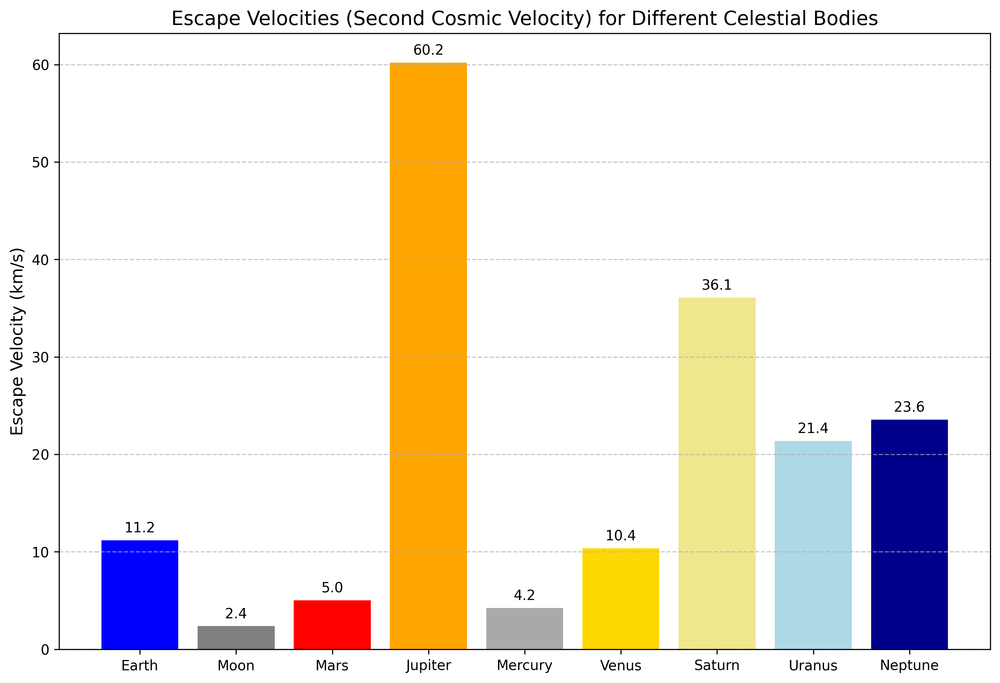
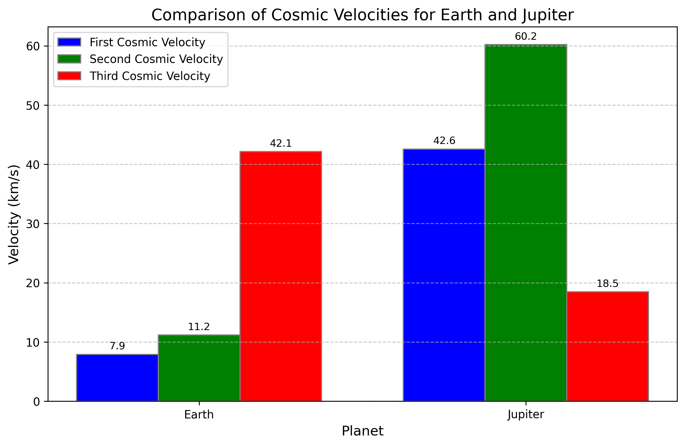
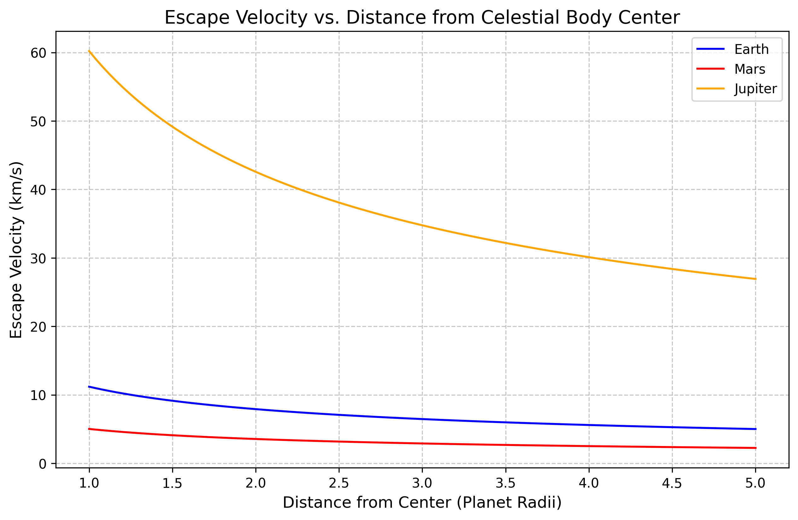
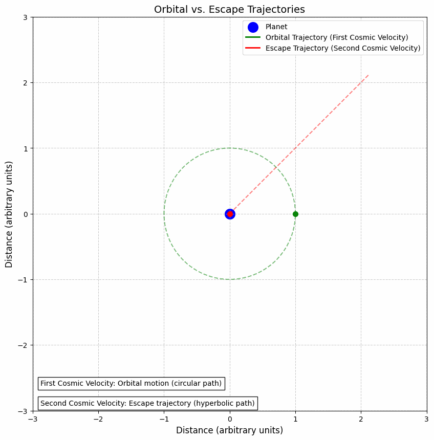
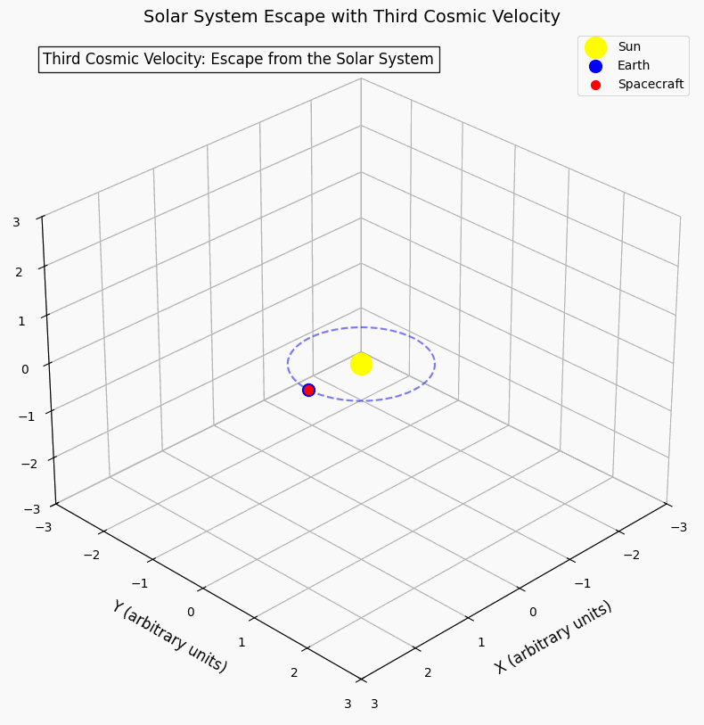

# Escape Velocities and Cosmic Velocities

## Motivation

The concept of escape velocity is crucial for understanding the conditions required to leave a celestial body's gravitational influence. Extending this concept, the first, second, and third cosmic velocities define the thresholds for orbiting, escaping, and leaving a star system. These principles underpin modern space exploration, from launching satellites to interplanetary missions.

## Theoretical Foundation

**Gravitational Potential Energy**

The foundation of cosmic velocities lies in understanding gravitational potential energy. For an object of mass $m$ in the gravitational field of a body with mass $M$, the gravitational potential energy is given by:

$$U = -\frac{G M m}{r}$$

Where:

- $G$ is the gravitational constant ($6.67430 \times 10^{-11} \, \text{m}^3 \, \text{kg}^{-1} \, \text{s}^{-2}$)
- $M$ is the mass of the central body
- $m$ is the mass of the object
- $r$ is the distance between the centers of the two bodies

**Conservation of Energy**

The total energy of an object in a gravitational field is the sum of its kinetic energy and potential energy:

$$E = \frac{1}{2}mv^2 - \frac{GMm}{r}$$

This total energy determines whether an object is bound to the gravitational field (negative total energy) or can escape to infinity (zero or positive total energy).

## The Three Cosmic Velocities

**First Cosmic Velocity (Orbital Velocity)**

The first cosmic velocity is the minimum velocity needed for an object to maintain a circular orbit around a celestial body at a given distance. It is derived by equating the gravitational force with the centripetal force required for circular motion:

$$\frac{GMm}{r^2} = m\frac{v_1^2}{r}$$

Solving for $v_1$:

$$v_1 = \sqrt{\frac{GM}{r}}$$

**Second Cosmic Velocity (Escape Velocity)**

The second cosmic velocity, also known as escape velocity, is the minimum velocity needed for an object to escape the gravitational field of a celestial body. It is derived from the principle that the total energy must be at least zero for escape:

$$\frac{1}{2}mv_2^2 - \frac{GMm}{r} = 0$$

Solving for $v_2$:

$$v_2 = \sqrt{\frac{2GM}{r}} = \sqrt{2} \cdot v_1$$

Notice that the escape velocity is exactly $\sqrt{2}$ times the orbital velocity at the same distance.

**Third Cosmic Velocity (Solar System Escape Velocity)**

The third cosmic velocity is the velocity needed for an object to escape the gravitational field of the Sun from a particular planet's orbit. For an object at Earth's orbit, it is the velocity needed to leave the Solar System entirely.

$$v_3 = \sqrt{\frac{2GM_{Sun}}{r_{orbit}}} + v_{planet}$$

Where $r_{orbit}$ is the distance of the planet from the Sun, and $v_{planet}$ is the orbital velocity of the planet around the Sun. This accounts for the fact that a spacecraft must overcome both the Sun's gravitational pull and also leverage the planet's orbital motion.

## Mathematical Analysis

**Relationship Between Cosmic Velocities**

The relationship between the first and second cosmic velocities is straightforward:

$$v_2 = \sqrt{2} \cdot v_1$$

This means that to escape a celestial body, an object needs approximately 1.414 times the velocity required to orbit it at the same distance.

**Variation with Distance**

All cosmic velocities decrease with increasing distance from the central body according to an inverse square root relationship:

$$v \propto \frac{1}{\sqrt{r}}$$

This means that it's easier to escape a gravitational field from a higher starting point.

**Variation with Mass**

Cosmic velocities increase with the square root of the mass of the central body:

$$v \propto \sqrt{M}$$

This explains why escape velocities for massive bodies like Jupiter are much higher than for smaller bodies like Earth or Mars.

## Cosmic Velocities for Different Celestial Bodies

| Celestial Body | Mass (kg) | Radius (km) | First Cosmic Velocity (km/s) | Second Cosmic Velocity (km/s) | Third Cosmic Velocity (km/s) |
|---------------|-----------|-------------|------------------------------|-------------------------------|-------------------------------|
| Mercury | 3.30 × 10²³ | 2,440 | 3.0 | 4.3 | 67.7 |
| Venus | 4.87 × 10²⁴ | 6,052 | 7.3 | 10.4 | 49.5 |
| Earth | 5.97 × 10²⁴ | 6,371 | 7.9 | 11.2 | 42.1 |
| Moon | 7.35 × 10²² | 1,737 | 1.7 | 2.4 | 42.1 |
| Mars | 6.42 × 10²³ | 3,390 | 3.6 | 5.0 | 34.1 |
| Jupiter | 1.90 × 10²⁷ | 69,911 | 42.1 | 59.5 | 18.5 |
| Saturn | 5.68 × 10²⁶ | 58,232 | 25.1 | 35.5 | 13.6 |
| Uranus | 8.68 × 10²⁵ | 25,362 | 15.1 | 21.3 | 9.6 |
| Neptune | 1.02 × 10²⁶ | 24,622 | 16.6 | 23.5 | 7.7 |
| Pluto | 1.30 × 10²² | 1,188 | 0.9 | 1.2 | 6.1 |

## Computational Model and Visualization

The computational model calculates the three cosmic velocities for various celestial bodies and visualizes them through charts and animations. The model demonstrates how these velocities vary with the mass and radius of celestial bodies, providing insights into the requirements for different types of space missions.

## Comparative Analysis

The following chart compares the escape velocities (second cosmic velocity) for various celestial bodies in our solar system:

*Figure 1: Escape velocities comparison.*

As shown, the escape velocity varies significantly across celestial bodies, with Jupiter requiring the highest velocity for escape due to its large mass, while the Moon has a relatively low escape velocity. The escape velocity is directly proportional to the square root of the mass of the celestial body and inversely proportional to the square root of its radius.

## Detailed Comparison of Earth and Jupiter

The following chart compares all three cosmic velocities for Earth and Jupiter:

*Figure 2: Cosmic velocities comparison for Earth and Jupiter.*

This comparison illustrates how the cosmic velocities scale with the mass of the celestial body. Jupiter, being much more massive than Earth, requires significantly higher velocities for both orbiting and escaping. However, the third cosmic velocity is lower for Jupiter because of its greater distance from the Sun, demonstrating the inverse square root relationship with distance.

## Variation with Distance

The escape velocity decreases as the distance from the center of a celestial body increases:

*Figure 3: Escape velocity vs distance.*

This graph shows how the escape velocity decreases with distance for Earth, Mars, and Jupiter according to the inverse square root relationship: $v_2 = \sqrt{\frac{2GM}{r}}$. The x-axis is normalized to the radius of each body, showing that the relationship follows the same pattern regardless of the body's size. At infinite distance, the escape velocity approaches zero.

## Visualizations of Cosmic Velocities

**Orbital vs. Escape Trajectories**

The following animation illustrates the difference between an orbital trajectory (first cosmic velocity) and an escape trajectory (second cosmic velocity):

*Figure 4: Animation comparing orbital and escape trajectories.*

With the first cosmic velocity, an object follows a closed circular or elliptical path around the central body, maintaining a constant total energy $E < 0$. With the second cosmic velocity, the object follows an open hyperbolic path that allows it to escape the gravitational influence of the central body, with total energy $E ≥ 0$.

**Solar System Escape**

The third cosmic velocity enables a spacecraft to escape the Solar System entirely:

*Figure 5: Animation showing Solar System escape trajectory.*

This animation shows a spacecraft leaving Earth's orbit with sufficient velocity to escape the Sun's gravitational field, demonstrating the concept of the third cosmic velocity. The trajectory becomes hyperbolic relative to the Sun, allowing the spacecraft to reach interstellar space.

## Applications in Space Exploration

**Launching Satellites**

To place a satellite in orbit, it must be accelerated to at least the first cosmic velocity for its intended orbital altitude. For a Low Earth Orbit (LEO) at approximately 400 km above Earth's surface, this velocity is about 7.67 km/s.

The rocket equation, developed by Konstantin Tsiolkovsky, describes the relationship between the rocket's final velocity change (Δv), the exhaust velocity (ve), and the initial and final masses (m0 and mf):

$$\Delta v = v_e \ln\left(\frac{m_0}{m_f}\right)$$

Rearranging to find the mass ratio required for a given velocity change:

$$\frac{m_0}{m_f} = e^{\frac{\Delta v}{v_e}}$$

This equation highlights the exponential relationship between the required propellant and the desired velocity change, making it increasingly difficult to achieve higher velocities.

**Interplanetary Missions**

For missions to other planets, spacecraft typically use a combination of the first and second cosmic velocities along with gravitational assists. The Hohmann transfer orbit is an efficient method for interplanetary travel, using the minimum energy required to transfer between two circular orbits:

$$\Delta v_{total} = \left|\sqrt{\frac{GM_{Sun}}{r_1}} - \sqrt{\frac{2GM_{Sun}r_2}{r_1(r_1+r_2)}}\right| + \left|\sqrt{\frac{GM_{Sun}}{r_2}} - \sqrt{\frac{2GM_{Sun}r_1}{r_2(r_1+r_2)}}\right|$$

The total Δv required for a Hohmann transfer from Earth to Mars is approximately 5.6 km/s, while a transfer to Jupiter requires about 9.1 km/s.

**Gravity Assists**

To reduce the propellant requirements for interplanetary missions, spacecraft often use gravity assists (also known as gravitational slingshots). By passing close to a planet, a spacecraft can gain or lose velocity relative to the Sun without expending propellant.

The maximum velocity change possible through a gravity assist is approximately twice the planet's orbital velocity. For Jupiter, this can provide a velocity boost of up to about 26 km/s, which is a significant fraction of the third cosmic velocity.

**Interstellar Travel Considerations**

For potential future interstellar missions, the velocities required are far beyond the third cosmic velocity. The nearest star system, Alpha Centauri, is approximately 4.37 light-years away. Even traveling at 0.1c (10% of the speed of light, or about 30,000 km/s), such a journey would take over 40 years.

Several propulsion concepts have been proposed for interstellar travel:

1. **Nuclear Pulse Propulsion**: Using nuclear explosions for propulsion, as proposed in Project Orion.
2. **Nuclear Fusion Rockets**: Utilizing controlled fusion reactions for high exhaust velocities.
3. **Antimatter Propulsion**: Utilizing matter-antimatter annihilation for maximum energy release.
4. **Breakthrough Starshot**: A proposed mission using powerful ground-based lasers to accelerate small probes to approximately 0.2c.

## Conclusion

The concepts of cosmic velocities are fundamental to understanding the requirements and limitations of space exploration. The first cosmic velocity enables satellites to orbit Earth, the second cosmic velocity allows spacecraft to escape a planet's gravitational field, and the third cosmic velocity permits escape from the Solar System.

As our technology advances, we continue to develop more efficient propulsion systems that bring us closer to achieving the velocities required for interplanetary and, eventually, interstellar travel. Understanding the physics behind these cosmic velocities is essential for planning future space missions and expanding humanity's presence beyond Earth.
