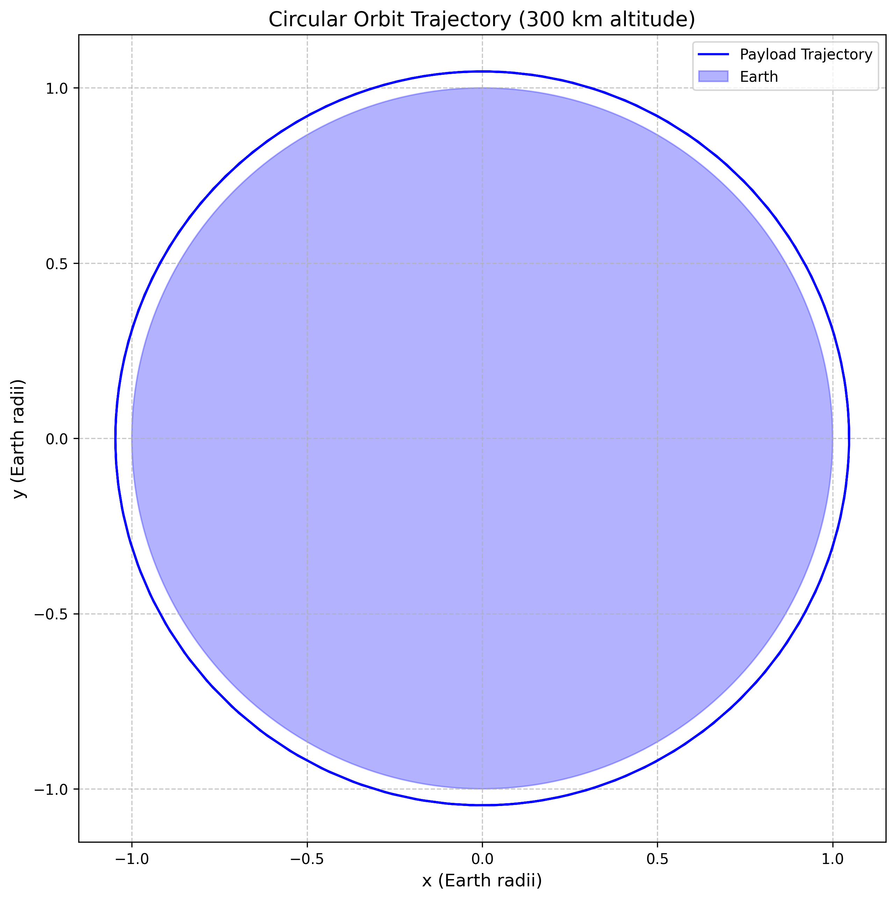
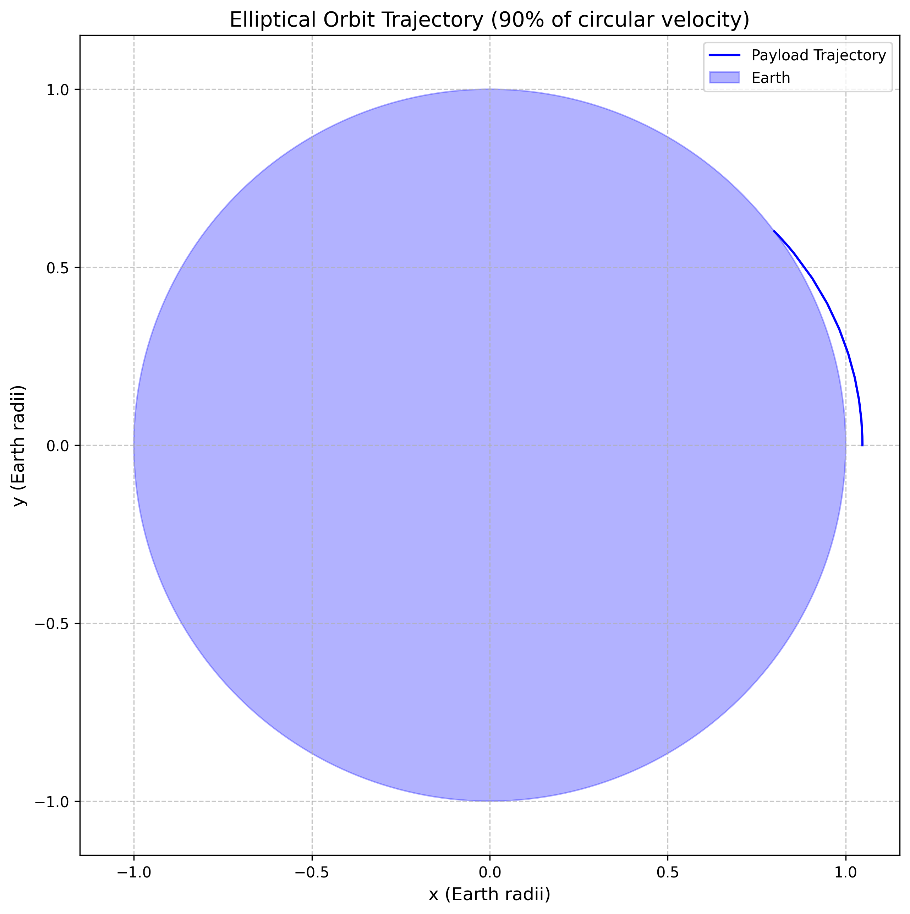
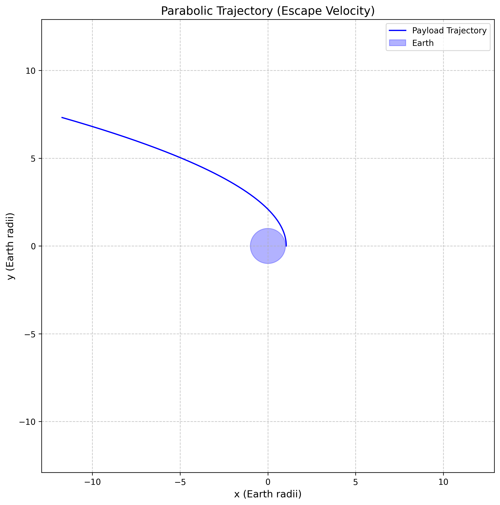
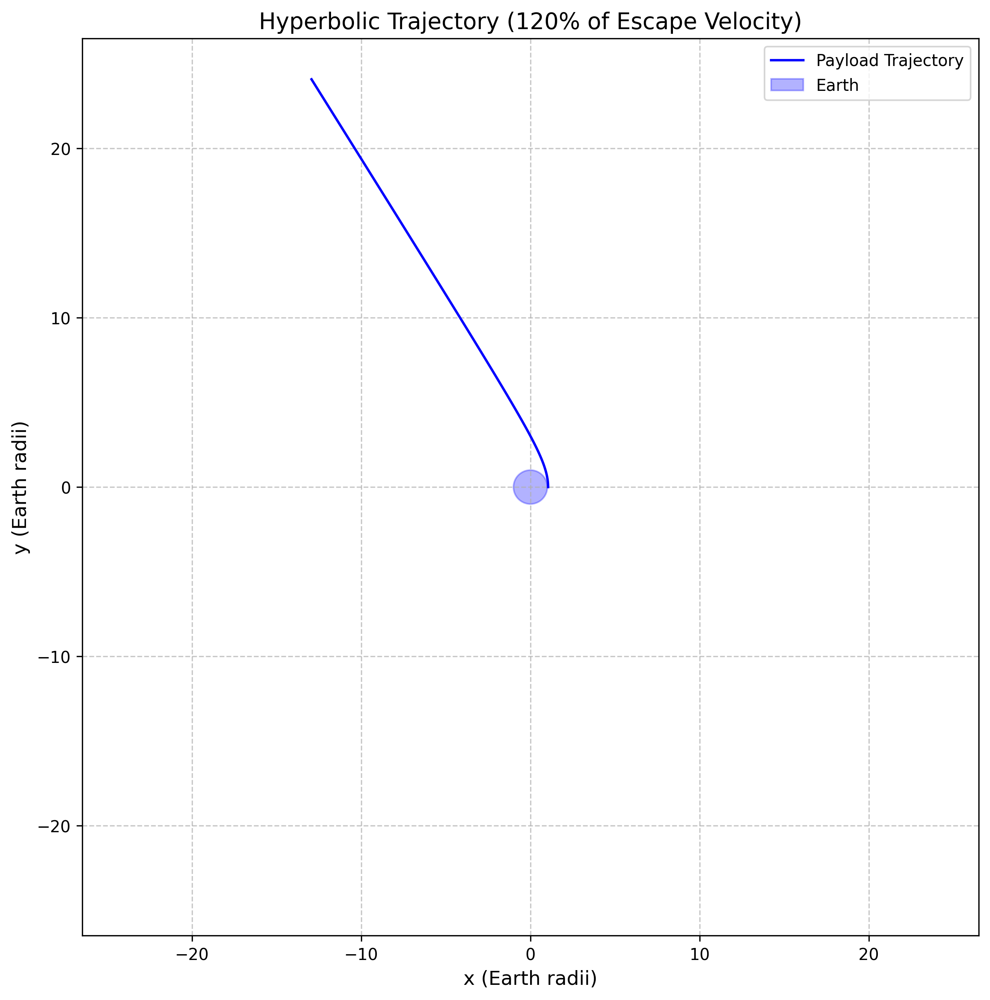
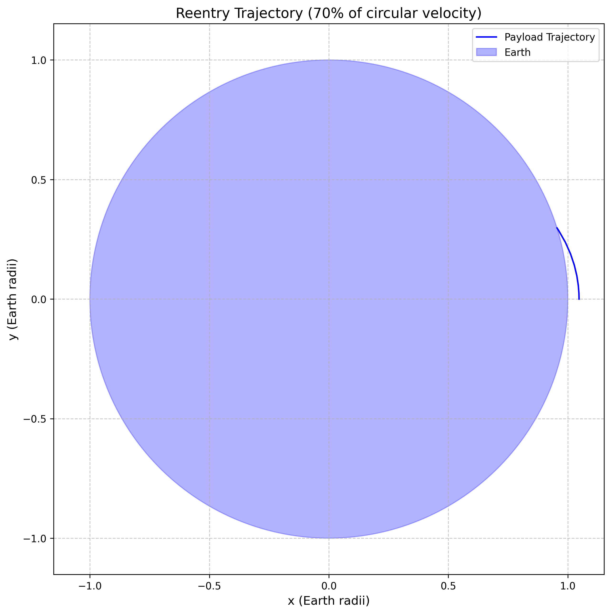
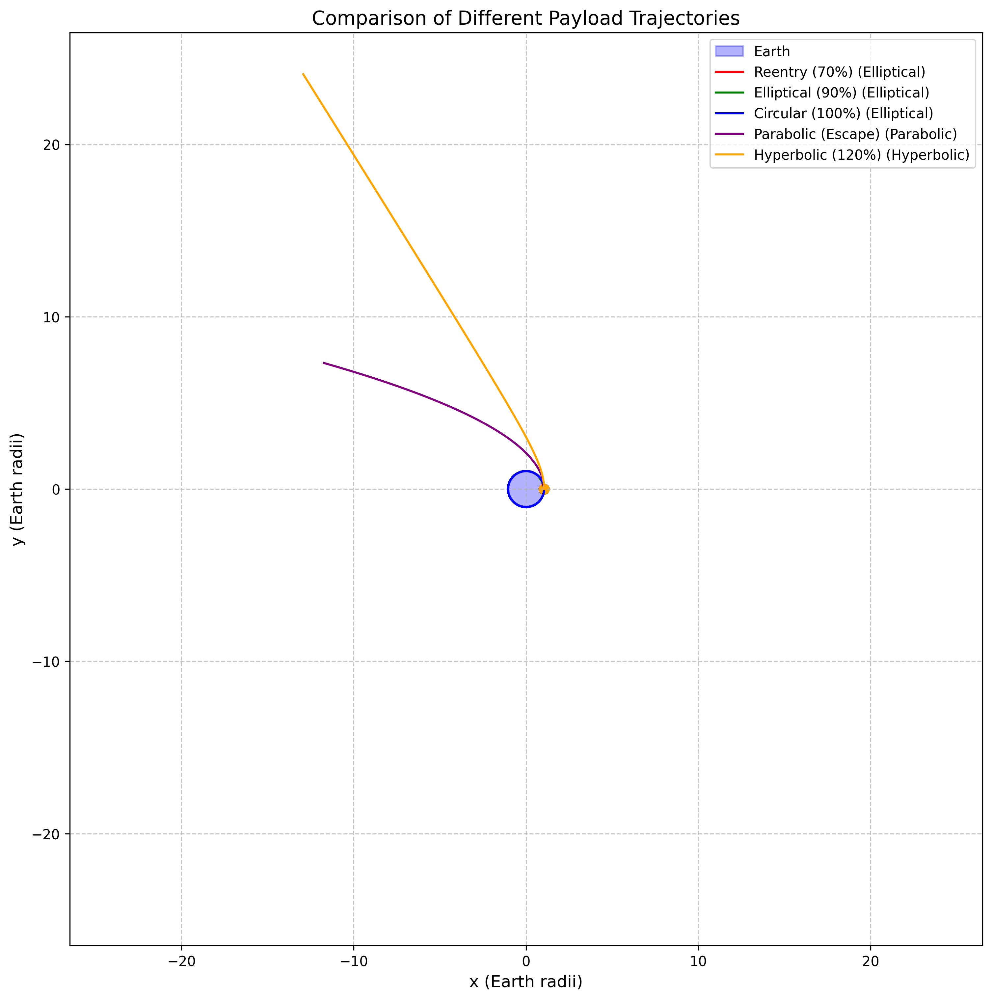
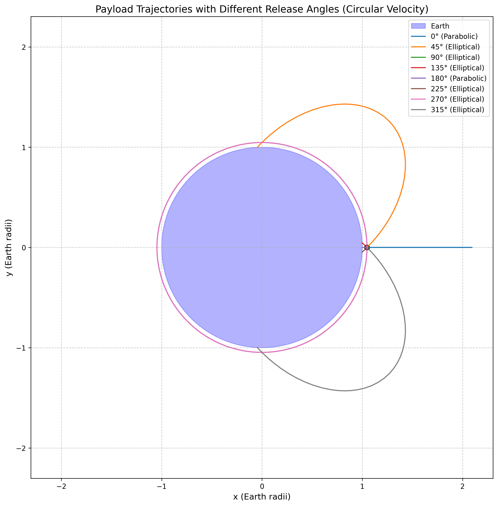
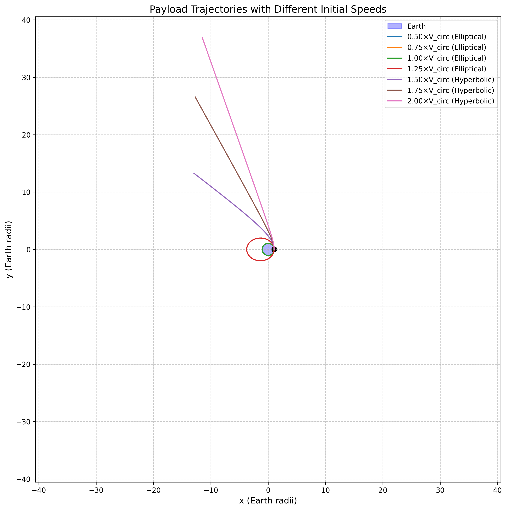

# Trajectories of a Freely Released Payload Near Earth

## Motivation

When an object is released from a moving rocket near Earth, its trajectory depends on initial conditions and gravitational forces. This scenario presents a rich problem, blending principles of orbital mechanics and numerical methods. Understanding the potential trajectories is vital for space missions, such as deploying payloads or returning objects to Earth.

## Theoretical Foundation

### Newton's Law of Universal Gravitation

The foundation of orbital mechanics lies in Newton's Law of Universal Gravitation, which states that every particle attracts every other particle with a force directly proportional to the product of their masses and inversely proportional to the square of the distance between them:

$$F = G \frac{m_1 m_2}{r^2}$$

Where:

- $F$ is the gravitational force between the two objects
- $G$ is the gravitational constant ($6.67430 \times 10^{-11} \, \text{m}^3 \, \text{kg}^{-1} \, \text{s}^{-2}$)
- $m_1$ and $m_2$ are the masses of the two objects
- $r$ is the distance between the centers of the two objects

### Equations of Motion

For a payload of mass $m$ in Earth's gravitational field, the equation of motion is:

$$\vec{a} = -\frac{GM_E}{r^3}\vec{r}$$

Where:

- $\vec{a}$ is the acceleration vector
- $G$ is the gravitational constant
- $M_E$ is the mass of Earth
- $\vec{r}$ is the position vector from Earth's center to the payload
- $r$ is the magnitude of $\vec{r}$

In Cartesian coordinates, this becomes:

$$\frac{d^2x}{dt^2} = -\frac{GM_E}{r^3}x\frac{d^2y}{dt^2} = -\frac{GM_E}{r^3}y$$

Where $r = \sqrt{x^2 + y^2}$.

### Orbital Energy and Conic Sections

The specific orbital energy (energy per unit mass) of a payload is conserved in a gravitational field and is given by:

$$\varepsilon = \frac{v^2}{2} - \frac{GM_E}{r}$$

This energy determines the type of orbit:

- $\varepsilon < 0$: Elliptical orbit (closed)
- $\varepsilon = 0$: Parabolic trajectory (escape with zero excess velocity)
- $\varepsilon > 0$: Hyperbolic trajectory (escape with excess velocity)

The eccentricity $e$ of the orbit is related to the specific energy and angular momentum $h$ by:

$$e = \sqrt{1 + \frac{2\varepsilon h^2}{(GM_E)^2}}$$

Where the angular momentum per unit mass is $h = |\vec{r} \times \vec{v}|$.

## Types of Trajectories

## Computational Model and Visualization

<details>
<summary>Click to view Python code for payload trajectory simulations and visualizations</summary>

```python
import numpy as np
import matplotlib.pyplot as plt
from matplotlib.animation import FuncAnimation
import os
import imageio
import tempfile
from scipy.integrate import solve_ivp

# Create directory for images if it doesn't exist
image_dir = os.path.join('docs', '1 Physics', '2 Gravity', 'images')
os.makedirs(image_dir, exist_ok=True)

# Constants
G = 6.67430e-11  # Gravitational constant (m^3 kg^-1 s^-2)
M_EARTH = 5.972e24  # Mass of Earth (kg)
R_EARTH = 6.371e6  # Radius of Earth (m)

# Function to calculate the gravitational acceleration
def gravitational_acceleration(r, M=M_EARTH):
    """Calculate the gravitational acceleration at distance r from a body of mass M.
    
    Args:
        r: Distance from the center of the body (m)
        M: Mass of the body (kg), defaults to Earth's mass
        
    Returns:
        Gravitational acceleration (m/s^2)
    """
    return G * M / r**2

# Function to compute the derivatives for the equations of motion
def payload_dynamics(t, state, mu=G*M_EARTH):
    """Compute the derivatives for the equations of motion of a payload in Earth's gravitational field.
    
    Args:
        t: Time (s)
        state: State vector [x, y, vx, vy]
        mu: Gravitational parameter (G*M) (m^3/s^2)
        
    Returns:
        Derivatives [dx/dt, dy/dt, dvx/dt, dvy/dt]
    """
    x, y, vx, vy = state
    
    # Calculate the distance from Earth's center
    r = np.sqrt(x**2 + y**2)
    
    # Check if the payload has hit Earth's surface
    if r <= R_EARTH:
        return [0, 0, 0, 0]  # Stop the simulation if the payload hits Earth
    
    # Calculate the gravitational acceleration
    a = mu / r**3
    
    # Return the derivatives
    return [vx, vy, -a * x, -a * y]

# Function to simulate the trajectory of a payload
def simulate_trajectory(initial_position, initial_velocity, t_span, t_eval=None):
    """Simulate the trajectory of a payload released near Earth.
    
    Args:
        initial_position: Initial position vector [x, y] (m)
        initial_velocity: Initial velocity vector [vx, vy] (m/s)
        t_span: Time span for the simulation [t_start, t_end] (s)
        t_eval: Times at which to evaluate the solution (s), defaults to None
        
    Returns:
        Solution object from solve_ivp
    """
    # Initial state vector [x, y, vx, vy]
    initial_state = [initial_position[0], initial_position[1], 
                    initial_velocity[0], initial_velocity[1]]
    
    # Solve the initial value problem
    solution = solve_ivp(
        payload_dynamics,
        t_span,
        initial_state,
        method='RK45',
        t_eval=t_eval,
        rtol=1e-8,
        atol=1e-8
    )
    
    return solution

# Function to calculate orbital parameters
def calculate_orbital_parameters(position, velocity, mu=G*M_EARTH):
    """Calculate orbital parameters from position and velocity vectors.
    
    Args:
        position: Position vector [x, y] (m)
        velocity: Velocity vector [vx, vy] (m/s)
        mu: Gravitational parameter (G*M) (m^3/s^2)
        
    Returns:
        Dictionary containing orbital parameters
    """
    r = np.sqrt(position[0]**2 + position[1]**2)
    v = np.sqrt(velocity[0]**2 + velocity[1]**2)
    
    # Specific energy
    energy = 0.5 * v**2 - mu / r
    
    # Semi-major axis
    if energy == 0:  # Parabolic orbit
        a = float('inf')
    else:
        a = -mu / (2 * energy)
    
    # Angular momentum per unit mass
    h_vec = np.cross(position, velocity)
    h = np.abs(h_vec)  # For 2D, this is just the magnitude
    
    # Eccentricity
    e = np.sqrt(1 + 2 * energy * h**2 / mu**2)
    
    # Orbit type
    if e < 1e-10:  # Numerical tolerance for circular orbit
        orbit_type = "Circular"
    elif e < 1.0:
        orbit_type = "Elliptical"
    elif abs(e - 1.0) < 1e-10:  # Numerical tolerance for parabolic orbit
        orbit_type = "Parabolic"
    else:
        orbit_type = "Hyperbolic"
    
    # Periapsis and apoapsis distances
    if e < 1.0:  # Elliptical orbit
        periapsis = a * (1 - e)
        apoapsis = a * (1 + e)
    elif e == 1.0:  # Parabolic orbit
        periapsis = h**2 / (2 * mu)
        apoapsis = float('inf')
    else:  # Hyperbolic orbit
        periapsis = a * (1 - e)  # Note: a is negative for hyperbolic orbits
        apoapsis = float('inf')
    
    return {
        "semi_major_axis": a,
        "eccentricity": e,
        "specific_energy": energy,
        "angular_momentum": h,
        "orbit_type": orbit_type,
        "periapsis": periapsis,
        "apoapsis": apoapsis
    }
```
</details>

The computational model simulates the trajectories of payloads released near Earth under the influence of gravity. It calculates orbital parameters such as eccentricity, specific energy, and angular momentum, and visualizes different types of trajectories through static plots and animations. The model demonstrates how initial conditions determine whether a payload will enter orbit, escape Earth's gravitational field, or reenter the atmosphere.
### Circular Orbit

A circular orbit occurs when the payload has exactly the right velocity to maintain a constant distance from Earth. The required velocity at a distance $r$ is:

$$v_{circ} = \sqrt{\frac{GM_E}{r}}$$

For a circular orbit, the eccentricity $e = 0$ and the specific energy $\varepsilon = -\frac{GM_E}{2r}$.



### Elliptical Orbit

An elliptical orbit occurs when the payload has less than escape velocity but more than the minimum velocity needed to prevent collision with Earth. The eccentricity is between 0 and 1 ($0 < e < 1$).

The semi-major axis $a$ of the ellipse is related to the specific energy by:

$$a = -\frac{GM_E}{2\varepsilon}$$



### Parabolic Trajectory

A parabolic trajectory occurs when the payload has exactly escape velocity. The eccentricity $e = 1$ and the specific energy $\varepsilon = 0$.

The escape velocity at a distance $r$ from Earth's center is:

$$v_{esc} = \sqrt{\frac{2GM_E}{r}}$$



### Hyperbolic Trajectory

A hyperbolic trajectory occurs when the payload has greater than escape velocity. The eccentricity $e > 1$ and the specific energy $\varepsilon > 0$.



### Reentry Trajectory

A reentry trajectory occurs when the payload has insufficient velocity to maintain orbit and intersects with Earth's surface. This is typically an elliptical orbit with a periapsis (closest approach) below Earth's surface.



## Comparison of Different Trajectories

The following figure compares different types of trajectories for a payload released at the same position (300 km above Earth's surface) but with different initial velocities:



The trajectories shown include:

- Reentry trajectory (70% of circular velocity)
- Elliptical orbit (90% of circular velocity)
- Circular orbit (100% of circular velocity)
- Parabolic trajectory (escape velocity)
- Hyperbolic trajectory (120% of escape velocity)

## Effect of Release Direction

The direction in which a payload is released significantly affects its trajectory. The following figure shows trajectories for a payload released with circular velocity in different directions:



When released tangentially to Earth's surface (90° or 270°), the payload achieves a circular orbit. When released at other angles, the trajectory becomes elliptical, with the Earth's center at one focus of the ellipse.

## Effect of Initial Speed

The initial speed of the payload is a critical factor in determining its trajectory. The following figure shows trajectories for a payload released with different speeds in the same direction:



As the speed increases:

- Below circular velocity: Elliptical orbit with increasing apoapsis (farthest point)
- At circular velocity: Circular orbit
- Between circular and escape velocity: Elliptical orbit with increasing eccentricity
- At escape velocity: Parabolic trajectory
- Above escape velocity: Hyperbolic trajectory with increasing eccentricity

## Applications in Space Missions

### Orbital Insertion

Orbital insertion involves placing a spacecraft into a stable orbit around Earth or another celestial body. This requires accelerating the spacecraft to the appropriate velocity for the desired orbit. For a circular Low Earth Orbit (LEO) at an altitude of 300 km, the required velocity is approximately 7.73 km/s.

The process typically involves:

1. Launch from Earth's surface
2. Ascent through the atmosphere
3. Coast to the desired altitude
4. Burn engines to achieve orbital velocity

### Reentry

Reentry involves returning a spacecraft or payload to Earth's surface. This requires reducing the spacecraft's velocity below orbital velocity, allowing it to follow a trajectory that intersects with Earth's atmosphere.

The process typically involves:

1. Deorbit burn to reduce velocity
2. Atmospheric entry
3. Aerodynamic braking
4. Terminal descent and landing

The reentry trajectory must be carefully controlled to ensure that the spacecraft experiences acceptable levels of deceleration and heating during atmospheric entry.

### Escape Trajectories

Escape trajectories are used for missions to other planets or beyond the Solar System. This requires accelerating the spacecraft to at least escape velocity.

For interplanetary missions, the spacecraft typically follows:

1. Escape trajectory from Earth
2. Heliocentric transfer orbit to the target planet
3. Capture into orbit around the target planet (requiring a deceleration burn)

For missions beyond the Solar System, the spacecraft must achieve the third cosmic velocity, which is the velocity needed to escape the Sun's gravitational field from Earth's orbit.

## Numerical Simulation

The trajectories shown in this document were generated using numerical integration of the equations of motion. The simulation uses the following approach:

1. Define the initial conditions (position and velocity)
2. Set up the differential equations based on Newton's Law of Gravitation
3. Use a numerical integrator (Runge-Kutta method) to solve the equations
4. Analyze the resulting trajectory

The simulation accounts for Earth's gravitational field but neglects other factors such as:

- Atmospheric drag
- Non-spherical shape of Earth
- Gravitational influence of the Moon and Sun
- Solar radiation pressure

For more accurate simulations of real space missions, these additional factors would need to be considered.

## Conclusion

The trajectory of a payload released near Earth depends primarily on its initial position, velocity, and direction. By understanding the principles of orbital mechanics and using numerical simulations, we can predict and analyze these trajectories for various space mission scenarios.

Key insights include:

- The initial velocity determines whether the trajectory will be elliptical, parabolic, or hyperbolic
- The release direction affects the orientation and shape of the orbit
- Specific velocities (circular, escape) serve as important thresholds for different types of trajectories
- Numerical simulation is a powerful tool for analyzing complex orbital scenarios

These principles are fundamental to space mission planning, satellite deployment, and planetary exploration.
