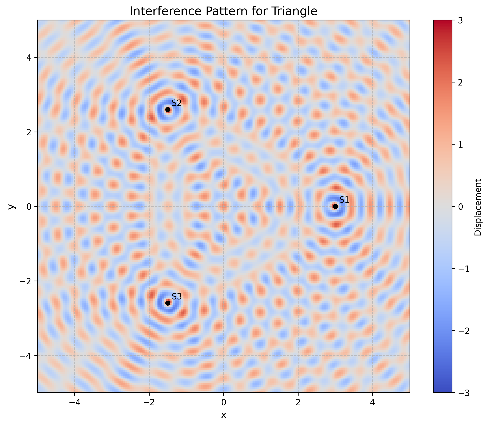
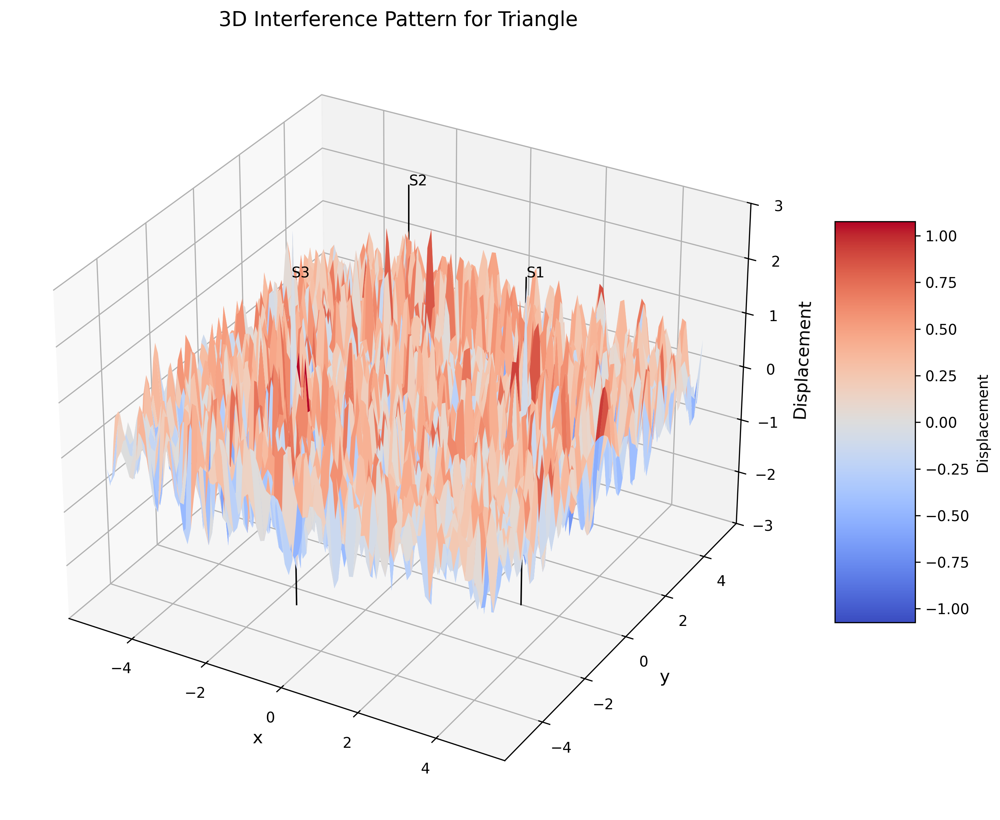
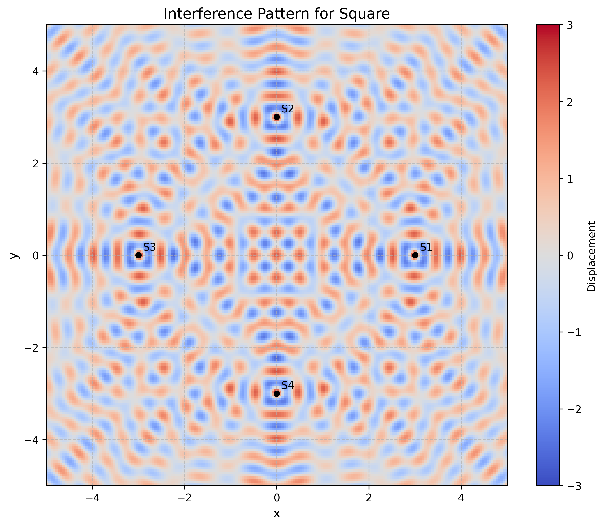
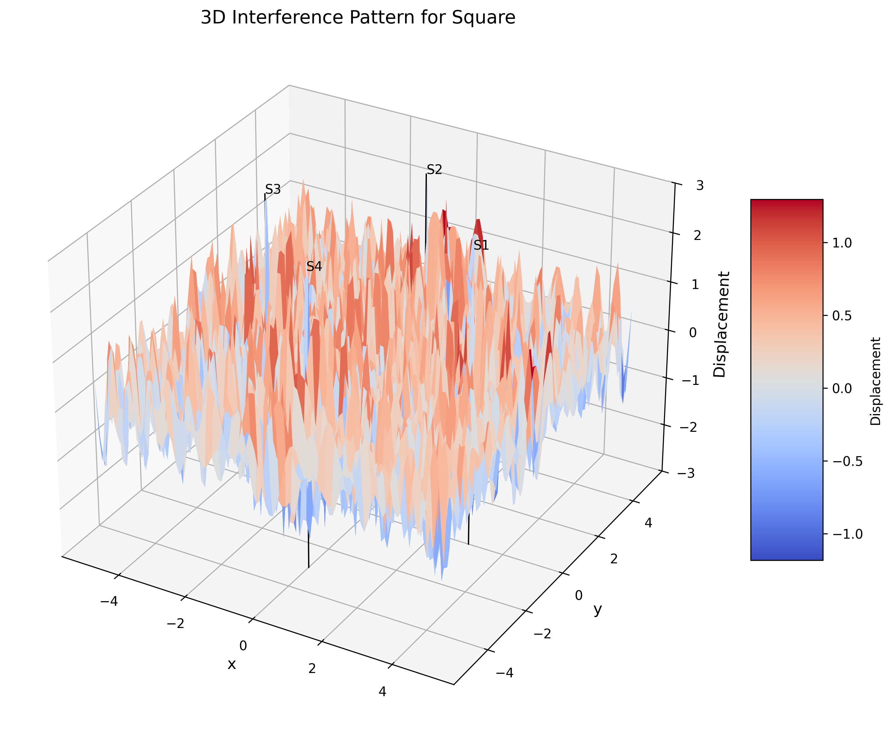
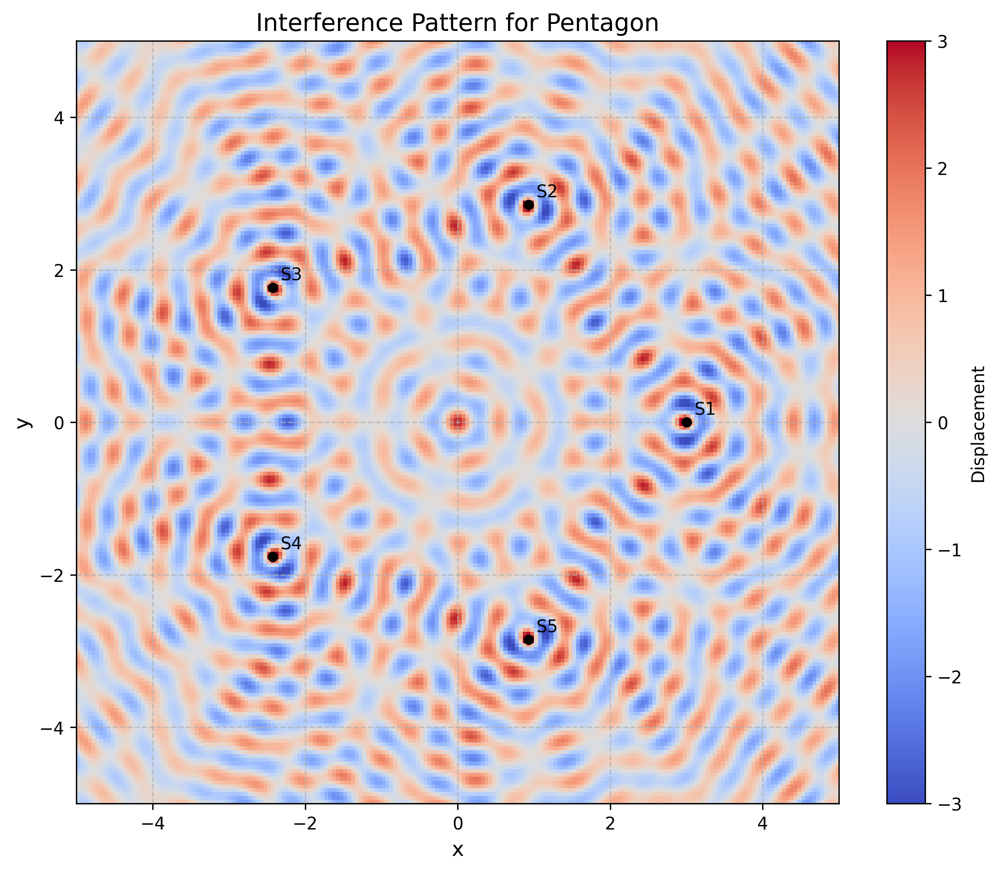
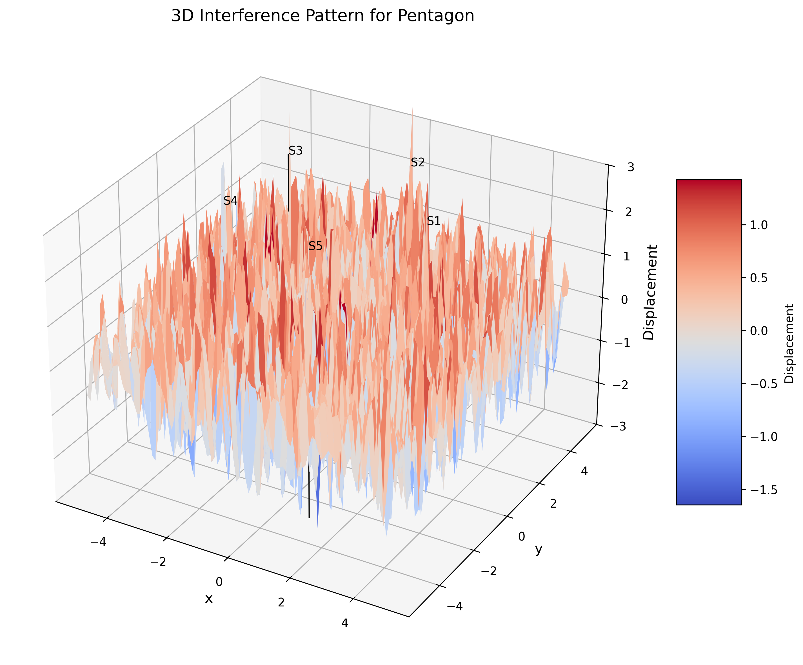
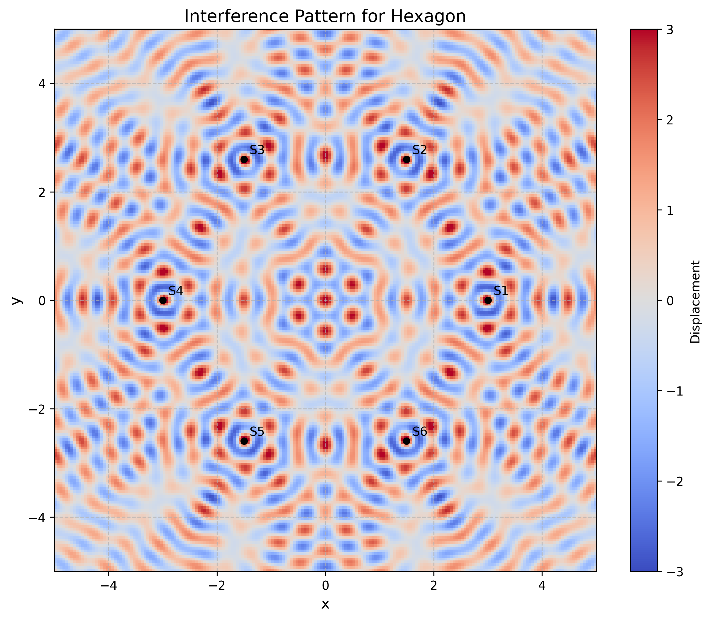
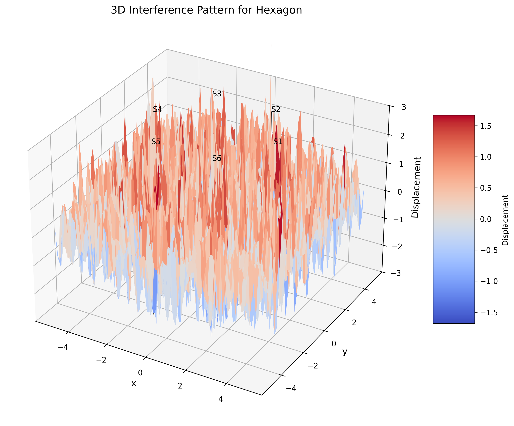

# Interference Patterns on a Water Surface

## Motivation

Interference occurs when waves from different sources overlap, creating new patterns. On a water surface, this can be easily observed when ripples from different points meet, forming distinctive interference patterns. These patterns can show us how waves combine in different ways, either reinforcing each other or canceling out.

Studying these patterns helps us understand wave behavior in a simple, visual way. It also allows us to explore important concepts, like the relationship between wave phase and the effects of multiple sources. This task offers a hands-on approach to learning about wave interactions and their real-world applications, making it an interesting and engaging way to dive into wave physics.

## Theoretical Background

A circular wave on the water surface, emanating from a point source located at $(x_0, y_0)$, can be described by the Single Disturbance equation:

$$\eta(x, y, t) = \frac{A}{\sqrt{r}} \cdot \cos(kr - \omega t + \phi)$$

where:

- $\eta(x, y, t)$ is the displacement of the water surface at point $(x, y)$ and time $t$,
- $A$ is the amplitude of the wave,
- $k = \frac{2\pi}{\lambda}$ is the wave number, related to the wavelength $\lambda$,
- $\omega = 2\pi f$ is the angular frequency, related to the frequency $f$,
- $r = \sqrt{(x - x_0)^2 + (y - y_0)^2}$ is the distance from the source to the point $(x, y)$,
- $\phi$ is the initial phase.

When multiple waves overlap at a point, the resulting displacement is the sum of the individual displacements. For $N$ sources, the total displacement is given by:

$$\eta_{sum}(x, y, t) = \sum_{i=1}^{N} \eta_i(x, y, t)$$

where $N$ is the number of sources (vertices of the polygon).

### Constructive and Destructive Interference

- **Constructive interference** occurs when waves combine to create a larger amplitude. This happens when the waves are in phase.
- **Destructive interference** occurs when waves combine to create a smaller amplitude or cancel out completely. This happens when the waves are out of phase.

## Data Analysis

### Triangle Configuration (3 Vertices)

For a triangle, three wave sources are placed at the vertices of an equilateral triangle. The interference pattern shows:

- A central region of constructive interference where waves from all three sources arrive approximately in phase.
- Three primary axes of constructive interference extending outward from the center along the angle bisectors of the triangle.
- Regions of destructive interference between these axes.

*Figure 1: 2D interference pattern for three point sources arranged in an equilateral triangle. The color map represents the displacement amplitude, with bright regions indicating constructive interference and dark regions indicating destructive interference.*

*Figure 2: 3D visualization of the interference pattern for three point sources arranged in an equilateral triangle. The height represents the displacement amplitude, showing the wave peaks and troughs across the water surface.*

### Square Configuration (4 Vertices)

For a square, four wave sources are placed at the vertices. The interference pattern shows:

- A central region of constructive interference.
- Four primary axes of constructive interference along the diagonals of the square.
- A more complex pattern of secondary maxima compared to the triangle case.
- More pronounced regions of destructive interference due to the increased number of sources.

*Figure 3: 2D interference pattern for four point sources arranged in a square. The pattern shows four-fold rotational symmetry with distinct regions of constructive and destructive interference.*

*Figure 4: 3D visualization of the interference pattern for four point sources arranged in a square, showing the complex wave structure resulting from the superposition of waves.*

### Pentagon Configuration (5 Vertices)

For a pentagon, five wave sources are placed at the vertices. The interference pattern shows:

- A central region of constructive interference.
- Five primary axes of constructive interference.
- A more complex and symmetric pattern compared to the triangle and square cases.
- More regions of destructive interference creating a more intricate pattern.

*Figure 5: 2D interference pattern for five point sources arranged in a regular pentagon. The five-fold symmetry creates a more complex pattern with multiple rings of constructive and destructive interference.*

*Figure 6: 3D visualization of the interference pattern for five point sources arranged in a regular pentagon, showing the intricate wave structure with multiple peaks and valleys.*

### Hexagon Configuration (6 Vertices)

For a hexagon, six wave sources are placed at the vertices. The interference pattern shows:

- A central region of constructive interference.
- Six primary axes of constructive interference.
- A highly symmetric pattern with six-fold rotational symmetry.
- Multiple rings of constructive and destructive interference.

*Figure 7: 2D interference pattern for six point sources arranged in a regular hexagon. The six-fold symmetry results in a highly ordered pattern with clear radial and angular structure.*

*Figure 8: 3D visualization of the interference pattern for six point sources arranged in a regular hexagon, showing the complex wave structure with multiple concentric rings of peaks and valleys.*

## Error Analysis

### Numerical Approximations

The simulation involves several numerical approximations that can affect the accuracy of the results:

1. **Spatial Discretization**: The continuous water surface is represented by a finite grid of points, which limits the spatial resolution of the interference pattern.
2. **Amplitude Decay**: The $1/\sqrt{r}$ amplitude decay is an approximation that works well for surface waves at intermediate distances but may not be accurate very close to or very far from the sources.
3. **Boundary Effects**: The simulation assumes an infinite water surface, but in reality, the computational domain is finite, which can introduce edge effects.

### Comparison with Theoretical Predictions

The interference patterns observed in the simulation can be compared with theoretical predictions:

1. **Symmetry**: The interference pattern should reflect the symmetry of the polygon configuration, which is confirmed by the simulation results.
2. **Nodal Lines**: The locations of destructive interference (nodal lines) can be calculated theoretically based on path difference considerations and compared with the simulation.
3. **Intensity Distribution**: The intensity distribution (square of amplitude) follows predictable patterns that can be verified against theoretical models.

## Conclusions

1. **Symmetry**: The interference pattern reflects the symmetry of the polygon. A regular polygon with $n$ sides produces an interference pattern with $n$-fold rotational symmetry.

2. **Central Constructive Interference**: All configurations show a region of constructive interference at the center of the polygon, where waves from all sources can arrive approximately in phase.

3. **Radial Pattern**: The interference patterns exhibit radial structures with alternating bands of constructive and destructive interference.

4. **Complexity with Increasing Vertices**: As the number of vertices increases, the interference pattern becomes more complex and intricate, with more regions of constructive and destructive interference.

5. **Distance Effect**: The amplitude of the waves decreases with distance from the sources (as $1/\sqrt{r}$), leading to less pronounced interference effects far from the sources.
