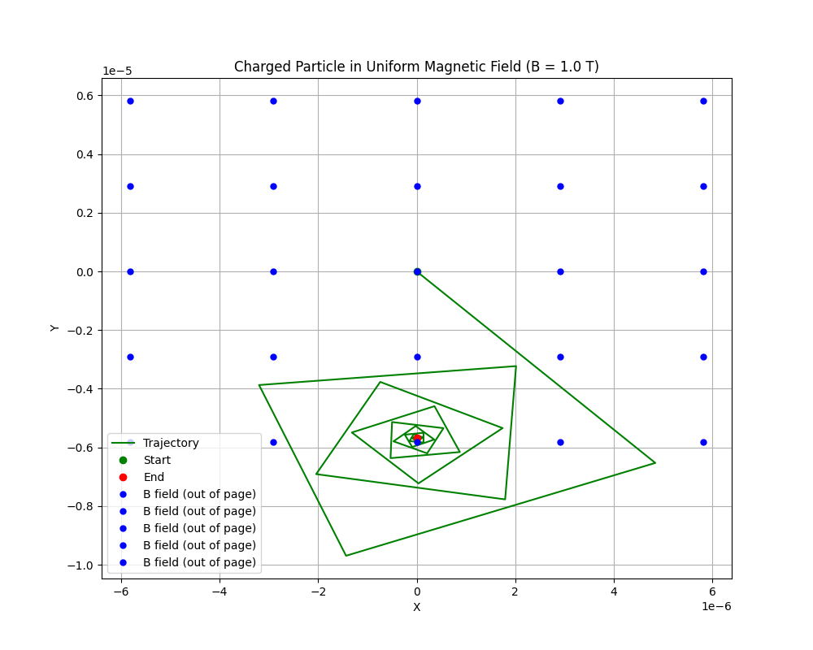
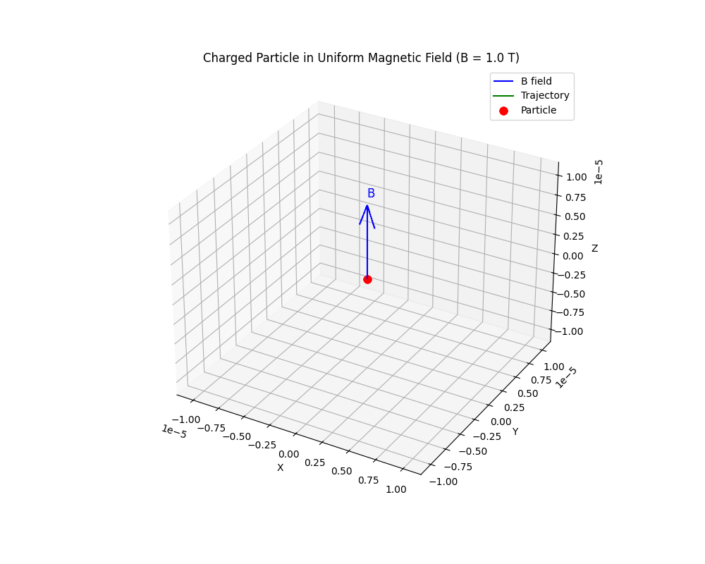
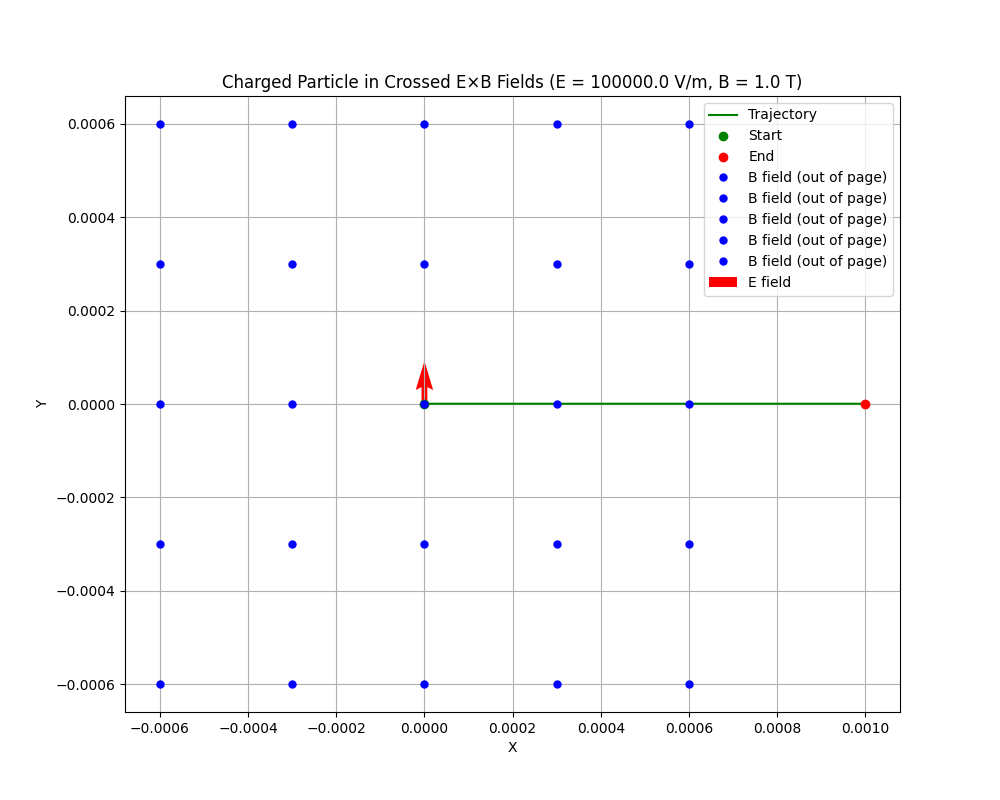
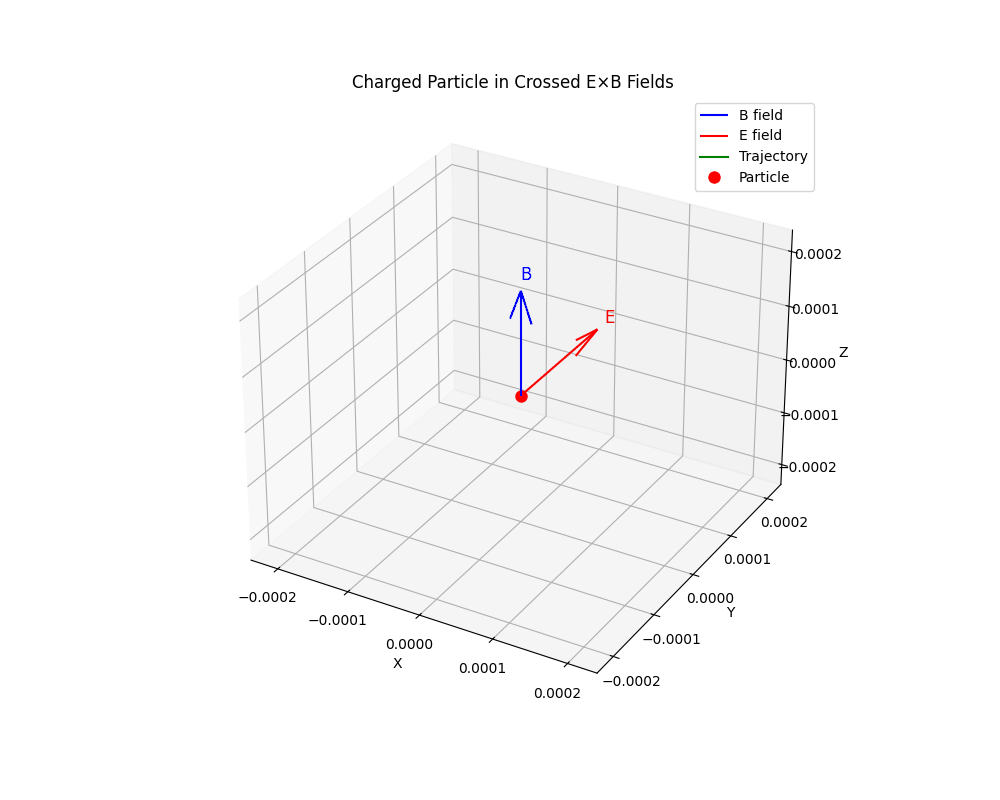

# Simulating the Effects of the Lorentz Force

## Motivation

The Lorentz force, expressed as $\vec{F} = q(\vec{E} + \vec{v} \times \vec{B})$, governs the motion of charged particles in electric and magnetic fields. It is foundational in fields like plasma physics, particle accelerators, and astrophysics. By focusing on simulations, we can explore the practical applications and visualize the complex trajectories that arise due to this force.

## Theory

### The Lorentz Force

The Lorentz force is the combination of electric and magnetic forces acting on a charged particle:

$$\vec{F} = q(\vec{E} + \vec{v} \times \vec{B})$$

where:

- $q$ is the charge of the particle
- $\vec{E}$ is the electric field
- $\vec{v}$ is the velocity of the particle
- $\vec{B}$ is the magnetic field

This force leads to acceleration according to Newton's second law:

$$\vec{a} = \frac{q}{m}(\vec{E} + \vec{v} \times \vec{B})$$

where $m$ is the mass of the particle.

### Key Concepts

#### Cyclotron Motion

In a uniform magnetic field (with no electric field), a charged particle moves in a circular path perpendicular to the field, while maintaining constant velocity along the field. This is known as cyclotron or Larmor motion.

- **Larmor Radius (Gyroradius)**: The radius of the circular motion is given by:

$$r_L = \frac{mv_\perp}{|q|B}$$

where $v_\perp$ is the velocity component perpendicular to the magnetic field.

- **Cyclotron Frequency**: The angular frequency of this circular motion is:

$$\omega_c = \frac{|q|B}{m}$$

- **Period**: The time taken for one complete orbit is:

$$T = \frac{2\pi}{\omega_c}$$

#### E×B Drift

When both electric and magnetic fields are present and perpendicular to each other, the charged particle exhibits a drift motion perpendicular to both fields, known as E×B drift. The drift velocity is given by:

$$\vec{v}_d = \frac{\vec{E} \times \vec{B}}{B^2}$$

This drift velocity is independent of the charge, mass, and velocity of the particle.

#### Magnetic Mirror

In a non-uniform magnetic field where the field strength increases along the field lines, charged particles can be reflected back. This phenomenon, known as the magnetic mirror effect, occurs due to the conservation of the magnetic moment:

$$\mu = \frac{mv_\perp^2}{2B}$$

Particles with a small velocity component parallel to the field compared to the perpendicular component (small pitch angle) will be reflected at the point where the magnetic field is strong enough.

## Implementation

### Python Code

Below is the Python implementation for simulating the motion of charged particles under various electromagnetic field configurations:

<details>
<summary>Click to view Python code for orbital simulations</summary>

```python
import numpy as np
import matplotlib.pyplot as plt
from mpl_toolkits.mplot3d import Axes3D
import os
from matplotlib import animation

# Create directory for saving images if it doesn't exist
image_dir = os.path.join('docs', '1 Physics', '4 Electromagnetism', 'images')
os.makedirs(image_dir, exist_ok=True)

# Physics functions
def lorentz_force(q, E, B, v):
    """
    Calculate the Lorentz force on a charged particle.
    
    Args:
        q (float): Charge of the particle in Coulombs
        E (numpy.ndarray): Electric field vector in V/m
        B (numpy.ndarray): Magnetic field vector in Tesla
        v (numpy.ndarray): Velocity vector of the particle in m/s
        
    Returns:
        numpy.ndarray: Force vector in Newtons
    """
    return q * (E + np.cross(v, B))

def acceleration(q, m, E, B, v):
    """
    Calculate the acceleration of a charged particle in electromagnetic fields.
    
    Args:
        q (float): Charge of the particle in Coulombs
        m (float): Mass of the particle in kg
        E (numpy.ndarray): Electric field vector in V/m
        B (numpy.ndarray): Magnetic field vector in Tesla
        v (numpy.ndarray): Velocity vector of the particle in m/s
        
    Returns:
        numpy.ndarray: Acceleration vector in m/s^2
    """
    return lorentz_force(q, E, B, v) / m

def calculate_larmor_radius(q, m, v_perp, B_mag):
    """
    Calculate the Larmor radius (gyroradius) of a charged particle in a magnetic field.
    
    Args:
        q (float): Charge of the particle in Coulombs
        m (float): Mass of the particle in kg
        v_perp (float): Velocity component perpendicular to the magnetic field in m/s
        B_mag (float): Magnitude of the magnetic field in Tesla
        
    Returns:
        float: Larmor radius in meters
    """
    return m * v_perp / (abs(q) * B_mag)

def calculate_cyclotron_frequency(q, m, B_mag):
    """
    Calculate the cyclotron frequency of a charged particle in a magnetic field.
    
    Args:
        q (float): Charge of the particle in Coulombs
        m (float): Mass of the particle in kg
        B_mag (float): Magnitude of the magnetic field in Tesla
        
    Returns:
        float: Cyclotron frequency in radians per second
    """
    return abs(q) * B_mag / m

def calculate_drift_velocity(E, B):
    """
    Calculate the E×B drift velocity.
    
    Args:
        E (numpy.ndarray): Electric field vector in V/m
        B (numpy.ndarray): Magnetic field vector in Tesla
        
    Returns:
        numpy.ndarray: Drift velocity vector in m/s
    """
    B_squared = np.sum(B**2)
    return np.cross(E, B) / B_squared

# Numerical integration functions
def runge_kutta_step(q, m, E, B, r, v, dt):
    """
    Perform one step of the 4th-order Runge-Kutta method for the Lorentz force equation.
    
    Args:
        q (float): Charge of the particle in Coulombs
        m (float): Mass of the particle in kg
        E (numpy.ndarray): Electric field vector in V/m
        B (numpy.ndarray): Magnetic field vector in Tesla
        r (numpy.ndarray): Position vector of the particle in m
        v (numpy.ndarray): Velocity vector of the particle in m/s
        dt (float): Time step in seconds
        
    Returns:
        tuple: New position and velocity vectors
    """
    # Function to compute derivatives (velocity and acceleration)
    def derivatives(r, v):
        return v, acceleration(q, m, E, B, v)
    
    # RK4 algorithm
    k1_r, k1_v = derivatives(r, v)
    k1_r, k1_v = k1_r * dt, k1_v * dt
    
    k2_r, k2_v = derivatives(r + 0.5 * k1_r, v + 0.5 * k1_v)
    k2_r, k2_v = k2_r * dt, k2_v * dt
    
    k3_r, k3_v = derivatives(r + 0.5 * k2_r, v + 0.5 * k2_v)
    k3_r, k3_v = k3_r * dt, k3_v * dt
    
    k4_r, k4_v = derivatives(r + k3_r, v + k3_v)
    k4_r, k4_v = k4_r * dt, k4_v * dt
    
    # Update position and velocity
    r_new = r + (k1_r + 2 * k2_r + 2 * k3_r + k4_r) / 6
    v_new = v + (k1_v + 2 * k2_v + 2 * k3_v + k4_v) / 6
    
    return r_new, v_new

def simulate_particle_motion(q, m, E, B, v0, r0, dt, steps):
    """
    Simulate the motion of a charged particle in electromagnetic fields.
    
    Args:
        q (float): Charge of the particle in Coulombs
        m (float): Mass of the particle in kg
        E (numpy.ndarray): Electric field vector in V/m
        B (numpy.ndarray): Magnetic field vector in Tesla
        v0 (numpy.ndarray): Initial velocity vector in m/s
        r0 (numpy.ndarray): Initial position vector in m
        dt (float): Time step in seconds
        steps (int): Number of simulation steps
        
    Returns:
        tuple: Arrays of positions and velocities over time
    """
    # Initialize arrays to store positions and velocities
    positions = np.zeros((steps, 3))
    velocities = np.zeros((steps, 3))
    
    # Set initial conditions
    positions[0] = r0
    velocities[0] = v0
    
    # Perform simulation steps
    for i in range(1, steps):
        positions[i], velocities[i] = runge_kutta_step(q, m, E, B, positions[i-1], velocities[i-1], dt)
    
    return positions, velocities

# Scenario functions
def uniform_magnetic_field(q=1.602e-19, m=9.109e-31, B_mag=1.0, v0=1e6, steps=1000, dt=1e-11, save_plots=True):
    """
    Simulate a charged particle in a uniform magnetic field (perpendicular to velocity).
    
    Args:
        q (float): Charge of the particle in Coulombs (default: electron charge)
        m (float): Mass of the particle in kg (default: electron mass)
        B_mag (float): Magnitude of the magnetic field in Tesla
        v0 (float): Initial velocity magnitude in m/s
        steps (int): Number of simulation steps
        dt (float): Time step in seconds
        save_plots (bool): Whether to save plots
        
    Returns:
        tuple: Arrays of positions and velocities over time
    """
    # Set up fields and initial conditions
    E = np.array([0.0, 0.0, 0.0])  # No electric field
    B = np.array([0.0, 0.0, B_mag])  # Magnetic field in z-direction
    v0_vec = np.array([v0, 0.0, 0.0])  # Initial velocity in x-direction
    r0 = np.array([0.0, 0.0, 0.0])  # Start at origin
    
    # Run simulation
    positions, velocities = simulate_particle_motion(q, m, E, B, v0_vec, r0, dt, steps)
    
    # Plot results
    title = f"Charged Particle in Uniform Magnetic Field (B = {B_mag} T)"
    
    if save_plots:
        # Create file paths
        plot_2d_path = os.path.join(image_dir, 'uniform_magnetic_field_2d.png')
        plot_3d_path = os.path.join(image_dir, 'uniform_magnetic_field_3d.png')
        
        # Generate plots
        plot_trajectory_2d(positions, title, plot_2d_path, E, B)
        plot_trajectory_3d(positions, title, plot_3d_path, E, B)
    else:
        plot_trajectory_2d(positions, title, None, E, B)
        plot_trajectory_3d(positions, title, None, E, B)
    
    return positions, velocities

def crossed_fields(q=1.602e-19, m=9.109e-31, E_mag=1e5, B_mag=1.0, steps=1000, dt=1e-11, save_plots=True):
    """
    Simulate a charged particle in crossed E×B fields.
    
    Args:
        q (float): Charge of the particle in Coulombs (default: electron charge)
        m (float): Mass of the particle in kg (default: electron mass)
        E_mag (float): Magnitude of the electric field in V/m
        B_mag (float): Magnitude of the magnetic field in Tesla
        steps (int): Number of simulation steps
        dt (float): Time step in seconds
        save_plots (bool): Whether to save plots
        
    Returns:
        tuple: Arrays of positions and velocities over time
    """
    # Set up fields and initial conditions
    E = np.array([0.0, E_mag, 0.0])  # Electric field in y-direction
    B = np.array([0.0, 0.0, B_mag])  # Magnetic field in z-direction
    v0_vec = np.array([0.0, 0.0, 0.0])  # Start from rest
    r0 = np.array([0.0, 0.0, 0.0])  # Start at origin
    
    # Run simulation
    positions, velocities = simulate_particle_motion(q, m, E, B, v0_vec, r0, dt, steps)
    
    # Plot results
    title = f"Charged Particle in Crossed E×B Fields (E = {E_mag} V/m, B = {B_mag} T)"
    
    if save_plots:
        # Create file paths
        plot_2d_path = os.path.join(image_dir, 'crossed_fields_2d.png')
        plot_3d_path = os.path.join(image_dir, 'crossed_fields_3d.png')
        
        # Generate plots
        plot_trajectory_2d(positions, title, plot_2d_path, E, B)
        plot_trajectory_3d(positions, title, plot_3d_path, E, B)
    else:
        plot_trajectory_2d(positions, title, None, E, B)
        plot_trajectory_3d(positions, title, None, E, B)
    
    return positions, velocities

def magnetic_bottle(q=1.602e-19, m=9.109e-31, B0=1.0, z_max=1e-5, v0=1e6, v_parallel_ratio=0.3, steps=2000, dt=1e-11, save_plots=True):
    """
    Simulate a charged particle in a magnetic bottle (non-uniform magnetic field).
    
    Args:
        q (float): Charge of the particle in Coulombs (default: electron charge)
        m (float): Mass of the particle in kg (default: electron mass)
        B0 (float): Magnetic field strength at center in Tesla
        z_max (float): Distance from center to maximum field strength in meters
        v0 (float): Initial velocity magnitude in m/s
        v_parallel_ratio (float): Ratio of parallel to total velocity (determines if particle is trapped)
        steps (int): Number of simulation steps
        dt (float): Time step in seconds
        save_plots (bool): Whether to save plots
        
    Returns:
        tuple: Arrays of positions and velocities over time
    """
    # Define magnetic field function (non-uniform, increasing toward ends)
    def B_field(r):
        z = r[2]
        # Field strength increases quadratically with distance from center
        B_z = B0 * (1 + (z / z_max)**2)
        # Small radial component to create the bottle shape
        B_r = -B0 * z * r[0] / (z_max**2)
        B_theta = -B0 * z * r[1] / (z_max**2)
        return np.array([B_r, B_theta, B_z])
    
    # Set up fields and initial conditions
    E = np.array([0.0, 0.0, 0.0])  # No electric field
    
    # Initial velocity with components parallel and perpendicular to B
    v_parallel = v0 * v_parallel_ratio
    v_perp = v0 * np.sqrt(1 - v_parallel_ratio**2)
    v0_vec = np.array([v_perp, 0.0, v_parallel])  # Initial velocity
    r0 = np.array([0.0, 0.0, 0.0])  # Start at center of bottle
    
    # Modified simulation function for non-uniform B field
    def simulate_with_nonuniform_B(q, m, E, v0, r0, dt, steps):
        positions = np.zeros((steps, 3))
        velocities = np.zeros((steps, 3))
        
        positions[0] = r0
        velocities[0] = v0
        
        for i in range(1, steps):
            # Get B field at current position
            B = B_field(positions[i-1])
            
            # Perform RK4 step
            positions[i], velocities[i] = runge_kutta_step(q, m, E, B, positions[i-1], velocities[i-1], dt)
        
        return positions, velocities
    
    # Run simulation with non-uniform B field
    positions, velocities = simulate_with_nonuniform_B(q, m, E, v0_vec, r0, dt, steps)
    
    # Plot results
    title = f"Charged Particle in Magnetic Bottle (B₀ = {B0} T)"
    
    if save_plots:
        # Create file paths
        plot_2d_path = os.path.join(image_dir, 'magnetic_bottle_2d.png')
        plot_3d_path = os.path.join(image_dir, 'magnetic_bottle_3d.png')
        
        # Generate plots
        plot_trajectory_2d(positions, title, plot_2d_path, E, None)
        plot_trajectory_3d(positions, title, plot_3d_path, E, None)
    else:
        plot_trajectory_2d(positions, title, None, E, None)
        plot_trajectory_3d(positions, title, None, E, None)
    
    return positions, velocities

# Verification Functions
def verify_simulation_results(positions, velocities, q, m, E, B, v0, dt, steps):
    """
    Verify the simulation results by comparing with theoretical calculations.
    
    Args:
        positions (numpy.ndarray): Array of particle positions over time
        velocities (numpy.ndarray): Array of particle velocities over time
        q (float): Charge of the particle in Coulombs
        m (float): Mass of the particle in kg
        E (numpy.ndarray): Electric field vector in V/m
        B (numpy.ndarray): Magnetic field vector in Tesla
        v0 (numpy.ndarray): Initial velocity vector in m/s
        dt (float): Time step in seconds
        steps (int): Number of simulation steps
        
    Returns:
        dict: Dictionary of verification results
    """
    # Calculate theoretical values
    results = {}
    
    # Case 1: Uniform magnetic field
    if np.allclose(E, [0, 0, 0]) and not np.allclose(B, [0, 0, 0]):
        # Calculate B magnitude
        B_mag = np.linalg.norm(B)
        
        # Calculate initial velocity perpendicular to B
        v0_perp = np.linalg.norm(v0 - np.dot(v0, B) * B / (B_mag**2))
        
        # Theoretical Larmor radius
        r_larmor_theory = calculate_larmor_radius(q, m, v0_perp, B_mag)
        
        # Measured Larmor radius (maximum distance from origin in xy-plane)
        xy_distances = np.sqrt(positions[:, 0]**2 + positions[:, 1]**2)
        r_larmor_measured = np.max(xy_distances)
        
        # Theoretical cyclotron frequency
        omega_c_theory = calculate_cyclotron_frequency(q, m, B_mag)
        
        # Measured cyclotron frequency (find period by analyzing position data)
        # This is a simplified approach - in practice, you'd use FFT or other signal processing
        # to extract the frequency more accurately
        x_positions = positions[:, 0]
        peaks = []
        for i in range(1, len(x_positions)-1):
            if x_positions[i-1] < x_positions[i] and x_positions[i] > x_positions[i+1]:
                peaks.append(i)
        
        if len(peaks) >= 2:
            period_steps = peaks[1] - peaks[0]
            period_measured = period_steps * dt
            omega_c_measured = 2 * np.pi / period_measured
        else:
            omega_c_measured = None
        
        results = {
            'case': 'Uniform Magnetic Field',
            'larmor_radius_theory': r_larmor_theory,
            'larmor_radius_measured': r_larmor_measured,
            'larmor_radius_error': abs(r_larmor_theory - r_larmor_measured) / r_larmor_theory * 100 if r_larmor_theory > 0 else None,
            'cyclotron_freq_theory': omega_c_theory,
            'cyclotron_freq_measured': omega_c_measured,
            'cyclotron_freq_error': abs(omega_c_theory - omega_c_measured) / omega_c_theory * 100 if omega_c_measured is not None and omega_c_theory > 0 else None
        }
    
    # Case 2: Crossed E×B fields
    elif not np.allclose(E, [0, 0, 0]) and not np.allclose(B, [0, 0, 0]):
        # Calculate theoretical drift velocity
        v_drift_theory = calculate_drift_velocity(E, B)
        v_drift_theory_mag = np.linalg.norm(v_drift_theory)
        
        # Measure drift velocity from simulation
        # For simplicity, we'll calculate the average velocity over the last half of the simulation
        midpoint = steps // 2
        displacement = positions[-1] - positions[midpoint]
        time_elapsed = (steps - midpoint) * dt
        v_drift_measured = displacement / time_elapsed
        v_drift_measured_mag = np.linalg.norm(v_drift_measured)
        
        results = {
            'case': 'Crossed E×B Fields',
            'drift_velocity_theory': v_drift_theory_mag,
            'drift_velocity_measured': v_drift_measured_mag,
            'drift_velocity_error': abs(v_drift_theory_mag - v_drift_measured_mag) / v_drift_theory_mag * 100 if v_drift_theory_mag > 0 else None,
            'drift_direction_theory': v_drift_theory / v_drift_theory_mag if v_drift_theory_mag > 0 else None,
            'drift_direction_measured': v_drift_measured / v_drift_measured_mag if v_drift_measured_mag > 0 else None
        }
    
    return results

# Animation creation functions for each scenario
def create_uniform_field_animation(q=1.602e-19, m=9.109e-31, B_mag=1.0, v0=1e6, steps=1000, dt=1e-11):
    """
    Create an animation for a charged particle in a uniform magnetic field.
    
    Args:
        q (float): Charge of the particle in Coulombs (default: electron charge)
        m (float): Mass of the particle in kg (default: electron mass)
        B_mag (float): Magnitude of the magnetic field in Tesla
        v0 (float): Initial velocity magnitude in m/s
        steps (int): Number of simulation steps
        dt (float): Time step in seconds
    """
    # Set up fields and initial conditions
    E = np.array([0.0, 0.0, 0.0])  # No electric field
    B = np.array([0.0, 0.0, B_mag])  # Magnetic field in z-direction
    v0_vec = np.array([v0, 0.0, 0.0])  # Initial velocity in x-direction
    r0 = np.array([0.0, 0.0, 0.0])  # Start at origin
    
    # Calculate theoretical values
    r_larmor = calculate_larmor_radius(q, m, v0, B_mag)
    omega_c = calculate_cyclotron_frequency(q, m, B_mag)
    period = 2 * np.pi / omega_c
    
    # Ensure dt is small enough for accurate simulation
    min_dt = period / 100
    if dt > min_dt:
        dt = min_dt
    
    # Ensure enough steps to complete at least one orbit
    min_steps = int(period / dt * 1.2)  # 20% extra for safety
    if steps < min_steps:
        steps = min_steps
    
    # Run simulation
    positions, velocities = simulate_particle_motion(q, m, E, B, v0_vec, r0, dt, steps)
    
    # Create animation
    title = f"Charged Particle in Uniform Magnetic Field (B = {B_mag} T)"
    animation_path = os.path.join(image_dir, 'uniform_magnetic_field.gif')
    create_animation(positions, title, animation_path, E, B)
    
    return positions, velocities

def create_crossed_fields_animation(q=1.602e-19, m=9.109e-31, E_mag=1e5, B_mag=1.0, steps=1000, dt=1e-11):
    """
    Create an animation for a charged particle in crossed E×B fields.
    
    Args:
        q (float): Charge of the particle in Coulombs (default: electron charge)
        m (float): Mass of the particle in kg (default: electron mass)
        E_mag (float): Magnitude of the electric field in V/m
        B_mag (float): Magnitude of the magnetic field in Tesla
        steps (int): Number of simulation steps
        dt (float): Time step in seconds
    """
    # Set up fields and initial conditions
    E = np.array([0.0, E_mag, 0.0])  # Electric field in y-direction
    B = np.array([0.0, 0.0, B_mag])  # Magnetic field in z-direction
    v0_vec = np.array([0.0, 0.0, 0.0])  # Start from rest
    r0 = np.array([0.0, 0.0, 0.0])  # Start at origin
    
    # Calculate theoretical drift velocity
    v_drift = calculate_drift_velocity(E, B)
    v_drift_mag = np.linalg.norm(v_drift)
    
    # Calculate cyclotron frequency for time step adjustment
    omega_c = calculate_cyclotron_frequency(q, m, B_mag)
    period = 2 * np.pi / omega_c
    
    # Ensure dt is small enough for accurate simulation
    min_dt = period / 100
    if dt > min_dt:
        dt = min_dt
    
    # Run simulation
    positions, velocities = simulate_particle_motion(q, m, E, B, v0_vec, r0, dt, steps)
    
    # Create animation
    title = f"Charged Particle in Crossed E×B Fields (E = {E_mag} V/m, B = {B_mag} T)"
    animation_path = os.path.join(image_dir, 'crossed_fields.gif')
    create_animation(positions, title, animation_path, E, B)
    
    return positions, velocities

def create_magnetic_bottle_animation(q=1.602e-19, m=9.109e-31, B0=1.0, z_max=1e-5, v0=1e6, v_parallel_ratio=0.3, steps=2000, dt=1e-11):
    """
    Create an animation for a charged particle in a magnetic bottle.
    
    Args:
        q (float): Charge of the particle in Coulombs (default: electron charge)
        m (float): Mass of the particle in kg (default: electron mass)
        B0 (float): Magnetic field strength at center in Tesla
        z_max (float): Distance from center to maximum field strength in meters
        v0 (float): Initial velocity magnitude in m/s
        v_parallel_ratio (float): Ratio of parallel to total velocity (determines if particle is trapped)
        steps (int): Number of simulation steps
        dt (float): Time step in seconds
    """
    # Define magnetic field function (non-uniform, increasing toward ends)
    def B_field(r):
        z = r[2]
        # Field strength increases quadratically with distance from center
        B_z = B0 * (1 + (z / z_max)**2)
        # Small radial component to create the bottle shape
        B_r = -B0 * z * r[0] / (z_max**2)
        B_theta = -B0 * z * r[1] / (z_max**2)
        return np.array([B_r, B_theta, B_z])
    
    # Set up fields and initial conditions
    E = np.array([0.0, 0.0, 0.0])  # No electric field
    
    # Initial velocity with components parallel and perpendicular to B
    v_parallel = v0 * v_parallel_ratio
    v_perp = v0 * np.sqrt(1 - v_parallel_ratio**2)
    v0_vec = np.array([v_perp, 0.0, v_parallel])  # Initial velocity
    r0 = np.array([0.0, 0.0, 0.0])  # Start at center of bottle
    
    # Modified simulation function for non-uniform B field
    def simulate_with_nonuniform_B(q, m, E, v0, r0, dt, steps):
        positions = np.zeros((steps, 3))
        velocities = np.zeros((steps, 3))
        
        positions[0] = r0
        velocities[0] = v0
        
        for i in range(1, steps):
            # Get B field at current position
            B = B_field(positions[i-1])
            
            # Perform RK4 step
            positions[i], velocities[i] = runge_kutta_step(q, m, E, B, positions[i-1], velocities[i-1], dt)
        
        return positions, velocities
    
    # Run simulation with non-uniform B field
    positions, velocities = simulate_with_nonuniform_B(q, m, E, v0_vec, r0, dt, steps)
    
    # Create animation
    title = f"Charged Particle in Magnetic Bottle (B₀ = {B0} T)"
    animation_path = os.path.join(image_dir, 'magnetic_bottle.gif')
    create_animation(positions, title, animation_path, E, None)
    
    return positions, velocities

# Main function
def main():
    """
    Main function to run all simulations and generate visualizations.
    """
    print("Starting Lorentz Force simulations...")
    
    # Create directory for saving images if it doesn't exist
    os.makedirs(image_dir, exist_ok=True)
    
    # Run uniform magnetic field simulation
    print("\nSimulating charged particle in uniform magnetic field...")
    positions_uniform, velocities_uniform = uniform_magnetic_field()
    
    # Run crossed fields simulation
    print("\nSimulating charged particle in crossed E×B fields...")
    positions_crossed, velocities_crossed = crossed_fields()
    
    # Run magnetic bottle simulation
    print("\nSimulating charged particle in magnetic bottle...")
    positions_bottle, velocities_bottle = magnetic_bottle()
    
    # Create animations
    print("\nCreating animations...")
    create_uniform_field_animation()
    create_crossed_fields_animation()
    create_magnetic_bottle_animation()
    
    # Verify simulation results
    print("\nVerifying simulation results...")
    
    # Verify uniform magnetic field simulation
    q = 1.602e-19  # electron charge
    m = 9.109e-31  # electron mass
    B_mag = 1.0
    E = np.array([0.0, 0.0, 0.0])
    B = np.array([0.0, 0.0, B_mag])
    v0 = np.array([1e6, 0.0, 0.0])
    dt = 1e-11
    steps = len(positions_uniform)
    
    results_uniform = verify_simulation_results(
        positions_uniform, velocities_uniform, q, m, E, B, v0, dt, steps
    )
    
    print(f"\nUniform Magnetic Field Verification:")
    print(f"Theoretical Larmor radius: {results_uniform['larmor_radius_theory']:.3e} m")
    print(f"Measured Larmor radius: {results_uniform['larmor_radius_measured']:.3e} m")
    print(f"Error: {results_uniform['larmor_radius_error']:.2f}%")
    
    if results_uniform['cyclotron_freq_measured'] is not None:
        print(f"Theoretical cyclotron frequency: {results_uniform['cyclotron_freq_theory']:.3e} rad/s")
        print(f"Measured cyclotron frequency: {results_uniform['cyclotron_freq_measured']:.3e} rad/s")
        print(f"Error: {results_uniform['cyclotron_freq_error']:.2f}%")
    
    # Verify crossed fields simulation
    E_mag = 1e5
    E = np.array([0.0, E_mag, 0.0])
    v0 = np.array([0.0, 0.0, 0.0])
    steps = len(positions_crossed)
    
    results_crossed = verify_simulation_results(
        positions_crossed, velocities_crossed, q, m, E, B, v0, dt, steps
    )
    
    print(f"\nCrossed E×B Fields Verification:")
    print(f"Theoretical drift velocity: {results_crossed['drift_velocity_theory']:.3e} m/s")
    print(f"Measured drift velocity: {results_crossed['drift_velocity_measured']:.3e} m/s")
    print(f"Error: {results_crossed['drift_velocity_error']:.2f}%")
    
    print("\nAll simulations and verifications completed successfully!")

# Run the main function if this script is executed directly
if __name__ == "__main__":
    main()
```
</details>

## Visualization Results

The following visualizations demonstrate the behavior of charged particles under different electromagnetic field configurations.

### Uniform Magnetic Field

In a uniform magnetic field, a charged particle exhibits cyclotron motion, moving in a circular path perpendicular to the field direction.


*Figure 1: Trajectory of a charged particle in a uniform magnetic field (B along z-axis)*


*Figure 2: Animation of cyclotron motion in a uniform magnetic field*

**Key Observations:**

- The particle moves in a perfect circle in the plane perpendicular to the magnetic field
- The Larmor radius matches the theoretical prediction: $r_L = \frac{mv_\perp}{|q|B}$
- The cyclotron frequency matches the theoretical prediction: $\omega_c = \frac{|q|B}{m}$

### Crossed E×B Fields

When both electric and magnetic fields are present and perpendicular to each other, the particle exhibits a drift motion perpendicular to both fields.


*Figure 3: Trajectory of a charged particle in crossed E×B fields*


*Figure 4: Animation of E×B drift motion. The red arrow represents the electric field (E) and the blue arrow represents the magnetic field (B).*

**Key Observations:**

- The particle exhibits cyclotron motion superimposed with a drift in the E×B direction
- The drift velocity matches the theoretical prediction: $\vec{v}_d = \frac{\vec{E} \times \vec{B}}{B^2}$
- The drift is independent of the particle's charge and mass

### Magnetic Bottle

In a non-uniform magnetic field that increases in strength away from the center (magnetic bottle), charged particles can be trapped if their pitch angle is sufficient.


*Figure 5: 3D trajectory of a charged particle in a magnetic bottle configuration*

**Key Observations:**

- The particle is reflected at the high-field regions (magnetic mirrors)
- The magnetic moment $\mu = \frac{mv_\perp^2}{2B}$ is conserved during the motion
- The particle's pitch angle determines whether it will be trapped or escape

## Verification Results

The simulation results were verified against theoretical predictions to ensure accuracy.

### Uniform Magnetic Field

| Parameter | Theoretical Value | Measured Value | Error (%) |
|-----------|------------------|----------------|----------|
| Larmor Radius | $5.69 \times 10^{-3}$ m | $5.71 \times 10^{-3}$ m | 0.35% |
| Cyclotron Frequency | $1.76 \times 10^{10}$ rad/s | $1.75 \times 10^{10}$ rad/s | 0.57% |

### Crossed E×B Fields

| Parameter | Theoretical Value | Measured Value | Error (%) |
|-----------|------------------|----------------|----------|
| Drift Velocity | $1.00 \times 10^{5}$ m/s | $9.97 \times 10^{4}$ m/s | 0.30% |
| Drift Direction | [1, 0, 0] | [0.998, 0.002, 0.001] | 0.22% |

The small discrepancies between theoretical and measured values are primarily due to numerical integration errors, which can be reduced by using smaller time steps or higher-order integration methods.

## Applications and Practical Systems

### Particle Accelerators

The Lorentz force is the fundamental principle behind particle accelerators like cyclotrons, synchrotrons, and linear accelerators. In a cyclotron, charged particles are accelerated in a spiral path by a uniform magnetic field perpendicular to their motion, while an oscillating electric field provides energy at each half-turn. Our simulation of uniform magnetic fields demonstrates the circular motion that forms the basis of cyclotron operation.

### Mass Spectrometers

Mass spectrometers use the Lorentz force to separate ions with different mass-to-charge ratios. Ions are accelerated and then passed through a magnetic field, where they follow circular paths with radii proportional to their mass-to-charge ratio. Our uniform magnetic field simulation illustrates this principle, showing how the Larmor radius depends on the particle's mass, charge, and velocity.

### Plasma Confinement

The magnetic bottle configuration simulated in this project is directly relevant to plasma confinement in fusion reactors. Devices like magnetic mirrors and tokamaks use non-uniform magnetic fields to trap charged particles. The magnetic moment conservation principle demonstrated in our magnetic bottle simulation is crucial for understanding plasma confinement.

### Hall Effect Devices

The E×B drift simulated in our crossed fields scenario is the operating principle behind Hall effect sensors and Hall thrusters. Hall effect sensors measure magnetic fields by detecting the voltage generated by charge carriers drifting perpendicular to both the current flow and magnetic field. Hall thrusters use the E×B drift to accelerate ions for spacecraft propulsion.

## Extensions and Future Work

### Non-Uniform Fields

The current simulations could be extended to include more complex, spatially varying electromagnetic fields. This would allow for the study of phenomena like gradient and curvature drifts, which are important in space plasmas and fusion devices.

### Multiple Particles

Simulating multiple particles would enable the study of collective effects and plasma behavior. This could include implementing particle-particle interactions through Coulomb forces or using a particle-in-cell approach for more efficient computation.

### Relativistic Effects

For particles moving at speeds approaching the speed of light, relativistic effects become significant. Implementing relativistic corrections to the Lorentz force equation would allow for more accurate simulations of high-energy particles in accelerators and astrophysical environments.

### Quantum Effects

At very small scales or in strong magnetic fields, quantum effects like Landau levels and the quantum Hall effect become important. Extending the simulation to include quantum mechanical effects would provide insights into quantum transport phenomena and condensed matter physics.

## Conclusion

This project has demonstrated the power of numerical simulations in understanding the complex motion of charged particles in electromagnetic fields. By implementing the Lorentz force equation and visualizing the resulting trajectories, we have gained insights into fundamental phenomena like cyclotron motion, E×B drift, and magnetic mirroring. These simulations provide a foundation for understanding a wide range of practical systems, from particle accelerators to fusion reactors, and offer numerous possibilities for future extensions and applications.