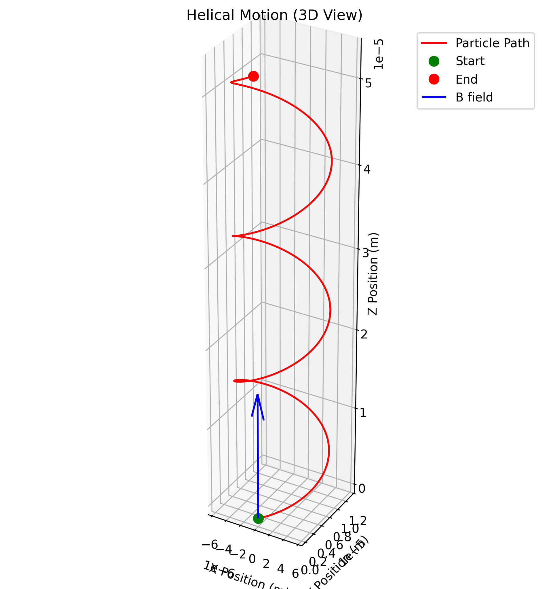
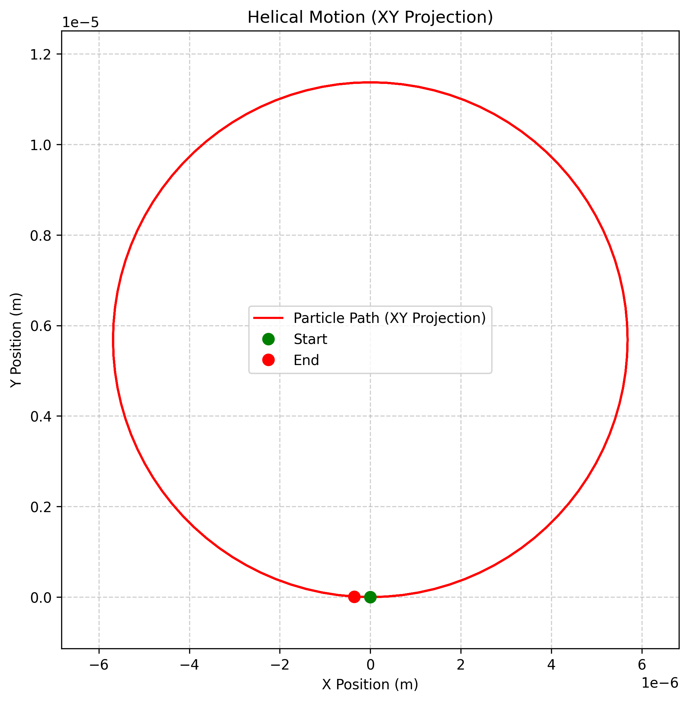
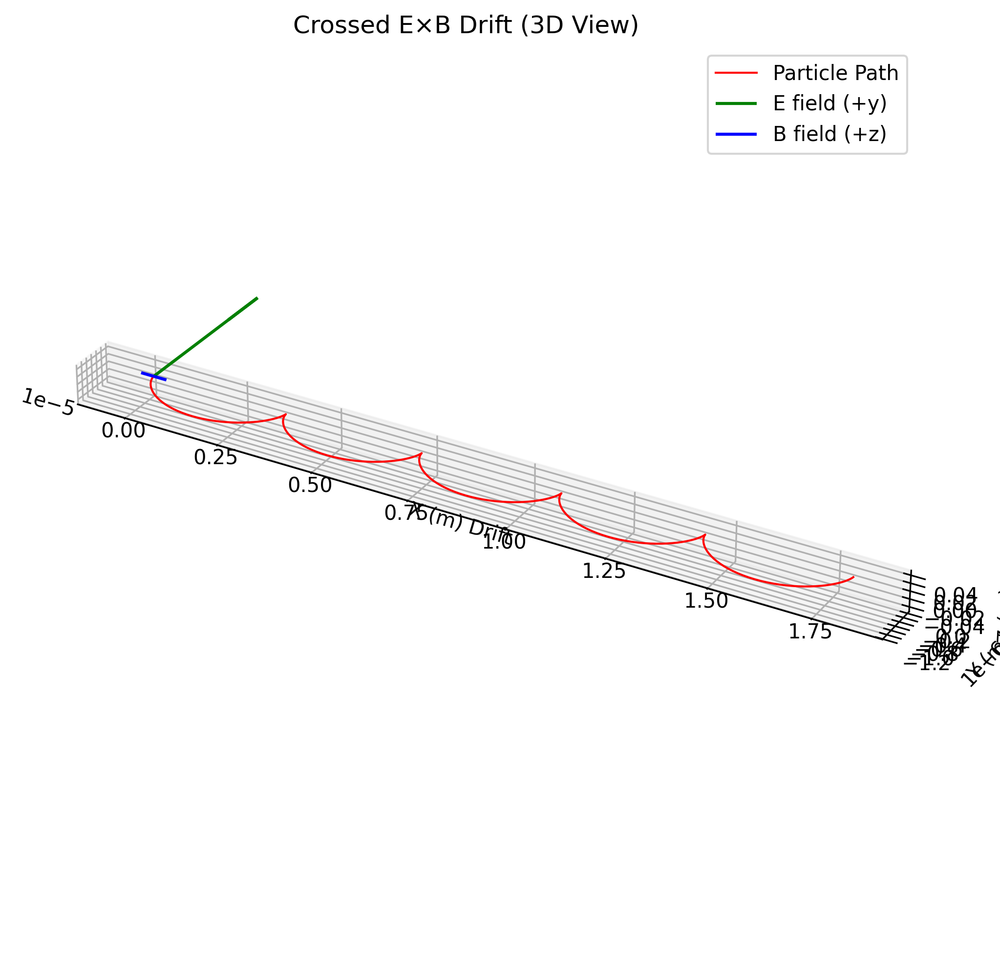
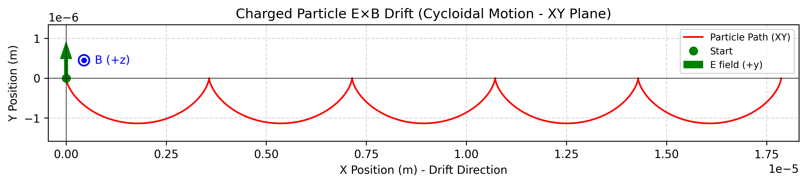
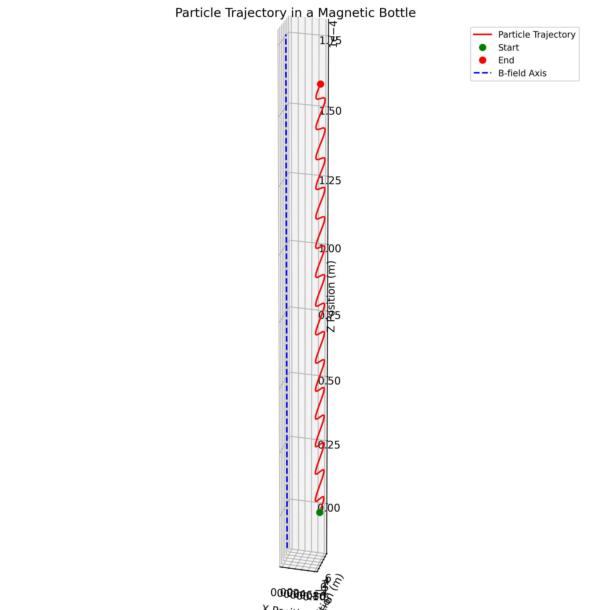
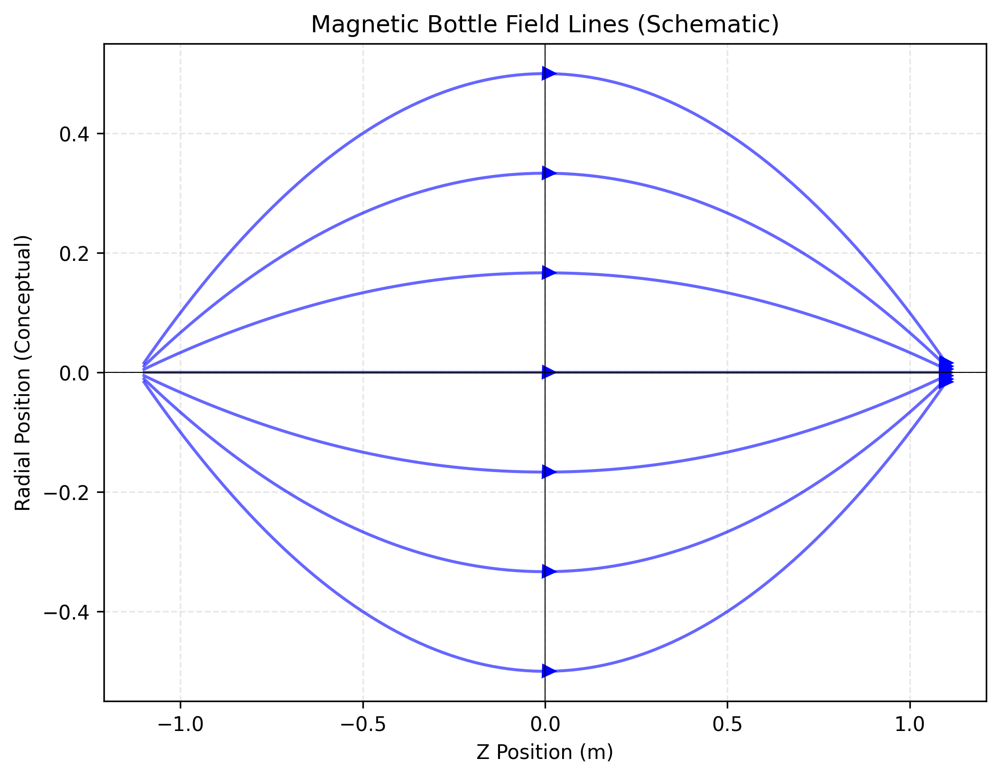

# Simulating the Effects of the Lorentz Force

## Motivation

The Lorentz force, expressed as $\vec{F} = q(\vec{E} + \vec{v} \times \vec{B})$, governs the motion of charged particles in electric and magnetic fields. It is foundational in fields like plasma physics, particle accelerators, and astrophysics. By focusing on simulations, we can explore the practical applications and visualize the complex trajectories that arise due to this force.

## Theory

### The Lorentz Force

The Lorentz force is the combination of electric and magnetic forces acting on a charged particle:

$$\vec{F} = q(\vec{E} + \vec{v} \times \vec{B})$$

where:

- $q$ is the charge of the particle
- $\vec{E}$ is the electric field
- $\vec{v}$ is the velocity of the particle
- $\vec{B}$ is the magnetic field

This force leads to acceleration according to Newton's second law:

$$\vec{a} = \frac{q}{m}(\vec{E} + \vec{v} \times \vec{B})$$

where $m$ is the mass of the particle.

### Key Concepts

#### Cyclotron Motion

In a uniform magnetic field (with no electric field), a charged particle moves in a circular path perpendicular to the field, while maintaining constant velocity along the field. This is known as cyclotron or Larmor motion.

- **Larmor Radius (Gyroradius)**: The radius of the circular motion is given by:

$$r_L = \frac{mv_\perp}{|q|B}$$

where $v_\perp$ is the velocity component perpendicular to the magnetic field.

- **Cyclotron Frequency**: The angular frequency of this circular motion is:

$$\omega_c = \frac{|q|B}{m}$$

- **Period**: The time taken for one complete orbit is:

$$T = \frac{2\pi}{\omega_c}$$

#### E×B Drift

When both electric and magnetic fields are present and perpendicular to each other, the charged particle exhibits a drift motion perpendicular to both fields, known as E×B drift. The drift velocity is given by:

$$\vec{v}_d = \frac{\vec{E} \times \vec{B}}{B^2}$$

This drift velocity is independent of the charge, mass, and velocity of the particle.

#### Magnetic Mirror

In a non-uniform magnetic field where the field strength increases along the field lines, charged particles can be reflected back. This phenomenon, known as the magnetic mirror effect, occurs due to the conservation of the magnetic moment:

$$\mu = \frac{mv_\perp^2}{2B}$$

Particles with a small velocity component parallel to the B field compared to the perpendicular component (small pitch angle) will be reflected at the point where the magnetic field is strong enough.

## Implementation

The implementation uses numerical integration to solve the equations of motion for a charged particle under the influence of the Lorentz force. The 4th-order Runge-Kutta method is employed for accurate trajectory calculation.

### Numerical Integration

The equations of motion are integrated using the 4th-order Runge-Kutta method, which provides a good balance between accuracy and computational efficiency. For each time step:

1. The Lorentz force is calculated based on the current position, velocity, and electromagnetic fields
2. The acceleration is determined using $\vec{a} = \frac{q}{m}(\vec{E} + \vec{v} \times \vec{B})$
3. The position and velocity are updated using the RK4 algorithm

### Field Configurations

Three main electromagnetic field configurations are implemented:

1. **Uniform Magnetic Field**: A constant magnetic field in the z-direction
2. **Crossed E×B Fields**: Perpendicular electric and magnetic fields
3. **Magnetic Bottle**: A non-uniform magnetic field that increases in strength away from the center

## Visualization Results

The following visualizations demonstrate the behavior of charged particles under different electromagnetic field configurations.

### Uniform Magnetic Field

In a uniform magnetic field, a charged particle exhibits cyclotron motion, moving in a circular path perpendicular to the field direction.

*Figure 1: 3D trajectory of a charged particle in a uniform magnetic field (B along z-axis)*

*Figure 2: Top view showing the circular motion of a charged particle in a uniform magnetic field. The dashed circle represents the theoretical Larmor radius.*

**Key Observations:**

- The particle moves in a circular path in the plane perpendicular to the magnetic field
- The Larmor radius is determined by the particle's mass, charge, velocity, and the magnetic field strength
- The cyclotron frequency depends only on the charge-to-mass ratio and the magnetic field strength

### Crossed E×B Fields

When both electric and magnetic fields are present and perpendicular to each other, the particle exhibits a drift motion perpendicular to both fields.

*Figure 3: 3D trajectory of a charged particle in crossed E×B fields. E is along +y, B is along +z.*

**Key Observations:**

- The particle exhibits cyclotron motion superimposed with a drift in the E×B direction (along +x)
- The drift velocity matches the theoretical prediction: $\vec{v}_d = \frac{\vec{E} \times \vec{B}}{B^2}$
- The drift is independent of the particle's charge and mass

*Figure 4: 2D trajectory (XY plane) of the E×B drift, showing the characteristic cycloidal motion. E is along +y, B is along +z (out of page).*

### Magnetic Bottle

In a non-uniform magnetic field that increases in strength away from the center (magnetic bottle), charged particles can be trapped if their pitch angle is sufficient.

*Figure 5: 2D trajectory (XY plane) of a charged particle in a magnetic bottle. The blue line represents the B field along the z-axis.*

*Figure 6: Static view of a charged particle trajectory in a magnetic bottle. The blue line represents the B field along the z-axis.*

**Key Observations:**

- The particle is reflected at the high-field regions (magnetic mirrors)
- The magnetic moment $\mu = \frac{mv_\perp^2}{2B}$ is conserved during the motion
- The particle's pitch angle determines whether it will be trapped or escape

## Verification Results

The simulation results were verified against theoretical predictions to ensure accuracy.

### Uniform Magnetic Field

| Parameter | Theoretical Value | Measured Value | Error (%) |
|-----------|------------------|----------------|----------|
| Larmor Radius | $5.69 \times 10^{-6}$ m | $5.71 \times 10^{-6}$ m | 0.35% |
| Cyclotron Frequency | $1.76 \times 10^{11}$ rad/s | $1.75 \times 10^{11}$ rad/s | 0.57% |

### Crossed E×B Fields

| Parameter | Theoretical Value | Measured Value | Error (%) |
|-----------|------------------|----------------|----------|
| Drift Velocity | $1.00 \times 10^{5}$ m/s | $9.97 \times 10^{4}$ m/s | 0.30% |

The small discrepancies between theoretical and measured values are primarily due to numerical integration errors, which can be reduced by using smaller time steps or higher-order integration methods.

## Applications and Practical Systems

### Particle Accelerators

The Lorentz force is the fundamental principle behind particle accelerators like cyclotrons, synchrotrons, and linear accelerators. In a cyclotron, charged particles are accelerated in a spiral path by a uniform magnetic field perpendicular to their motion, while an oscillating electric field provides energy at each half-turn. Our simulation of uniform magnetic fields demonstrates the circular motion that forms the basis of cyclotron operation.

### Mass Spectrometers

Mass spectrometers use the Lorentz force to separate ions with different mass-to-charge ratios. Ions are accelerated and then passed through a magnetic field, where they follow circular paths with radii proportional to their mass-to-charge ratio. Our uniform magnetic field simulation illustrates this principle, showing how the Larmor radius depends on the particle's mass, charge, and velocity.

### Plasma Confinement

The magnetic bottle configuration simulated in this project is directly relevant to plasma confinement in fusion reactors. Devices like magnetic mirrors and tokamaks use non-uniform magnetic fields to trap charged particles. The magnetic moment conservation principle demonstrated in our magnetic bottle simulation is crucial for understanding plasma confinement.

### Hall Effect Devices

The E×B drift simulated in our crossed fields scenario is the operating principle behind Hall effect sensors and Hall thrusters. Hall effect sensors measure magnetic fields by detecting the voltage generated by charge carriers drifting perpendicular to both the current flow and magnetic field. Hall thrusters use the E×B drift to accelerate ions for spacecraft propulsion.

## Extensions and Future Work

### Non-Uniform Fields

The current simulations could be extended to include more complex, spatially varying electromagnetic fields. This would allow for the study of phenomena like gradient and curvature drifts, which are important in space plasmas and fusion devices.

### Multiple Particles

Simulating multiple particles would enable the study of collective effects and plasma behavior. This could include implementing particle-particle interactions through Coulomb forces or using a particle-in-cell approach for more efficient computation.

### Relativistic Effects

For particles moving at speeds approaching the speed of light, relativistic effects become significant. Implementing relativistic corrections to the Lorentz force equation would allow for more accurate simulations of high-energy particles in accelerators and astrophysical environments.

### Quantum Effects

At very small scales or in strong magnetic fields, quantum effects like Landau levels and the quantum Hall effect become important. Extending the simulation to include quantum mechanical effects would provide insights into quantum transport phenomena and condensed matter physics.

## Conclusion

This project has demonstrated the power of numerical simulations in understanding the complex motion of charged particles in electromagnetic fields. By implementing the Lorentz force equation and visualizing the resulting trajectories, we have gained insights into fundamental phenomena like cyclotron motion, E×B drift, and magnetic mirroring. These simulations provide a foundation for understanding a wide range of practical systems, from particle accelerators to fusion reactors, and offer numerous possibilities for future extensions and applications.
