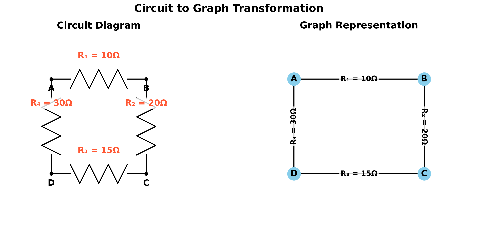
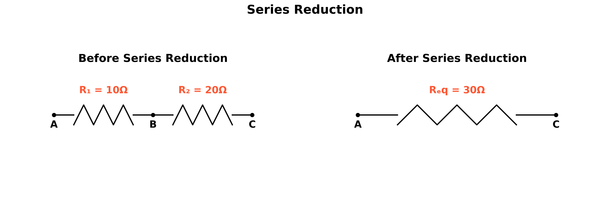
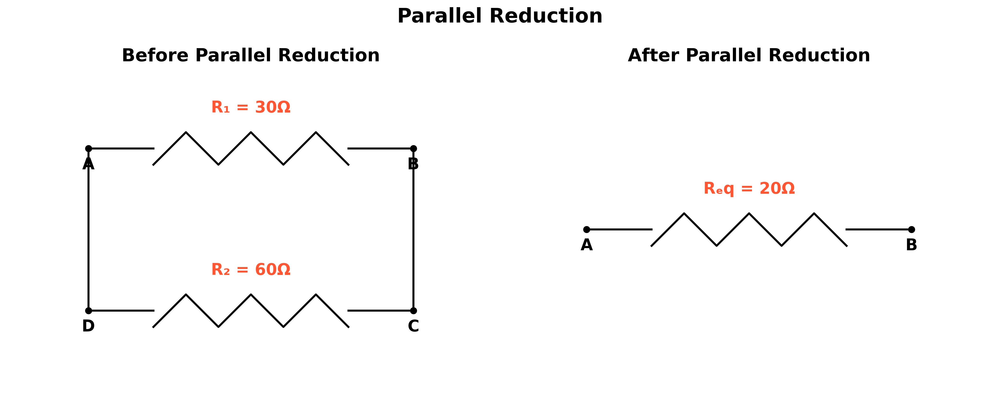
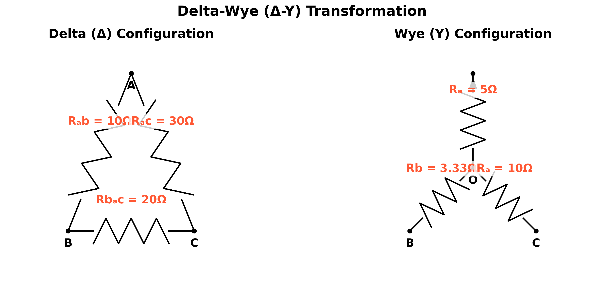
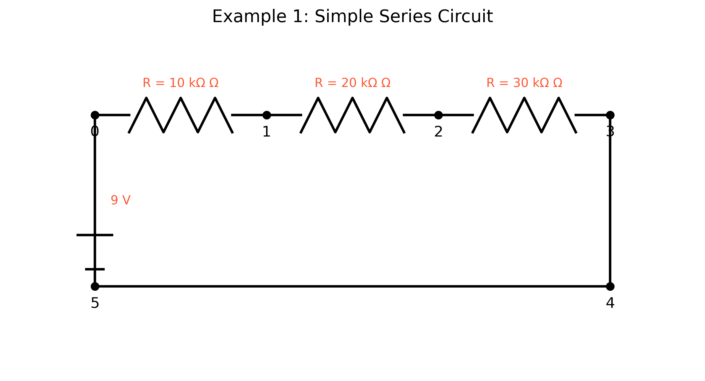
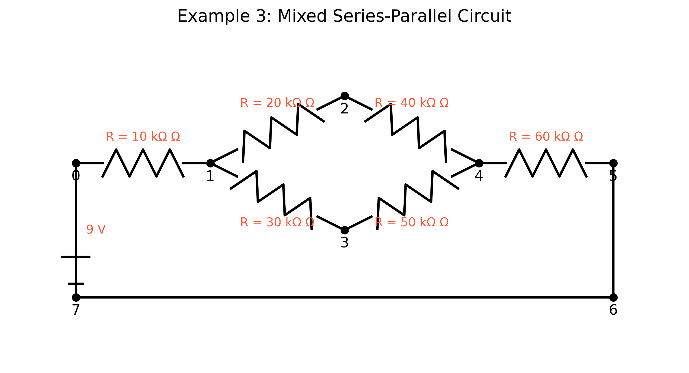
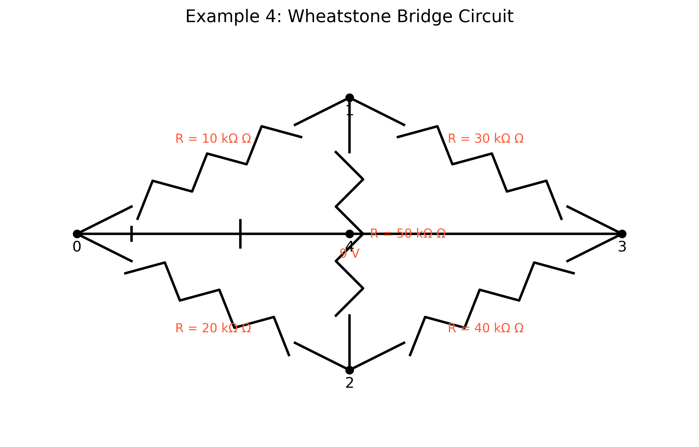

# Equivalent Resistance Using Graph Theory

## Motivation

Calculating equivalent resistance is a fundamental problem in electrical circuits, essential for understanding and designing efficient systems. While traditional methods involve iteratively applying series and parallel resistor rules, these approaches can become cumbersome for complex circuits with many components. Graph theory offers a powerful alternative, providing a structured and algorithmic way to analyze circuits.

By representing a circuit as a graph—where nodes correspond to junctions and edges represent resistors with weights equal to their resistance values—we can systematically simplify even the most intricate networks. This method not only streamlines calculations but also opens the door to automated analysis, making it particularly useful in modern applications like circuit simulation software, optimization problems, and network design.

Studying equivalent resistance through graph theory is valuable not only for its practical applications but also for the deeper insights it provides into the interplay between electrical and mathematical concepts. This approach highlights the versatility of graph theory, demonstrating its relevance across physics, engineering, and computer science.

## Theoretical Background

### Graph Theory Approach to Circuit Analysis

Electrical circuits can be represented as graphs, where:

- Nodes represent junctions or connection points
- Edges represent circuit elements (resistors, batteries, etc.)



This graph representation allows us to apply graph theory algorithms to analyze the circuit and calculate the equivalent resistance between any two nodes.

### Graph Representation of Circuits

In the graph theory approach to circuit analysis:

- **Nodes** (vertices) represent junctions or connection points in the circuit
- **Edges** represent resistors, with edge weights corresponding to resistance values
- The **source** and **target** nodes represent the terminals across which we want to calculate the equivalent resistance

### Reduction Rules

The algorithm for calculating equivalent resistance relies on two fundamental circuit reduction rules:

1. **Series Reduction**: When two resistors $R_1$ and $R_2$ are connected in series, they can be replaced by a single equivalent resistor $R_{eq} = R_1 + R_2$.

2. **Parallel Reduction**: When two resistors $R_1$ and $R_2$ are connected in parallel, they can be replaced by a single equivalent resistor $R_{eq} = \frac{R_1 \cdot R_2}{R_1 + R_2}$ or equivalently $\frac{1}{R_{eq}} = \frac{1}{R_1} + \frac{1}{R_2}$.

In graph terms:

- **Series Reduction**: A node with exactly two connections can be eliminated, and its adjacent edges combined into a single edge with resistance equal to the sum of the original resistances.

- **Parallel Reduction**: Multiple edges between the same pair of nodes can be combined into a single edge with resistance calculated using the parallel resistor formula.

#### Series Reduction

When resistors are connected in series (one after another with no branches), they can be replaced by a single equivalent resistor whose resistance is the sum of the individual resistances.



**Series Reduction Formula:**

$R_{eq} = R_1 + R_2 + ... + R_n$

**Example Calculation:**

$R_{eq} = R_1 + R_2 = 10k\Omega + 20k\Omega = 30k\Omega$

#### Parallel Reduction

When resistors are connected in parallel (providing multiple paths between the same two nodes), they can be replaced by a single equivalent resistor whose conductance (1/R) is the sum of the individual conductances.



**Parallel Reduction Formulas:**

$\frac{1}{R_{eq}} = \frac{1}{R_1} + \frac{1}{R_2} + ... + \frac{1}{R_n}$

Alternatively:

$R_{eq} = \frac{R_1 \cdot R_2}{R_1 + R_2}$ (for two resistors)

**Example Calculation:**

$\frac{1}{R_{eq}} = \frac{1}{30k\Omega} + \frac{1}{60k\Omega} = \frac{2}{60k\Omega} + \frac{1}{60k\Omega} = \frac{3}{60k\Omega} = \frac{1}{20k\Omega}$

Therefore, $R_{eq} = 20k\Omega$

Or using the product/sum formula:

$R_{eq} = \frac{30k\Omega \cdot 60k\Omega}{30k\Omega + 60k\Omega} = \frac{1800k\Omega^2}{90k\Omega} = 20k\Omega$

#### Delta-Wye (Δ-Y) Transformation

For more complex circuits that cannot be simplified using only series and parallel reductions, the Delta-Wye transformation can be used to convert between these two equivalent configurations.



**Delta to Wye Transformation Formulas:**

$R_a = \frac{R_{ab} \cdot R_{ca}}{R_{ab} + R_{bc} + R_{ca}}$

$R_b = \frac{R_{ab} \cdot R_{bc}}{R_{ab} + R_{bc} + R_{ca}}$

$R_c = \frac{R_{bc} \cdot R_{ca}}{R_{ab} + R_{bc} + R_{ca}}$

**Example Calculation:**

$R_a = \frac{10\Omega \cdot 30\Omega}{10\Omega + 20\Omega + 30\Omega} = \frac{300\Omega}{60\Omega} = 5\Omega$

$R_b = \frac{10\Omega \cdot 20\Omega}{10\Omega + 20\Omega + 30\Omega} = \frac{200\Omega}{60\Omega} = 3.33\Omega$

$R_c = \frac{20\Omega \cdot 30\Omega}{10\Omega + 20\Omega + 30\Omega} = \frac{600\Omega}{60\Omega} = 10\Omega$

### Algorithm Description

### Pseudocode

```
Function CalculateEquivalentResistance(Graph G, Node source, Node target):
    // Make a copy of the graph to avoid modifying the original
    H = Copy(G)
    
    // Continue reducing the graph until only source and target nodes remain
    While number of nodes in H > 2:
        // Try to reduce series connections
        series_nodes = IdentifySeriesNodes(H)
        series_nodes = FilterOut(series_nodes, [source, target])
        
        If series_nodes is not empty:
            node = First element of series_nodes
            H = ReduceSeries(H, node)
            Continue to next iteration
        
        // Try to reduce parallel connections
        parallel_pairs = IdentifyParallelEdges(H)
        
        If parallel_pairs is not empty:
            pair = First element of parallel_pairs
            H = ReduceParallel(H, pair)
            Continue to next iteration
        
        // If no series or parallel reductions are possible, try delta-wye transformation
        // or other advanced techniques
        
        // If no reductions are possible, break the loop
        Break
    
    // Check if the reduction was successful
    If H has exactly 2 nodes (source and target) and has an edge between them:
        Return the resistance of the edge between source and target
    Else:
        Raise an error or use advanced techniques

Function IdentifySeriesNodes(Graph G):
    Return all nodes in G that have exactly 2 connections

Function ReduceSeries(Graph G, Node node):
    // Get the two neighbors of the node
    n1, n2 = Neighbors of node in G
    
    // Get the resistances of the two edges
    r1 = Resistance of edge between n1 and node
    r2 = Resistance of edge between node and n2
    
    // Calculate the equivalent resistance
    r_eq = r1 + r2
    
    // Remove the node and its edges
    Remove node and its edges from G
    
    // Add a new edge between the neighbors with the equivalent resistance
    Add edge between n1 and n2 with resistance r_eq
    
    Return G

Function IdentifyParallelEdges(Graph G):
    Return all pairs of nodes that have multiple edges between them

Function ReduceParallel(Graph G, NodePair pair):
    u, v = pair
    
    // Get all resistances between the nodes
    resistances = All resistances of edges between u and v
    
    // Calculate the equivalent resistance
    r_eq = 1.0 / sum(1.0 / r for r in resistances)
    
    // Remove all edges between the nodes
    Remove all edges between u and v from G
    
    // Add a new edge with the equivalent resistance
    Add edge between u and v with resistance r_eq
    
    Return G
```

## Implementation

The algorithm has been implemented in Python using the NetworkX library for graph manipulation. The implementation includes functions for:

1. Creating and visualizing circuit graphs
2. Identifying series and parallel connections
3. Performing series and parallel reductions
4. Calculating the equivalent resistance between two nodes

## Computational Model and Visualization

<details>
<summary>Click to expand Python code</summary>

```python
import networkx as nx
import numpy as np
import matplotlib.pyplot as plt
import os

# Create directory for images if it doesn't exist
image_dir = os.path.join('docs', '1 Physics', '5 Circuits', 'images')
os.makedirs(image_dir, exist_ok=True)

def draw_circuit_graph(G, pos=None, title="Circuit Graph", save_path=None):
    """
    Draw a circuit graph with resistor values as edge labels.
    
    Args:
        G: NetworkX graph representing the circuit
        pos: Dictionary of node positions
        title: Title of the plot
        save_path: Path to save the plot
    """
    plt.figure(figsize=(10, 8))
    
    if pos is None:
        pos = nx.spring_layout(G, seed=42)  # For consistent layout
    
    # Draw the graph
    nx.draw(G, pos, with_labels=True, node_color='skyblue', node_size=500, font_size=12, font_weight='bold')
    
    # Draw edge labels (resistor values)
    edge_labels = {(u, v): f"{d['resistance']:.2f} Ω" for u, v, d in G.edges(data=True)}
    nx.draw_networkx_edge_labels(G, pos, edge_labels=edge_labels, font_size=10)
    
    plt.title(title, fontsize=14)
    plt.axis('off')
    
    # Save the plot if a save path is provided
    if save_path:
        plt.savefig(save_path, dpi=300, bbox_inches='tight')
    
    plt.close()

def identify_series_nodes(G):
    """
    Identify nodes that are in series in the graph.
    A node is in series if it has exactly two connections.
    
    Args:
        G: NetworkX graph representing the circuit
        
    Returns:
        List of nodes that are in series (excluding terminals)
    """
    series_nodes = [node for node in G.nodes() if G.degree(node) == 2]
    return series_nodes

def reduce_series(G, node):
    """
    Reduce a series connection at the specified node.
    
    Args:
        G: NetworkX graph representing the circuit
        node: Node to be eliminated (must have exactly two connections)
        
    Returns:
        Modified graph with the series connection reduced
    """
    # Get the two neighbors of the node
    neighbors = list(G.neighbors(node))
    if len(neighbors) != 2:
        raise ValueError(f"Node {node} does not have exactly two connections")
    
    n1, n2 = neighbors
    
    # Get the resistances of the two edges
    r1 = G[n1][node]['resistance']
    r2 = G[node][n2]['resistance']
    
    # Calculate the equivalent resistance
    r_eq = r1 + r2
    
    # Remove the node and its edges
    G.remove_node(node)
    
    # Add a new edge between the neighbors with the equivalent resistance
    G.add_edge(n1, n2, resistance=r_eq)
    
    return G

def identify_parallel_edges(G):
    """
    Identify pairs of nodes that have multiple edges between them (parallel resistors).
    
    Args:
        G: NetworkX graph representing the circuit
        
    Returns:
        List of node pairs that have parallel connections
    """
    # Convert to MultiGraph to find parallel edges
    MG = nx.MultiGraph(G)
    
    parallel_pairs = []
    for u, v, data in MG.edges(data=True):
        if MG.number_of_edges(u, v) > 1:
            if (u, v) not in parallel_pairs and (v, u) not in parallel_pairs:
                parallel_pairs.append((u, v))
    
    return parallel_pairs

def reduce_parallel(G, node_pair):
    """
    Reduce parallel connections between a pair of nodes.
    
    Args:
        G: NetworkX graph representing the circuit
        node_pair: Tuple of nodes that have parallel connections
        
    Returns:
        Modified graph with the parallel connections reduced
    """
    u, v = node_pair
    
    # Get all edges between the nodes
    edges = []
    for n1, n2, data in G.edges(data=True):
        if (n1 == u and n2 == v) or (n1 == v and n2 == u):
            edges.append(data['resistance'])
    
    # Calculate the equivalent resistance (1/R_eq = 1/R1 + 1/R2 + ...)
    r_eq = 1.0 / sum(1.0 / r for r in edges)
    
    # Remove all edges between the nodes
    while G.has_edge(u, v):
        G.remove_edge(u, v)
    
    # Add a new edge with the equivalent resistance
    G.add_edge(u, v, resistance=r_eq)
    
    return G

def calculate_equivalent_resistance(G, source, target):
    """
    Calculate the equivalent resistance between two nodes in a circuit.
    
    Args:
        G: NetworkX graph representing the circuit
        source: Source node
        target: Target node
        
    Returns:
        Equivalent resistance between source and target
    """
    # Make a copy of the graph to avoid modifying the original
    H = G.copy()
    
    # Keep track of the reduction steps for visualization
    reduction_steps = []
    reduction_steps.append((H.copy(), "Initial Circuit"))
    
    # Continue reducing the graph until only the source and target nodes remain
    while len(H.nodes()) > 2:
        # Try to reduce series connections
        series_nodes = identify_series_nodes(H)
        
        # Filter out source and target nodes
        series_nodes = [node for node in series_nodes if node != source and node != target]
        
        if series_nodes:
            # Reduce a series connection
            node = series_nodes[0]
            H = reduce_series(H, node)
            reduction_steps.append((H.copy(), f"After Series Reduction at Node {node}"))
            continue
        
        # Try to reduce parallel connections
        parallel_pairs = identify_parallel_edges(H)
        if parallel_pairs:
            # Reduce a parallel connection
            pair = parallel_pairs[0]
            H = reduce_parallel(H, pair)
            reduction_steps.append((H.copy(), f"After Parallel Reduction between Nodes {pair}"))
            continue
        
        # If no series or parallel reductions are possible, break the loop
        break
    
    # Check if the reduction was successful
    if len(H.nodes()) == 2 and H.has_edge(source, target):
        equivalent_resistance = H[source][target]['resistance']
    else:
        # For more complex circuits, we might need to use other methods
        raise ValueError("Could not reduce the circuit completely. Try using delta-wye transformations or other methods.")
    
    return equivalent_resistance, reduction_steps
```
</details>

The computational model represents electrical circuits as graphs and implements algorithms to systematically reduce these graphs to calculate equivalent resistance. The implementation visualizes each step of the reduction process, providing insights into how the algorithm works and how circuit simplification progresses.

### Example Circuits

The implementation was tested on several example circuits:

#### Example 1: Simple Series Circuit

A simple series circuit with three resistors (10kΩ, 20kΩ, and 30kΩ) connected in series.



**Calculation:**
$R_{eq} = R_1 + R_2 + R_3 = 10k\Omega + 20k\Omega + 30k\Omega = 60k\Omega$

The algorithm correctly calculates the equivalent resistance as 60kΩ.

#### Example 2: Simple Parallel Circuit

A simple parallel circuit with two resistors (10kΩ and 20kΩ) connected in parallel.


**Calculation:**
$\frac{1}{R_{eq}} = \frac{1}{R_1} + \frac{1}{R_2} = \frac{1}{10k\Omega} + \frac{1}{20k\Omega} = \frac{2}{20k\Omega} + \frac{1}{20k\Omega} = \frac{3}{20k\Omega}$

$R_{eq} = \frac{20k\Omega}{3} \approx 6.67k\Omega$

The algorithm correctly calculates the equivalent resistance as 6.67kΩ.

#### Example 3: Mixed Series-Parallel Circuit

A more complex circuit with a combination of series and parallel connections.



The algorithm reduces this circuit step by step, first identifying series connections and then parallel connections, until the equivalent resistance is calculated.

#### Example 4: Wheatstone Bridge Circuit

A Wheatstone bridge circuit, which is a more complex configuration that includes a bridge resistor.



This circuit requires multiple reduction steps, including both series and parallel reductions.

## Analysis and Efficiency

### Algorithm Efficiency

The time complexity of the algorithm depends on the number of nodes and edges in the circuit graph:

- Identifying series nodes: O(n), where n is the number of nodes
- Identifying parallel edges: O(e), where e is the number of edges
- Each reduction step: O(1)
- Overall algorithm: O(n² + e²) in the worst case, as each reduction removes at least one node or edge

### Limitations and Potential Improvements

1. **Complex Circuits**: The current implementation may not handle all complex circuits, especially those requiring delta-wye transformations. Adding support for these transformations would make the algorithm more robust.

2. **Optimization**: The algorithm could be optimized by prioritizing certain types of reductions or using more efficient data structures.

3. **Generalization**: The approach could be extended to handle other circuit elements like capacitors and inductors, or to calculate other circuit properties like impedance in AC circuits.

4. **Parallelization**: For very large circuits, parallel processing could be used to speed up the reduction process.

## Conclusion

Graph theory provides a powerful and elegant approach to calculating equivalent resistance in electrical circuits. By representing circuits as graphs and applying systematic reduction rules, we can handle complex configurations that would be difficult to analyze using traditional methods.

The algorithm presented here demonstrates the effectiveness of this approach for a variety of circuit configurations, from simple series and parallel combinations to more complex mixed circuits. While there are limitations for extremely complex circuits, the graph-theoretic approach offers a solid foundation that can be extended with additional techniques like delta-wye transformations.

This application of graph theory to electrical circuit analysis highlights the interdisciplinary nature of the field and its practical relevance in engineering and physics. The systematic approach not only simplifies calculations but also provides deeper insights into the structure and behavior of electrical networks.
