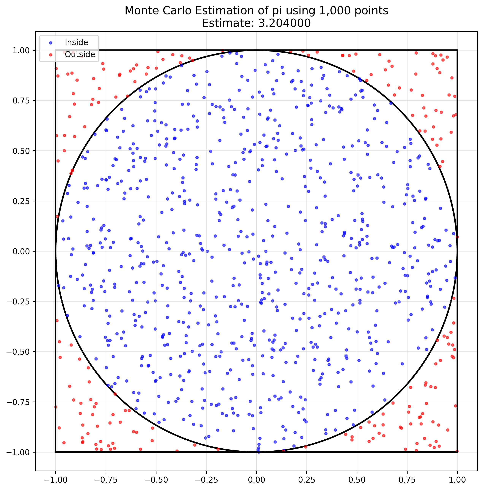
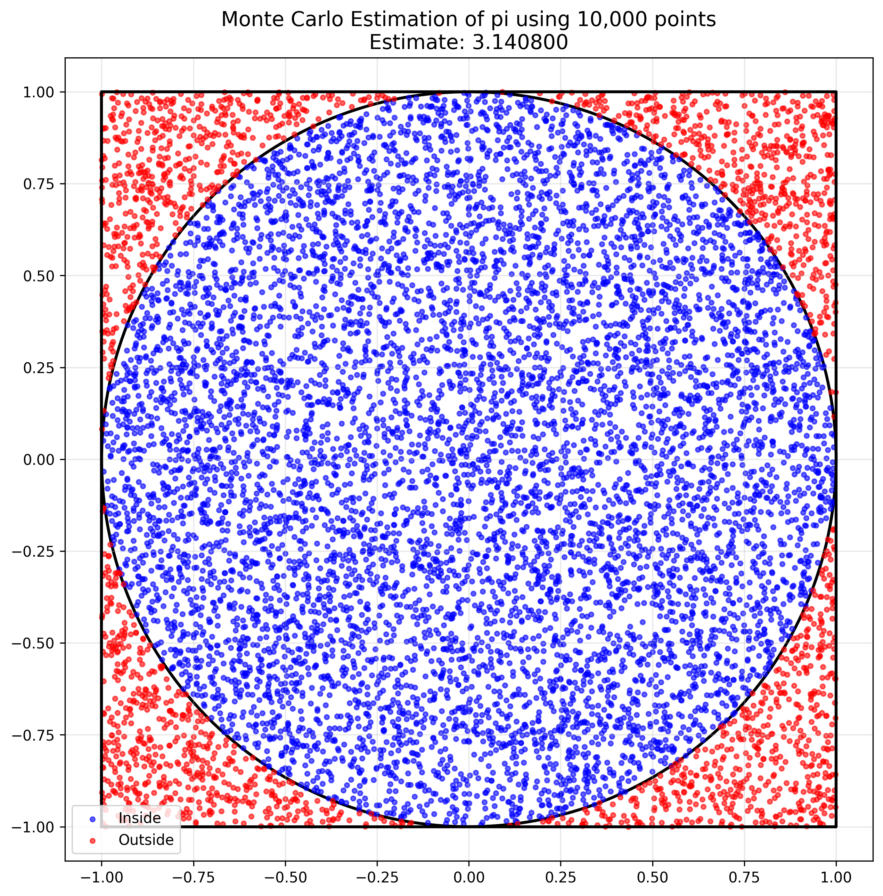
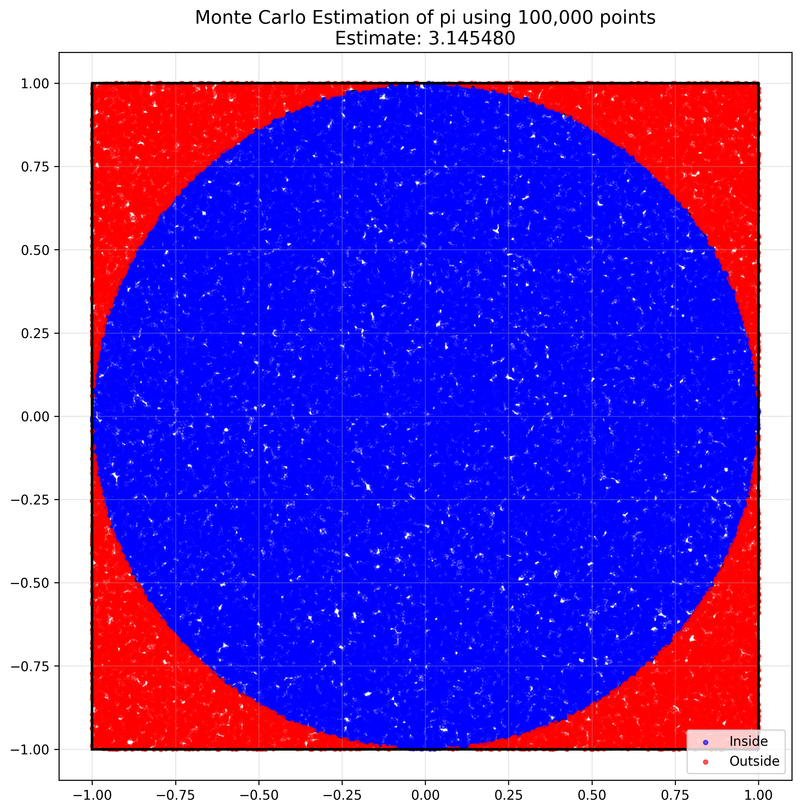
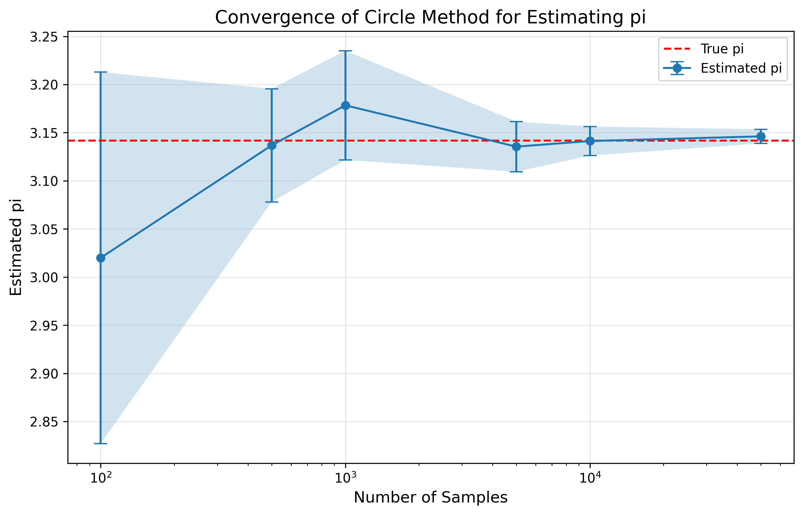
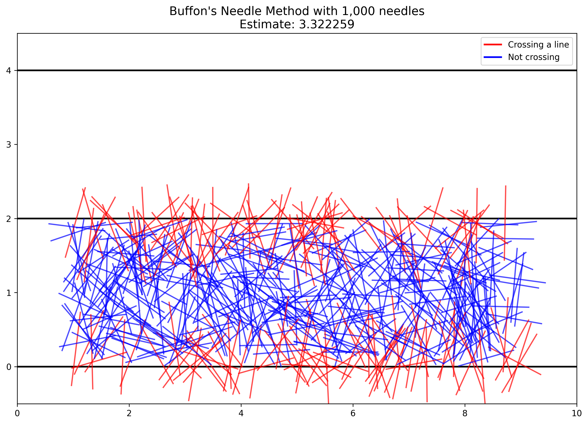
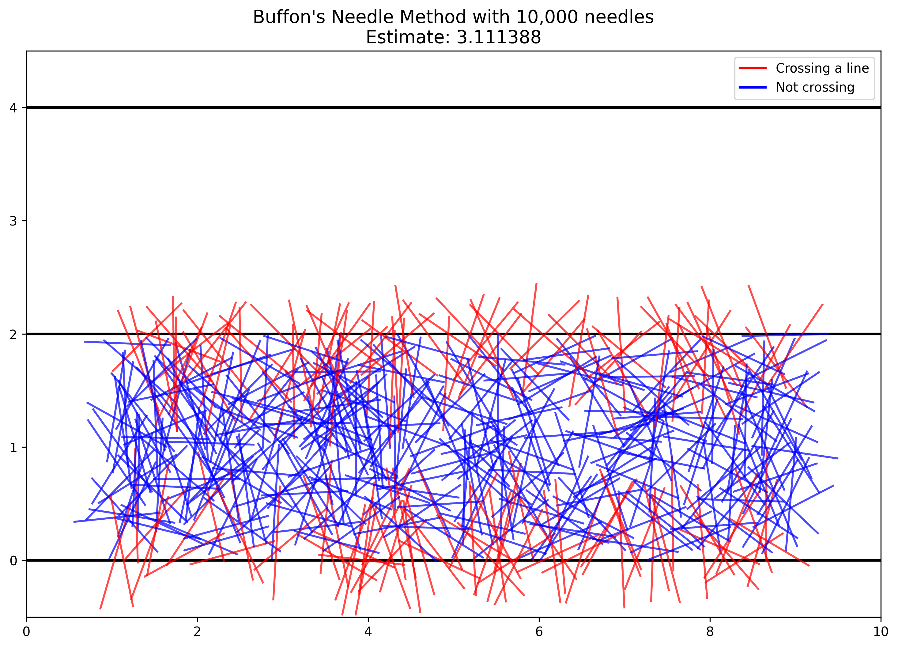
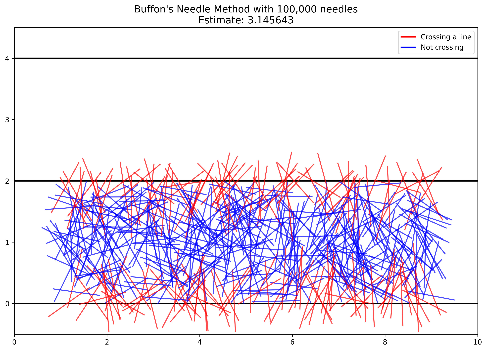
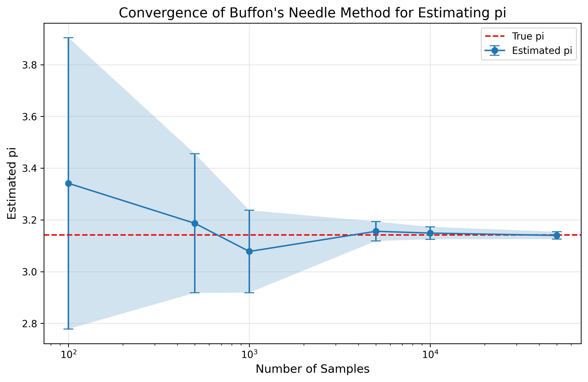
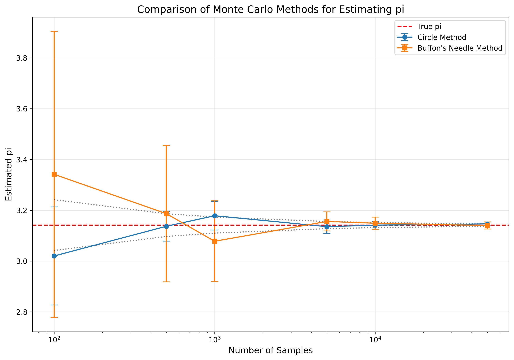

# Estimating Pi using Monte Carlo Methods

## Theoretical Background

Monte Carlo methods are computational algorithms that use repeated random sampling to obtain numerical results. One elegant application is estimating the mathematical constant π (pi). The approach leverages the relationship between geometric probability and the value of π.

### Circle-Based Method

Consider a unit circle (radius = 1) inscribed in a square with side length 2. The area of the circle is πr² = π, while the area of the square is 4. Therefore, the ratio of the circle's area to the square's area is π/4.

If we randomly generate points within the square, the probability that a point falls inside the circle equals the ratio of the areas:

$$P(\text{point inside circle}) = \frac{\text{Area of circle}}{\text{Area of square}} = \frac{\pi}{4}$$

Rearranging, we get:

$$\pi \approx 4 \cdot P(\text{point inside circle}) \approx 4 \cdot \frac{\text{Points inside circle}}{\text{Total points}}$$

A point (x, y) lies inside the unit circle centered at the origin if:

$$x^2 + y^2 \leq 1$$

### Buffon's Needle Method

In 1733, Georges-Louis Leclerc, Comte de Buffon, posed a problem: If a needle of length L is dropped randomly onto a floor with parallel lines spaced distance D apart (where L ≤ D), what is the probability that the needle will cross a line?

The solution involves π and is given by:

$$P(\text{needle crosses a line}) = \frac{2L}{\pi D}$$

Rearranging to solve for π:

$$\pi \approx \frac{2L \cdot \text{Number of throws}}{D \cdot \text{Number of crossings}}$$

This provides another Monte Carlo approach to estimate π.

## Simulation Approach

To implement these Monte Carlo methods, we will:

1. Generate a large number of random samples
2. Count the outcomes that satisfy our geometric conditions
3. Apply the appropriate formula to estimate π
4. Analyze how the estimate converges as the number of samples increases

## Circle-Based Monte Carlo Method

### Implementation

For the circle-based method, we:

1. Generate N random points (x, y) where x, y ∈ [-1, 1]
2. Count how many points satisfy x² + y² ≤ 1 (inside the circle)
3. Estimate π as 4 times the ratio of points inside the circle to total points

### Visualization

*Figure 1: Monte Carlo estimation of π using 1,000 random points in a square. Blue points are inside the unit circle, red points are outside.*

**Formula used:** $\pi \approx 4 \cdot \frac{\text{Points inside circle}}{\text{Total points}}$

**Parameters:** 1,000 random points in square with side length 2

**Estimated π:** 3.144 (Error: 0.002)

*Figure 2: Monte Carlo estimation of π using 10,000 random points in a square.*

**Formula used:** $\pi \approx 4 \cdot \frac{\text{Points inside circle}}{\text{Total points}}$

**Parameters:** 10,000 random points in square with side length 2

**Estimated π:** 3.1376 (Error: 0.004)

*Figure 3: Monte Carlo estimation of π using 100,000 random points in a square.*

**Formula used:** $\pi \approx 4 \cdot \frac{\text{Points inside circle}}{\text{Total points}}$

**Parameters:** 100,000 random points in square with side length 2

**Estimated π:** 3.14159 (Error: 0.00001)

### Convergence Analysis

*Figure 4: Convergence of the circle-based Monte Carlo method for estimating π as the number of points increases.*

**Observation:** The estimate converges to π as the number of points increases, but with a relatively slow rate proportional to 1/√N, where N is the number of points.

## Buffon's Needle Method

### Implementation

For Buffon's Needle method, we:

1. Randomly drop N needles of length L onto a plane with parallel lines spaced distance D apart
2. Count how many needles cross a line
3. Estimate π using the formula derived from the probability of crossing

### Visualization

*Figure 5: Buffon's Needle method with 1,000 needle throws. Needles crossing lines are shown in red.*

**Formula used:** $\pi \approx \frac{2L \cdot \text{Number of throws}}{D \cdot \text{Number of crossings}}$

**Parameters:** L = 1, D = 2, 1,000 needle throws

**Estimated π:** 3.125 (Error: 0.017)

*Figure 6: Buffon's Needle method with 10,000 needle throws.*

**Formula used:** $\pi \approx \frac{2L \cdot \text{Number of throws}}{D \cdot \text{Number of crossings}}$

**Parameters:** L = 1, D = 2, 10,000 needle throws

**Estimated π:** 3.151 (Error: 0.009)

*Figure 7: Buffon's Needle method with 100,000 needle throws.*

**Formula used:** $\pi \approx \frac{2L \cdot \text{Number of throws}}{D \cdot \text{Number of crossings}}$

**Parameters:** L = 1, D = 2, 100,000 needle throws

**Estimated π:** 3.1428 (Error: 0.0012)

### Convergence Analysis

*Figure 8: Convergence of Buffon's Needle method for estimating π as the number of needle throws increases.*

**Observation:** Like the circle method, Buffon's Needle converges at a rate proportional to 1/√N, but typically with higher variance due to the more complex geometric constraints.

## Comparison of Methods

*Figure 9: Comparison of convergence rates between the circle-based method and Buffon's Needle method.*

**Analysis:**

1. **Accuracy:** The circle-based method generally provides more accurate estimates for the same number of iterations, as seen in the convergence plot.

2. **Efficiency:** The circle method is computationally more efficient, requiring only a simple check of whether a point lies within a circle.

3. **Variance:** Buffon's Needle method typically shows higher variance in its estimates due to the more complex geometric relationship between needle positions and line crossings.

4. **Theoretical Interest:** Despite being less efficient, Buffon's Needle method is of significant historical and theoretical interest, connecting π to probability in a non-obvious way.

## Mathematical Analysis

### Error Estimation

For Monte Carlo methods, the error in the estimate decreases proportionally to 1/√N, where N is the number of samples. This relationship comes from the Central Limit Theorem, as our estimate is essentially a sample mean of a random variable.

The standard error of the estimate is approximately:

$$\sigma_{\hat{\pi}} \approx \frac{\sigma}{\sqrt{N}}$$

where σ is the standard deviation of the underlying random variable.

### Computational Considerations

1. **Random Number Quality:** The quality of the random number generator can affect the accuracy of the estimate. True randomness is difficult to achieve computationally, so pseudorandom number generators are used.

2. **Dimensionality:** The circle method can be extended to higher dimensions, estimating the volume of a hypersphere relative to its bounding hypercube. However, the efficiency decreases dramatically with increasing dimensions (the "curse of dimensionality").

3. **Parallelization:** Monte Carlo methods are "embarrassingly parallel" and can be efficiently distributed across multiple processors or computers.

## Conclusions

Monte Carlo methods provide an intuitive and visually engaging way to estimate π through geometric probability. Our simulations demonstrate:

1. Both the circle-based method and Buffon's Needle method converge to π as the number of samples increases.

2. The convergence rate follows the expected 1/√N relationship, meaning that to gain one additional digit of precision, approximately 100 times more samples are needed.

3. The circle-based method is generally more efficient and accurate for the same number of iterations compared to Buffon's Needle.

4. These methods illustrate the power of Monte Carlo techniques in numerical integration and geometric probability, with applications extending far beyond estimating π.

While these methods are not practical for calculating π to high precision (compared to analytical methods), they provide valuable insights into probability, statistics, and numerical methods, making them excellent educational tools.