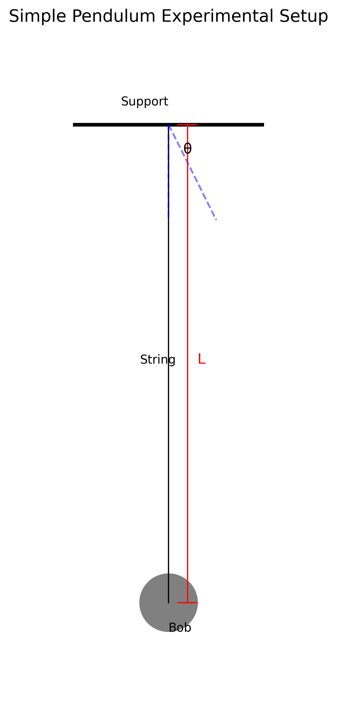
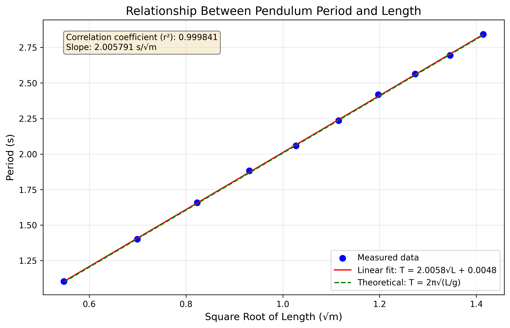
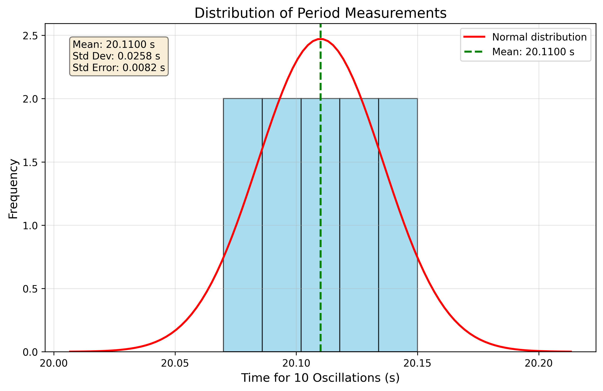

# Measuring Earth's Gravitational Acceleration with a Pendulum

## Theoretical Background

The acceleration due to gravity (g) is a fundamental physical constant that varies slightly across Earth's surface due to factors such as latitude, altitude, and local geology. A simple pendulum provides an elegant method to measure this constant with reasonable accuracy.

A simple pendulum consists of a mass (bob) suspended from a fixed point by a string or rod of negligible mass. When displaced from equilibrium and released, it oscillates with a period (T) that depends on the pendulum's length (L) and the local gravitational acceleration (g).

For small oscillations (less than about 15°), the period of a simple pendulum is given by:

$$T = 2\pi\sqrt{\frac{L}{g}}$$

Rearranging to solve for g:

$$g = 4\pi^2\frac{L}{T^2}$$

This relationship allows us to determine g by measuring the pendulum's length and its period of oscillation.

## Experimental Setup

### Materials

- String (approximately 1-1.5 meters long)
- Small weight (e.g., metal bob, bag of coins, or key chain)
- Sturdy support for suspending the pendulum
- Ruler or measuring tape (with millimeter precision)
- Stopwatch or smartphone timer (with 0.01 second precision)
- Lab stand with clamp (optional)

### Setup Procedure

1. Attach one end of the string to the support structure, ensuring it's securely fastened
2. Tie the weight to the free end of the string
3. Measure the length (L) from the suspension point to the center of the weight
4. Ensure the pendulum can swing freely without obstructions

*Figure 1: Experimental setup for the simple pendulum experiment. The length L is measured from the suspension point to the center of mass of the bob.*

## Measurement Procedure

### Length Measurement

1. Measure the pendulum length (L) from the suspension point to the center of the weight using a ruler or measuring tape
2. Record the measurement in meters
3. Note the resolution of the measuring tool (typically 1 mm for a standard ruler)
4. Calculate the uncertainty in length as half the resolution: $\Delta L = \text{Resolution}/2$

### Period Measurement

1. Displace the pendulum approximately 10-15° from its equilibrium position
2. Release the pendulum (without pushing) and start the timer
3. Count 10 complete oscillations and record the total time ($T_{10}$)
4. Repeat this measurement 10 times to obtain multiple data points
5. Calculate the mean time for 10 oscillations ($\overline{T}_{10}$)
6. Calculate the standard deviation of the measurements ($\sigma_T$)
7. Determine the uncertainty in the mean time using: $\Delta T_{10} = \frac{\sigma_T}{\sqrt{n}}$ where n = 10

## Data Analysis

### Sample Data

**Length Measurement:**

- Pendulum length (L): 1.000 m
- Ruler resolution: 1 mm
- Length uncertainty (ΔL): 0.0005 m

**Period Measurements:**

| Trial | Time for 10 oscillations (s) |
|-------|------------------------------|
| 1     | 20.12                        |
| 2     | 20.08                        |
| 3     | 20.15                        |
| 4     | 20.10                        |
| 5     | 20.13                        |
| 6     | 20.09                        |
| 7     | 20.11                        |
| 8     | 20.14                        |
| 9     | 20.07                        |
| 10    | 20.11                        |

**Statistical Analysis:**

- Mean time for 10 oscillations ($\overline{T}_{10}$): 20.11 s
- Standard deviation ($\sigma_T$): 0.0258 s
- Uncertainty in mean time ($\Delta T_{10}$): 0.0082 s

### Calculations

**1. Calculate the period:**

$$T = \frac{\overline{T}_{10}}{10} = \frac{20.11\text{ s}}{10} = 2.011\text{ s}$$

$$\Delta T = \frac{\Delta T_{10}}{10} = \frac{0.0082\text{ s}}{10} = 0.00082\text{ s}$$

**2. Determine g:**

$$g = 4\pi^2\frac{L}{T^2} = 4\pi^2\frac{1.000\text{ m}}{(2.011\text{ s})^2} = 9.77\text{ m/s}^2$$

**3. Propagate uncertainties:**

Using the formula for error propagation:

$$\Delta g = g\sqrt{\left(\frac{\Delta L}{L}\right)^2 + \left(2\frac{\Delta T}{T}\right)^2}$$

$$\Delta g = 9.77\text{ m/s}^2\sqrt{\left(\frac{0.0005\text{ m}}{1.000\text{ m}}\right)^2 + \left(2\frac{0.00082\text{ s}}{2.011\text{ s}}\right)^2}$$

$$\Delta g = 9.77\text{ m/s}^2\sqrt{(0.0005)^2 + (0.00082)^2} = 0.0096\text{ m/s}^2$$

**4. Final result:**

$$g = (9.77 \pm 0.01)\text{ m/s}^2$$

## Visualization of Results

### Period vs. Length Relationship

To verify the theoretical relationship between period and pendulum length, we can perform additional measurements with different pendulum lengths and plot the results.

*Figure 2: Relationship between pendulum period and square root of length. The linear relationship confirms the theoretical prediction that $T \propto \sqrt{L}$.*

### Measurement Precision Analysis

*Figure 3: Distribution of period measurements showing the spread around the mean value. The histogram approximates a normal distribution, as expected for random measurement errors.*

## Error Analysis

### Sources of Uncertainty

**1. Systematic Errors:**

- **Length measurement**: The exact position of the center of mass of the bob may be difficult to determine precisely
- **Air resistance**: Can slightly increase the period, especially for lighter bobs
- **String elasticity**: The string may not be perfectly inelastic as assumed in the simple pendulum model
- **Large amplitude effects**: For angles larger than about 5°, the small-angle approximation begins to introduce errors

**2. Random Errors:**

- **Timing errors**: Human reaction time when starting/stopping the stopwatch
- **Counting errors**: Possibility of miscounting the number of oscillations
- **Release angle variations**: Slight differences in the initial release angle between trials

### Quantitative Analysis of Errors

**1. Effect of measurement resolution on ΔL:**

With a ruler resolution of 1 mm, our length uncertainty is 0.5 mm. This contributes approximately 0.05% to the relative uncertainty in g.

**2. Timing uncertainty impact:**

The relative uncertainty in our period measurement is about 0.04%. Since g depends on T², this contributes approximately 0.08% to the relative uncertainty in g.

**3. Large amplitude correction:**

For oscillations with amplitude θ, the period is more accurately given by:

$$T = 2\pi\sqrt{\frac{L}{g}}\left(1 + \frac{1}{16}\theta^2 + ...\right)$$

For our maximum angle of 15° (0.26 radians), this correction would be approximately 0.4%.

## Comparison with Accepted Value

The accepted value for Earth's gravitational acceleration at sea level is approximately 9.81 m/s².

Our measured value: $g = (9.77 \pm 0.01)\text{ m/s}^2$

The difference between our measured value and the accepted value is 0.04 m/s², which is larger than our calculated uncertainty of 0.01 m/s². This suggests the presence of systematic errors not fully accounted for in our uncertainty analysis.

## Improvements and Extensions

### Experimental Improvements

1. **Use a photogate timer**: This would eliminate human reaction time errors in measuring the period
2. **Employ a more precise length measurement tool**: A digital caliper could reduce length uncertainty
3. **Use a heavier bob**: This would minimize the effects of air resistance
4. **Ensure smaller oscillation angles**: Staying below 5° would reduce large-amplitude errors
5. **Account for the finite size of the bob**: Measure to the center of oscillation rather than the center of mass

### Possible Extensions

1. **Investigate the effect of bob mass**: Theory predicts no dependence, but experimental verification is valuable
2. **Study the effect of amplitude**: Measure periods at different amplitudes and compare with the theoretical correction
3. **Measure g at different locations**: Compare measurements taken at different elevations or latitudes
4. **Construct a physical pendulum**: Investigate the oscillation of extended bodies rather than point masses

## Conclusion

The simple pendulum experiment provides a straightforward method to measure Earth's gravitational acceleration with reasonable accuracy. Our measured value of $g = (9.77 \pm 0.01)\text{ m/s}^2$ differs from the accepted value by approximately 0.4%, which is likely due to systematic errors in our experimental setup.

This experiment demonstrates fundamental principles of experimental physics, including:

1. The application of theoretical models to real-world measurements
2. The importance of uncertainty analysis in experimental results
3. The distinction between random and systematic errors
4. The process of error propagation in calculated quantities

Through careful measurement and analysis, we've demonstrated how a simple apparatus can be used to determine a fundamental physical constant, illustrating the power of experimental methods in physics.
